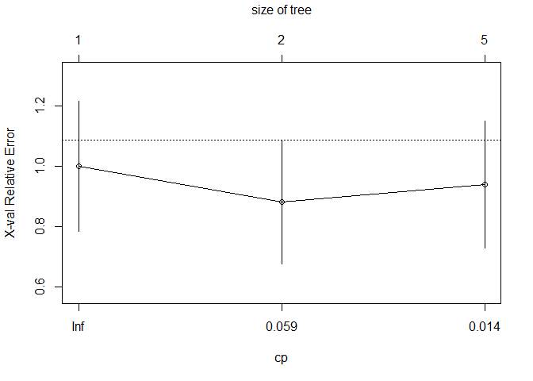
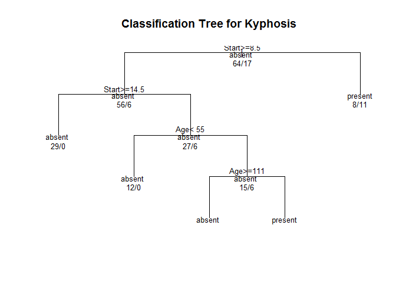

# Decision Trees
Jan-Philipp Kolb  
3 August 2016  


## [Decision Trees](http://www.statmethods.net/advstats/cart.html)


```r
library(rpart)
```

Grow a tree


```r
fit <- rpart(Kyphosis ~ Age + Number + Start,
   method="class", data=kyphosis)

printcp(fit) # display the results
```

```
## 
## Classification tree:
## rpart(formula = Kyphosis ~ Age + Number + Start, data = kyphosis, 
##     method = "class")
## 
## Variables actually used in tree construction:
## [1] Age   Start
## 
## Root node error: 17/81 = 0.20988
## 
## n= 81 
## 
##         CP nsplit rel error  xerror    xstd
## 1 0.176471      0   1.00000 1.00000 0.21559
## 2 0.019608      1   0.82353 0.88235 0.20565
## 3 0.010000      4   0.76471 0.94118 0.21078
```

```r
plotcp(fit) # visualize cross-validation results
```

<!-- -->

```r
summary(fit) # detailed summary of splits
```

```
## Call:
## rpart(formula = Kyphosis ~ Age + Number + Start, data = kyphosis, 
##     method = "class")
##   n= 81 
## 
##           CP nsplit rel error    xerror      xstd
## 1 0.17647059      0 1.0000000 1.0000000 0.2155872
## 2 0.01960784      1 0.8235294 0.8823529 0.2056488
## 3 0.01000000      4 0.7647059 0.9411765 0.2107780
## 
## Variable importance
##  Start    Age Number 
##     64     24     12 
## 
## Node number 1: 81 observations,    complexity param=0.1764706
##   predicted class=absent   expected loss=0.2098765  P(node) =1
##     class counts:    64    17
##    probabilities: 0.790 0.210 
##   left son=2 (62 obs) right son=3 (19 obs)
##   Primary splits:
##       Start  < 8.5  to the right, improve=6.762330, (0 missing)
##       Number < 5.5  to the left,  improve=2.866795, (0 missing)
##       Age    < 39.5 to the left,  improve=2.250212, (0 missing)
##   Surrogate splits:
##       Number < 6.5  to the left,  agree=0.802, adj=0.158, (0 split)
## 
## Node number 2: 62 observations,    complexity param=0.01960784
##   predicted class=absent   expected loss=0.09677419  P(node) =0.7654321
##     class counts:    56     6
##    probabilities: 0.903 0.097 
##   left son=4 (29 obs) right son=5 (33 obs)
##   Primary splits:
##       Start  < 14.5 to the right, improve=1.0205280, (0 missing)
##       Age    < 55   to the left,  improve=0.6848635, (0 missing)
##       Number < 4.5  to the left,  improve=0.2975332, (0 missing)
##   Surrogate splits:
##       Number < 3.5  to the left,  agree=0.645, adj=0.241, (0 split)
##       Age    < 16   to the left,  agree=0.597, adj=0.138, (0 split)
## 
## Node number 3: 19 observations
##   predicted class=present  expected loss=0.4210526  P(node) =0.2345679
##     class counts:     8    11
##    probabilities: 0.421 0.579 
## 
## Node number 4: 29 observations
##   predicted class=absent   expected loss=0  P(node) =0.3580247
##     class counts:    29     0
##    probabilities: 1.000 0.000 
## 
## Node number 5: 33 observations,    complexity param=0.01960784
##   predicted class=absent   expected loss=0.1818182  P(node) =0.4074074
##     class counts:    27     6
##    probabilities: 0.818 0.182 
##   left son=10 (12 obs) right son=11 (21 obs)
##   Primary splits:
##       Age    < 55   to the left,  improve=1.2467530, (0 missing)
##       Start  < 12.5 to the right, improve=0.2887701, (0 missing)
##       Number < 3.5  to the right, improve=0.1753247, (0 missing)
##   Surrogate splits:
##       Start  < 9.5  to the left,  agree=0.758, adj=0.333, (0 split)
##       Number < 5.5  to the right, agree=0.697, adj=0.167, (0 split)
## 
## Node number 10: 12 observations
##   predicted class=absent   expected loss=0  P(node) =0.1481481
##     class counts:    12     0
##    probabilities: 1.000 0.000 
## 
## Node number 11: 21 observations,    complexity param=0.01960784
##   predicted class=absent   expected loss=0.2857143  P(node) =0.2592593
##     class counts:    15     6
##    probabilities: 0.714 0.286 
##   left son=22 (14 obs) right son=23 (7 obs)
##   Primary splits:
##       Age    < 111  to the right, improve=1.71428600, (0 missing)
##       Start  < 12.5 to the right, improve=0.79365080, (0 missing)
##       Number < 3.5  to the right, improve=0.07142857, (0 missing)
## 
## Node number 22: 14 observations
##   predicted class=absent   expected loss=0.1428571  P(node) =0.1728395
##     class counts:    12     2
##    probabilities: 0.857 0.143 
## 
## Node number 23: 7 observations
##   predicted class=present  expected loss=0.4285714  P(node) =0.08641975
##     class counts:     3     4
##    probabilities: 0.429 0.571
```


```r
# plot tree
plot(fit, uniform=TRUE,
   main="Classification Tree for Kyphosis")
text(fit, use.n=TRUE, all=TRUE, cex=.8)
```

<!-- -->

## Links

- CRAN Task View [Machine & Statistical Learning](http://cran.r-project.org/web/views/MachineLearning.html)
