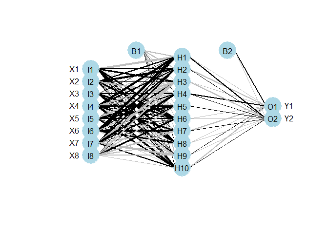
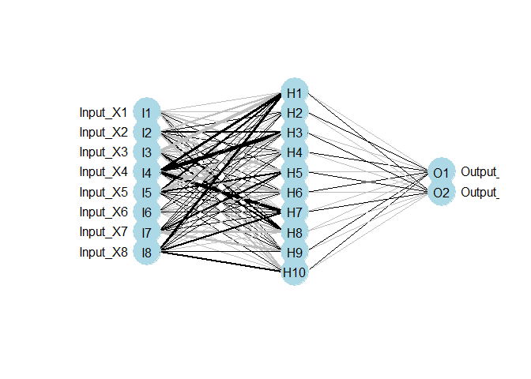

# Neural Networks
Jan-Philipp Kolb  
1 September 2016  


## [Choice Modeling vs. Neural Networks ](http://joelcadwell.blogspot.de/2016/03/understanding-statistical-models.html)


```r
install.packages("neuralnet")
install.packages("clusterGeneration")
install.packages("RSNNS")
install.packages("reshape")
```


```r
library("neuralnet")
```

## [Visualizing neural networks in R – update](https://www.r-bloggers.com/visualizing-neural-networks-in-r-update/)


```r
library("clusterGeneration")
seed.val<-2
set.seed(seed.val)
 
num.vars<-8
num.obs<-1000
 
#input variables
cov.mat<-genPositiveDefMat(num.vars,covMethod=c("unifcorrmat"))$Sigma
rand.vars<-mvrnorm(num.obs,rep(0,num.vars),Sigma=cov.mat)
 
#output variables
parms<-runif(num.vars,-10,10)
y1<-rand.vars %*% matrix(parms) + rnorm(num.obs,sd=20)
parms2<-runif(num.vars,-10,10)
y2<-rand.vars %*% matrix(parms2) + rnorm(num.obs,sd=20)
 
#final datasets
rand.vars<-data.frame(rand.vars)
resp<-data.frame(y1,y2)
names(resp)<-c('Y1','Y2')
dat.in<-data.frame(resp,rand.vars)
```


```r
#nnet function from nnet package
library(nnet)
set.seed(seed.val)
mod1<-nnet(rand.vars,resp,data=dat.in,size=10,linout=T)
```

```
## # weights:  112
## initial  value 4706527.663184 
## iter  10 value 1682227.931458
## iter  20 value 1522492.473996
## iter  30 value 1488373.057508
## iter  40 value 1400011.928744
## iter  50 value 1379128.695644
## iter  60 value 1372733.807931
## iter  70 value 1366736.955130
## iter  80 value 1354819.679789
## iter  90 value 1339423.092144
## iter 100 value 1330009.296320
## final  value 1330009.296320 
## stopped after 100 iterations
```

```r
#neuralnet function from neuralnet package, notice use of only one response
library(neuralnet)
form.in<-as.formula('Y1~X1+X2+X3+X4+X5+X6+X7+X8')
set.seed(seed.val)
mod2<-neuralnet(form.in,data=dat.in,hidden=10)
 
#mlp function from RSNNS package
library(RSNNS)
set.seed(seed.val)
mod3<-mlp(rand.vars, resp, size=10,linOut=T)
```


```r
#import the function from Github
library(devtools)
source_url('https://gist.github.com/fawda123/7471137/raw/cd6e6a0b0bdb4e065c597e52165e5ac887f5fe95/nnet_plot_update.r')
 
#plot each model
plot.nnet(mod1)
```

<!-- -->

```r
# plot.nnet(mod2)
plot.nnet(mod3)
```

<!-- -->


## Resources

- Michael Nielsen - [Using neural nets to recognize handwritten digits](http://neuralnetworksanddeeplearning.com/chap1.html)
