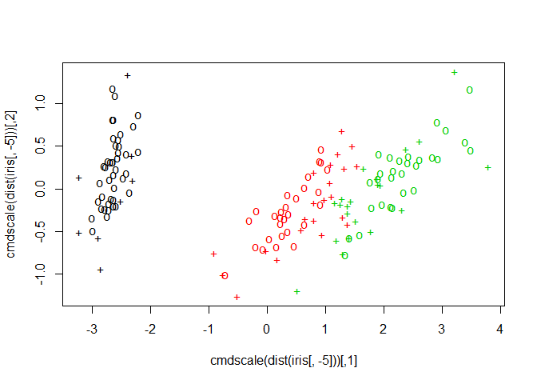

# Support Vector Machines
Jan-Philipp Kolb  
29 Juli 2016  


## Application Examples

- [SVM with the iris dataset](http://www.r-bloggers.com/using-support-vector-machines-as-flower-finders-name-that-iris/)


```r
library(e1071)
data(iris)
attach(iris)

x <- subset(iris, select = -Species)
y <- Species
model <- svm(x, y) 
```


```r
pred <- predict(model, x, decision.values = TRUE)
attr(pred, "decision.values")[1:4,]
```

```
##   setosa/versicolor setosa/virginica versicolor/virginica
## 1          1.196152         1.091757            0.6708810
## 2          1.064621         1.056185            0.8483518
## 3          1.180842         1.074542            0.6439798
## 4          1.110699         1.053012            0.6782041
```

```r
# visualize (classes by color, SV by crosses):
plot(cmdscale(dist(iris[,-5])),
     col = as.integer(iris[,5]),
     pch = c("o","+")[1:150 %in% model$index + 1])
```

<!-- -->

## [Using Support Vector Machines as Flower Finders: Name that Iris!](http://joelcadwell.blogspot.de/2016/05/using-support-vector-machines-as-flower.html)


```r
library(e1071)
data(iris)
attach(iris)
```

```
## The following objects are masked from iris (pos = 3):
## 
##     Petal.Length, Petal.Width, Sepal.Length, Sepal.Width, Species
```


```r
model <- svm(Species ~ ., data = iris)
```


## Links

- Joseph Rickert - [The 5th Tribe, Support Vector Machines and caret](https://www.r-bloggers.com/the-5th-tribe-support-vector-machines-and-caret/)


- [SVM - Wikipedia](https://en.wikipedia.org/wiki/Support_vector_machine)


- Chih-Wei Hsu et al - [A practical guide to SVM](https://www.csie.ntu.edu.tw/~cjlin/papers/guide/guide.pdf)

## German Links

- Florian Markowetz - [Klassifikation mit Support Vector Machines](http://lectures.molgen.mpg.de/statistik03/docs/Kapitel_16.pdf)
