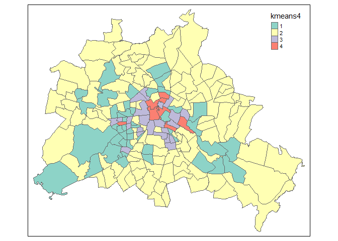

Buzz words
----------

-   Jaccard Coefficient
-   Single Linkage (Nearest neighbour)
-   Complete Linkage
-   Between Group Linkage
-   Within Groups Linkage

Get the data
------------

I will use data from [Openstreetmap](http://www.openstreetmap.org/) to
perform the cluster analysis. The data was downloaded using the
[Overpass API](http://wiki.openstreetmap.org/wiki/Overpass_API).

    load("data/berplz.RData")
    mydata <- berplz@data[,c("bar","biergarten","cafe","college","fast_food","ice_cream","pub","restaurant")]

    kable(head(mydata))

<table>
<thead>
<tr class="header">
<th></th>
<th align="right">bar</th>
<th align="right">biergarten</th>
<th align="right">cafe</th>
<th align="right">college</th>
<th align="right">fast_food</th>
<th align="right">ice_cream</th>
<th align="right">pub</th>
<th align="right">restaurant</th>
</tr>
</thead>
<tbody>
<tr class="odd">
<td>674</td>
<td align="right">15</td>
<td align="right">0</td>
<td align="right">51</td>
<td align="right">0</td>
<td align="right">13</td>
<td align="right">0</td>
<td align="right">15</td>
<td align="right">72</td>
</tr>
<tr class="even">
<td>675</td>
<td align="right">25</td>
<td align="right">0</td>
<td align="right">83</td>
<td align="right">3</td>
<td align="right">24</td>
<td align="right">3</td>
<td align="right">22</td>
<td align="right">174</td>
</tr>
<tr class="odd">
<td>676</td>
<td align="right">13</td>
<td align="right">1</td>
<td align="right">29</td>
<td align="right">0</td>
<td align="right">15</td>
<td align="right">0</td>
<td align="right">16</td>
<td align="right">42</td>
</tr>
<tr class="even">
<td>677</td>
<td align="right">14</td>
<td align="right">1</td>
<td align="right">58</td>
<td align="right">0</td>
<td align="right">36</td>
<td align="right">0</td>
<td align="right">9</td>
<td align="right">108</td>
</tr>
<tr class="odd">
<td>678</td>
<td align="right">1</td>
<td align="right">1</td>
<td align="right">16</td>
<td align="right">0</td>
<td align="right">9</td>
<td align="right">0</td>
<td align="right">3</td>
<td align="right">38</td>
</tr>
<tr class="even">
<td>679</td>
<td align="right">15</td>
<td align="right">3</td>
<td align="right">21</td>
<td align="right">2</td>
<td align="right">35</td>
<td align="right">0</td>
<td align="right">7</td>
<td align="right">43</td>
</tr>
</tbody>
</table>

K-Means Clustering
------------------

    fit <- kmeans(mydata, 4) # 5 cluster solution
    mydata <- data.frame(mydata, fit$cluster)
    berplz@data$kmeans4 <- as.factor(fit$cluster)

    ## Loading required package: sp

    ## Warning: package 'sp' was built under R version 3.2.5

    library(tmap)
    qtm(berplz,"kmeans4")

    ## Warning: Currect projection of shape berplz unknown. Long-lat (WGS84) is
    ## assumed.

[Hierarchical Clustering](https://stat.ethz.ch/R-manual/R-devel/library/stats/html/hclust.html)
-----------------------------------------------------------------------------------------------

Violent crime rates by US state

    hc <- hclust(dist(USArrests), "ave")
    plot(hc)

