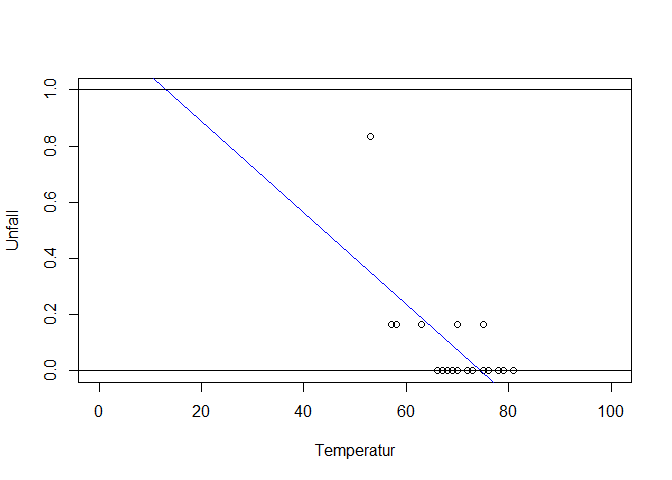
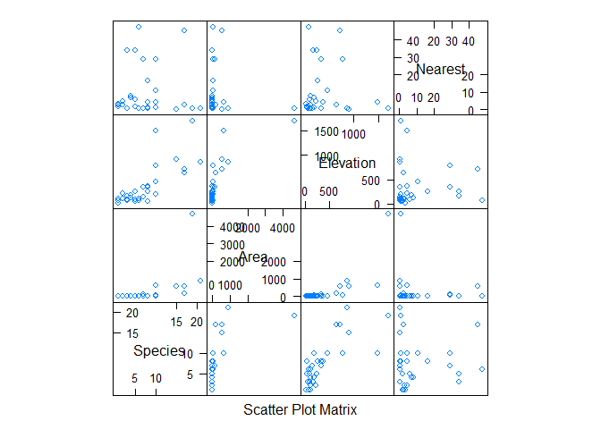
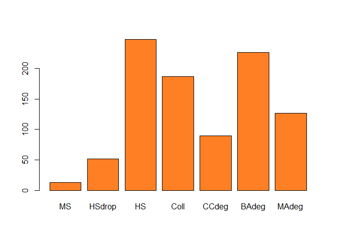
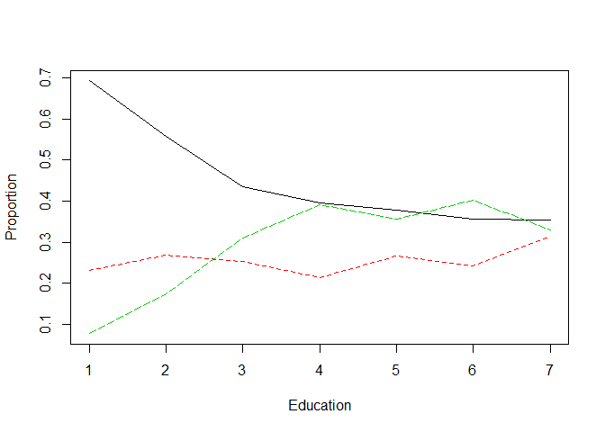
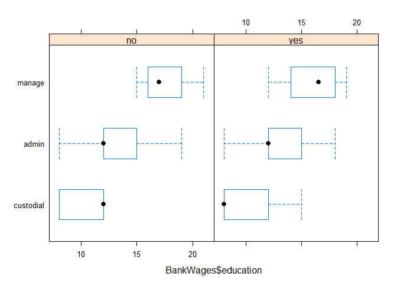
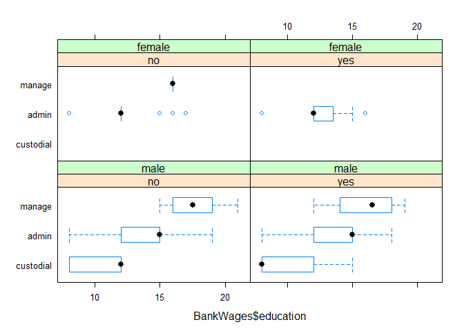
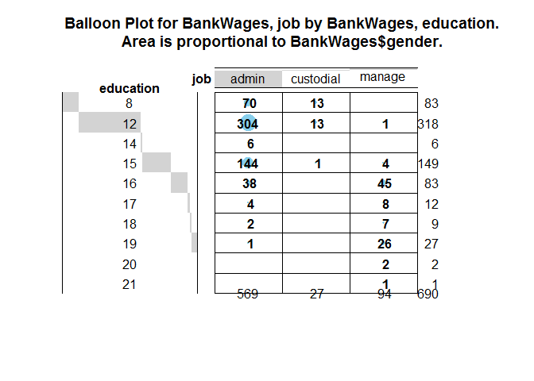

# Empirical Data Analysis
Jan-Philipp Kolb  
24 August 2016  


## Introduction

- [Spotty Statistics](http://www.statlit.org/pdf/2011SchieldISI6up.pdf)


## Data

- [Austrian PUF data](http://www.statistik.at/web_de/services/mikrodaten_fuer_forschung_und_lehre/kostenloser_download_von_testdaten/index.html)

- [Regional data RLP](http://www.statistik.rlp.de/regionaldaten/meine-heimat/)

- [Mietspiegel Munich](http://www.statistik.lmu.de/service/datenarchiv/miete/miete03.html)

## Tests


```r
N <- 1000
INC <- runif(N)
SEX <- sample(c(1,2),N,replace=T)

t.test(INC[SEX==1],INC[SEX==2])
```

```
## 
## 	Welch Two Sample t-test
## 
## data:  INC[SEX == 1] and INC[SEX == 2]
## t = 2.2011, df = 980.98, p-value = 0.02796
## alternative hypothesis: true difference in means is not equal to 0
## 95 percent confidence interval:
##  0.004333907 0.075588666
## sample estimates:
## mean of x mean of y 
## 0.5036351 0.4636738
```

- high p-value - we cannot reject the null hypothesis

## Regression with categorical y-variable


```r
library(faraway)
data(orings)
plot(damage/6 ~ temp, orings, xlim=c(0,100), ylim=c(0,1),
    xlab="Temperatur", ylab="Unfall")
lmod <- lm(damage/6 ~ temp, orings)
abline(lmod, col=4); abline(h=0); abline(h=1)
```

<!-- -->


```r
summary(m<-lm ( am ~ hp + wt,data=mtcars))
```

```
## 
## Call:
## lm(formula = am ~ hp + wt, data = mtcars)
## 
## Residuals:
##     Min      1Q  Median      3Q     Max 
## -0.6309 -0.2562 -0.1099  0.3039  0.5301 
## 
## Coefficients:
##              Estimate Std. Error t value Pr(>|t|)    
## (Intercept)  1.547430   0.211046   7.332 4.46e-08 ***
## hp           0.002738   0.001192   2.297    0.029 *  
## wt          -0.479556   0.083523  -5.742 3.24e-06 ***
## ---
## Signif. codes:  0 '***' 0.001 '**' 0.01 '*' 0.05 '.' 0.1 ' ' 1
## 
## Residual standard error: 0.3423 on 29 degrees of freedom
## Multiple R-squared:  0.5597,	Adjusted R-squared:  0.5293 
## F-statistic: 18.43 on 2 and 29 DF,  p-value: 6.833e-06
```

```r
predict(m,data.frame(hp=65,wt=2))
```

```
##         1 
## 0.7663062
```

```r
predict(m,data.frame(hp=180,wt=2))
```

```
##        1 
## 1.081208
```


## Galapagos Example


```r
library(faraway)
data(gala)
gala<-gala[,-2]
gala$Species <- round(sqrt(gala$Species))
head(gala)
```

```
##              Species  Area Elevation Nearest Scruz Adjacent
## Baltra             8 25.09       346     0.6   0.6     1.84
## Bartolome          6  1.24       109     0.6  26.3   572.33
## Caldwell           2  0.21       114     2.8  58.7     0.78
## Champion           5  0.10        46     1.9  47.4     0.18
## Coamano            1  0.05        77     1.9   1.9   903.82
## Daphne.Major       4  0.34       119     8.0   8.0     1.84
```


```r
 library(solaR)
 splom(gala[,c(1,2,3,4)])
```

<!-- -->


```r
summary(mod1<-lm(sqrt(Species)~Area+Elevation+Nearest,gala))
```

```
## 
## Call:
## lm(formula = sqrt(Species) ~ Area + Elevation + Nearest, data = gala)
## 
## Residuals:
##      Min       1Q   Median       3Q      Max 
## -1.42896 -0.29396  0.09255  0.40199  1.21080 
## 
## Coefficients:
##               Estimate Std. Error t value Pr(>|t|)    
## (Intercept)  1.845e+00  2.059e-01   8.960 1.98e-09 ***
## Area        -9.384e-05  2.357e-04  -0.398 0.693734    
## Elevation    1.861e-03  4.800e-04   3.877 0.000644 ***
## Nearest      5.899e-03  9.375e-03   0.629 0.534718    
## ---
## Signif. codes:  0 '***' 0.001 '**' 0.01 '*' 0.05 '.' 0.1 ' ' 1
## 
## Residual standard error: 0.7118 on 26 degrees of freedom
## Multiple R-squared:  0.5401,	Adjusted R-squared:  0.487 
## F-statistic: 10.18 on 3 and 26 DF,  p-value: 0.0001305
```


```r
predict(mod1,data.frame(Area = 200000,Elevation=40,Nearest=8))
```

```
##         1 
## -16.80054
```

[Information about binary data](http://stat.ethz.ch/education/semesters/WS_2005_06/asr/folien.pdf)


## Goodness-of-fit


```r
summary(glm(am ~ hp + wt, data=mtcars,family=binomial) )
```

```
## 
## Call:
## glm(formula = am ~ hp + wt, family = binomial, data = mtcars)
## 
## Deviance Residuals: 
##     Min       1Q   Median       3Q      Max  
## -2.2537  -0.1568  -0.0168   0.1543   1.3449  
## 
## Coefficients:
##             Estimate Std. Error z value Pr(>|z|)   
## (Intercept) 18.86630    7.44356   2.535  0.01126 * 
## hp           0.03626    0.01773   2.044  0.04091 * 
## wt          -8.08348    3.06868  -2.634  0.00843 **
## ---
## Signif. codes:  0 '***' 0.001 '**' 0.01 '*' 0.05 '.' 0.1 ' ' 1
## 
## (Dispersion parameter for binomial family taken to be 1)
## 
##     Null deviance: 43.230  on 31  degrees of freedom
## Residual deviance: 10.059  on 29  degrees of freedom
## AIC: 16.059
## 
## Number of Fisher Scoring iterations: 8
```

## Multinomial Regression


```r
library(MASS)
example(birthwt)
```

```
## 
## brthwt> bwt <- with(birthwt, {
## brthwt+ race <- factor(race, labels = c("white", "black", "other"))
## brthwt+ ptd <- factor(ptl > 0)
## brthwt+ ftv <- factor(ftv)
## brthwt+ levels(ftv)[-(1:2)] <- "2+"
## brthwt+ data.frame(low = factor(low), age, lwt, race, smoke = (smoke > 0),
## brthwt+            ptd, ht = (ht > 0), ui = (ui > 0), ftv)
## brthwt+ })
## 
## brthwt> options(contrasts = c("contr.treatment", "contr.poly"))
## 
## brthwt> glm(low ~ ., binomial, bwt)
## 
## Call:  glm(formula = low ~ ., family = binomial, data = bwt)
## 
## Coefficients:
## (Intercept)          age          lwt    raceblack    raceother  
##     0.82302     -0.03723     -0.01565      1.19241      0.74068  
##   smokeTRUE      ptdTRUE       htTRUE       uiTRUE         ftv1  
##     0.75553      1.34376      1.91317      0.68020     -0.43638  
##       ftv2+  
##     0.17901  
## 
## Degrees of Freedom: 188 Total (i.e. Null);  178 Residual
## Null Deviance:	    234.7 
## Residual Deviance: 195.5 	AIC: 217.5
```

```r
head(bwt)
```

```
##   low age lwt  race smoke   ptd    ht    ui ftv
## 1   0  19 182 black FALSE FALSE FALSE  TRUE   0
## 2   0  33 155 other FALSE FALSE FALSE FALSE  2+
## 3   0  20 105 white  TRUE FALSE FALSE FALSE   1
## 4   0  21 108 white  TRUE FALSE FALSE  TRUE  2+
## 5   0  18 107 white  TRUE FALSE FALSE  TRUE   0
## 6   0  21 124 other FALSE FALSE FALSE FALSE   0
```

```r
summary(bwt)
```

```
##  low          age             lwt           race      smoke        
##  0:130   Min.   :14.00   Min.   : 80.0   white:96   Mode :logical  
##  1: 59   1st Qu.:19.00   1st Qu.:110.0   black:26   FALSE:115      
##          Median :23.00   Median :121.0   other:67   TRUE :74       
##          Mean   :23.24   Mean   :129.8              NA's :0        
##          3rd Qu.:26.00   3rd Qu.:140.0                             
##          Max.   :45.00   Max.   :250.0                             
##     ptd          ht              ui          ftv     
##  FALSE:159   Mode :logical   Mode :logical   0 :100  
##  TRUE : 30   FALSE:177       FALSE:161       1 : 47  
##              TRUE :12        TRUE :28        2+: 42  
##              NA's :0         NA's :0                 
##                                                      
## 
```


```r
library(nnet)

multinom(formula = low ~ ., data = bwt)
```

```
## # weights:  12 (11 variable)
## initial  value 131.004817 
## iter  10 value 98.029803
## final  value 97.737759 
## converged
```

```
## Call:
## multinom(formula = low ~ ., data = bwt)
## 
## Coefficients:
## (Intercept)         age         lwt   raceblack   raceother   smokeTRUE 
##  0.82320102 -0.03723828 -0.01565359  1.19240391  0.74065606  0.75550487 
##     ptdTRUE      htTRUE      uiTRUE        ftv1       ftv2+ 
##  1.34375901  1.91320116  0.68020207 -0.43638470  0.17900392 
## 
## Residual Deviance: 195.4755 
## AIC: 217.4755
```

## Election Example


```r
head(nes96[,c(8:10)])
```

```
##    educ   income    vote
## 1    HS $3Kminus    Dole
## 2  Coll $3Kminus Clinton
## 3 BAdeg $3Kminus Clinton
## 4 BAdeg $3Kminus Clinton
## 5 BAdeg $3Kminus Clinton
## 6  Coll $3Kminus Clinton
```

```r
data(nes96)
sPID <- nes96$PID

summary(sPID)
```

```
##  strDem weakDem  indDem  indind  indRep weakRep  strRep 
##     200     180     108      37      94     150     175
```

```r
levels(sPID) <- c("Democrat","Democrat","Independent",
"Independent", "Independent","Republican","Republican")

summary(sPID)
```

```
##    Democrat Independent  Republican 
##         380         239         325
```

```r
inca <- c(1.5,4,6,8,9.5,10.5,11.5,12.5,13.5,14.5,16,18.5,
  21,23.5,27.5,32.5,37.5,42.5,47.5,55,67.5,82.5,97.5,115)
 nincome <- inca[unclass(nes96$income)]
 summary(nincome)
```

```
##    Min. 1st Qu.  Median    Mean 3rd Qu.    Max. 
##    1.50   23.50   37.50   46.58   67.50  115.00
```

```r
 barplot(table(nes96$educ),col="chocolate1")
```

<!-- -->


```r
matplot(prop.table(table(nes96$educ,sPID),1),type="l",
xlab="Education",ylab="Proportion",lty=c(1,2,5))
```

<!-- -->


```r
library(nnet)
mmod <- multinom(sPID ~ age + educ + nincome, nes96)
```

```
## # weights:  30 (18 variable)
## initial  value 1037.090001 
## iter  10 value 990.568608
## iter  20 value 984.319052
## final  value 984.166272 
## converged
```

```r
 mmodi <- step(mmod)
```

```
## Start:  AIC=2004.33
## sPID ~ age + educ + nincome
## 
## trying - age 
## # weights:  27 (16 variable)
## initial  value 1037.090001 
## iter  10 value 988.896864
## iter  20 value 985.822223
## final  value 985.812737 
## converged
## trying - educ 
## # weights:  12 (6 variable)
## initial  value 1037.090001 
## iter  10 value 992.269502
## final  value 992.269484 
## converged
## trying - nincome 
## # weights:  27 (16 variable)
## initial  value 1037.090001 
## iter  10 value 1009.025560
## iter  20 value 1006.961593
## final  value 1006.955275 
## converged
##           Df      AIC
## - educ     6 1996.539
## - age     16 2003.625
## <none>    18 2004.333
## - nincome 16 2045.911
## # weights:  12 (6 variable)
## initial  value 1037.090001 
## iter  10 value 992.269502
## final  value 992.269484 
## converged
## 
## Step:  AIC=1996.54
## sPID ~ age + nincome
## 
## trying - age 
## # weights:  9 (4 variable)
## initial  value 1037.090001 
## final  value 992.712152 
## converged
## trying - nincome 
## # weights:  9 (4 variable)
## initial  value 1037.090001 
## final  value 1020.425203 
## converged
##           Df      AIC
## - age      4 1993.424
## <none>     6 1996.539
## - nincome  4 2048.850
## # weights:  9 (4 variable)
## initial  value 1037.090001 
## final  value 992.712152 
## converged
## 
## Step:  AIC=1993.42
## sPID ~ nincome
## 
## trying - nincome 
## # weights:  6 (2 variable)
## initial  value 1037.090001 
## final  value 1020.636052 
## converged
##           Df      AIC
## <none>     4 1993.424
## - nincome  2 2045.272
```

## [Prediction](http://www.dartmouth.edu/~chance/teaching_aids/books_articles/probability_book/Chapters1-12.pdf)


```r
il <- 5
 predict(mmodi,data.frame(nincome=il),type="probs")
```

```
##    Democrat Independent  Republican 
##   0.5691492   0.1904984   0.2403524
```

```r
summary(mmodi)
```

```
## Call:
## multinom(formula = sPID ~ nincome, data = nes96)
## 
## Coefficients:
##             (Intercept)    nincome
## Independent  -1.1749331 0.01608683
## Republican   -0.9503591 0.01766457
## 
## Std. Errors:
##             (Intercept)     nincome
## Independent   0.1536103 0.002849738
## Republican    0.1416859 0.002652532
## 
## Residual Deviance: 1985.424 
## AIC: 1993.424
```

```r
predict(mmodi,data.frame(nincome=0),type="probs")
```

```
##    Democrat Independent  Republican 
##   0.5898168   0.1821588   0.2280244
```

We can see more explicitly what this means by predicting probabilities for incomes 1000 Dollar apart and then computing the log-odds:


```r
(pp <-
predict(mmodi,data.frame(nincome=c(0,1)),type="probs"))
```

```
##    Democrat Independent Republican
## 1 0.5898168   0.1821588  0.2280244
## 2 0.5857064   0.1838228  0.2304708
```

- Akaike-Information criteria (AIC)
- Wald-Test
- Likelihood-Ratio-Test


##  Ordinal Regression

- Ordered response model
- Latent variable in ordered response model
- Proportional odds logistic regression (polr)


```r
library(MASS)
?polr
pomod <- polr(sPID ~ age + educ + nincome, nes96)
c(deviance(pomod), pomod$edf)
```

```
## [1] 1984.211   10.000
```

```r
pomodi <- step(pomod)
```

```
## Start:  AIC=2004.21
## sPID ~ age + educ + nincome
## 
##           Df    AIC
## - educ     6 2002.8
## <none>       2004.2
## - age      1 2004.4
## - nincome  1 2038.6
## 
## Step:  AIC=2002.83
## sPID ~ age + nincome
## 
##           Df    AIC
## - age      1 2001.4
## <none>       2002.8
## - nincome  1 2047.2
## 
## Step:  AIC=2001.36
## sPID ~ nincome
## 
##           Df    AIC
## <none>       2001.4
## - nincome  1 2045.3
```

```r
summary(pomodi)
```

```
## Call:
## polr(formula = sPID ~ nincome, data = nes96)
## 
## Coefficients:
##           Value Std. Error t value
## nincome 0.01312   0.001971   6.657
## 
## Intercepts:
##                        Value   Std. Error t value
## Democrat|Independent    0.2091  0.1123     1.8627
## Independent|Republican  1.2916  0.1201    10.7526
## 
## Residual Deviance: 1995.363 
## AIC: 2001.363
```

```r
ilogit(0.209)
```

```
## [1] 0.5520606
```

```r
ilogit(1.292)-ilogit(0.209)
```

```
## [1] 0.2324249
```

```r
predict(pomodi,data.frame(nincome=il,row.names=il),  type="probs")
```

```
##    Democrat Independent  Republican 
##   0.5358149   0.2372954   0.2268898
```

## Applied Econometrics with R (AER)


```r
install.packages("AER")
```


```r
data("BankWages", package="AER")

summary(BankWages)
```

```
##         job        education        gender    minority 
##  custodial: 27   Min.   : 8.00   male  :258   no :370  
##  admin    :363   1st Qu.:12.00   female:216   yes:104  
##  manage   : 84   Median :12.00                         
##                  Mean   :13.49                         
##                  3rd Qu.:15.00                         
##                  Max.   :21.00
```


```r
library(lattice)
bwplot(BankWages$job ~BankWages$education | 
  BankWages$minority)
```

<!-- -->

```r
bwplot(BankWages$job ~BankWages$education | 
  BankWages$minority + BankWages$gender)
```

<!-- -->


```r
tab <- table(BankWages$job, BankWages$education)
```


```r
install.packages("gplots")
```


```r
library(gplots)
  balloonplot(BankWages$job, BankWages$education,
  BankWages$gender, xlab="job", ylab ="education")
```

<!-- -->

