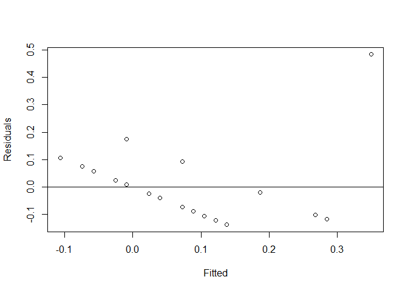
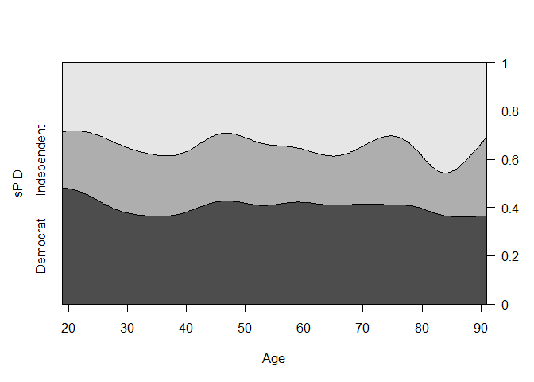
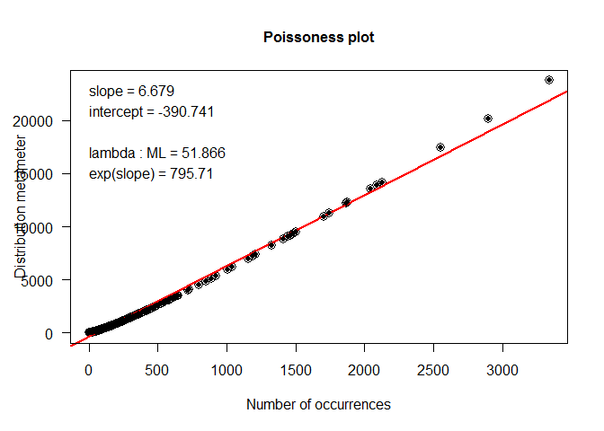
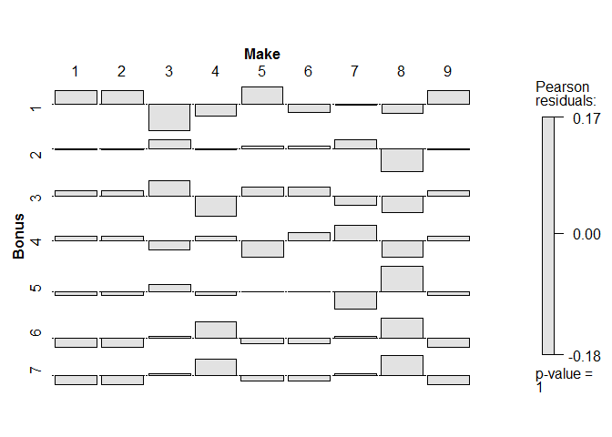
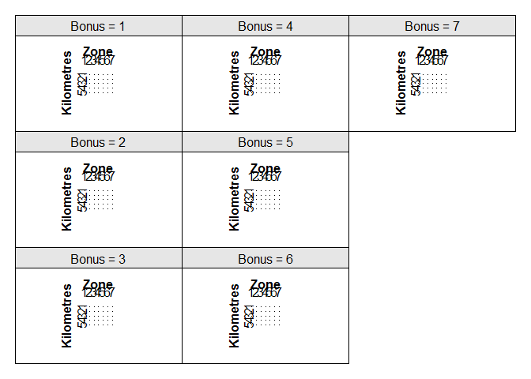
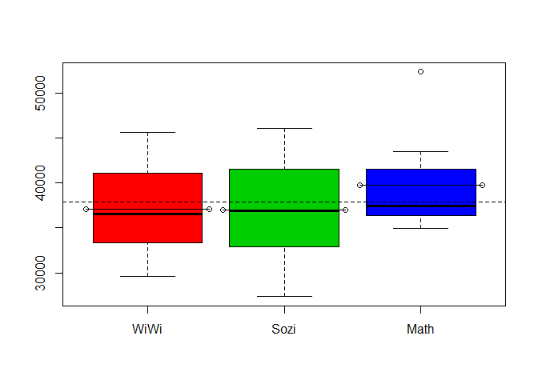
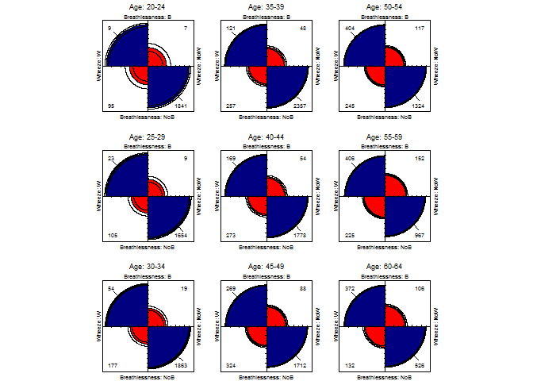
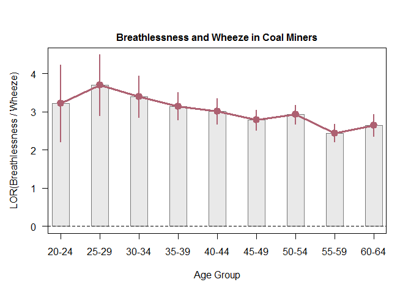
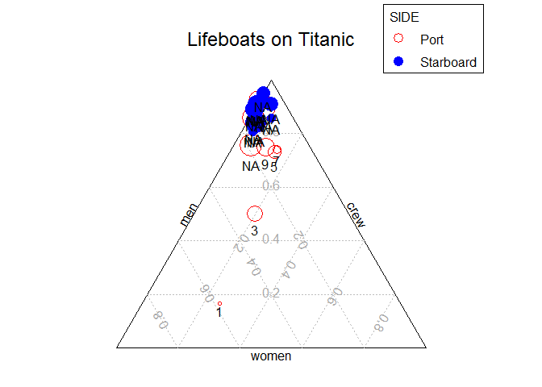
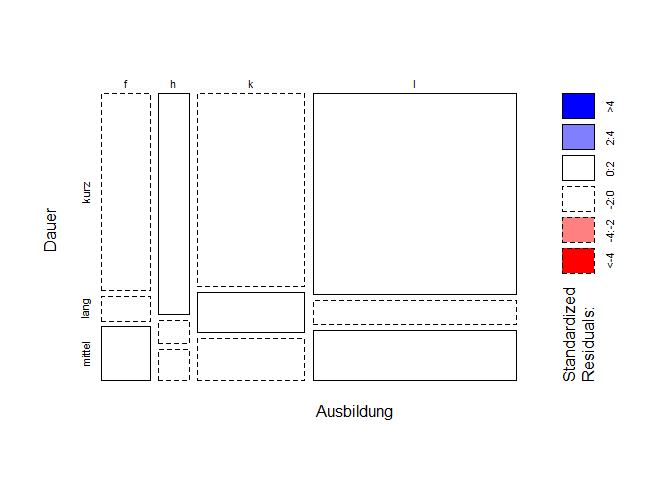

# Empirical Data Analysis
Jan-Philipp Kolb  
24 August 2016  


## Introduction

- [Spotty Statistics](http://www.statlit.org/pdf/2011SchieldISI6up.pdf)


## Data

- [Austrian PUF data](http://www.statistik.at/web_de/services/mikrodaten_fuer_forschung_und_lehre/kostenloser_download_von_testdaten/index.html)

- [Regional data RLP](http://www.statistik.rlp.de/regionaldaten/meine-heimat/)

- [Mietspiegel Munich](http://www.statistik.lmu.de/service/datenarchiv/miete/miete03.html)

## Tests


```r
N <- 1000
INC <- runif(N)
SEX <- sample(c(1,2),N,replace=T)

t.test(INC[SEX==1],INC[SEX==2])
```

```
## 
## 	Welch Two Sample t-test
## 
## data:  INC[SEX == 1] and INC[SEX == 2]
## t = 0.20898, df = 997.25, p-value = 0.8345
## alternative hypothesis: true difference in means is not equal to 0
## 95 percent confidence interval:
##  -0.03283382  0.04066065
## sample estimates:
## mean of x mean of y 
## 0.5034632 0.4995498
```

- high p-value - we cannot reject the null hypothesis

## Regression with categorical y-variable


```r
library(faraway)
data(orings)
plot(damage/6 ~ temp, orings, xlim=c(0,100), ylim=c(0,1),
    xlab="Temperatur", ylab="Unfall")
lmod <- lm(damage/6 ~ temp, orings)
abline(lmod, col=4); abline(h=0); abline(h=1)
```

<!-- -->


```r
summary(m<-lm ( am ~ hp + wt,data=mtcars))
```

```
## 
## Call:
## lm(formula = am ~ hp + wt, data = mtcars)
## 
## Residuals:
##     Min      1Q  Median      3Q     Max 
## -0.6309 -0.2562 -0.1099  0.3039  0.5301 
## 
## Coefficients:
##              Estimate Std. Error t value Pr(>|t|)    
## (Intercept)  1.547430   0.211046   7.332 4.46e-08 ***
## hp           0.002738   0.001192   2.297    0.029 *  
## wt          -0.479556   0.083523  -5.742 3.24e-06 ***
## ---
## Signif. codes:  0 '***' 0.001 '**' 0.01 '*' 0.05 '.' 0.1 ' ' 1
## 
## Residual standard error: 0.3423 on 29 degrees of freedom
## Multiple R-squared:  0.5597,	Adjusted R-squared:  0.5293 
## F-statistic: 18.43 on 2 and 29 DF,  p-value: 6.833e-06
```

```r
predict(m,data.frame(hp=65,wt=2))
```

```
##         1 
## 0.7663062
```

```r
predict(m,data.frame(hp=180,wt=2))
```

```
##        1 
## 1.081208
```


## Galapagos Example


```r
library(faraway)
data(gala)
gala<-gala[,-2]
gala$Species <- round(sqrt(gala$Species))
head(gala)
```

```
##              Species  Area Elevation Nearest Scruz Adjacent
## Baltra             8 25.09       346     0.6   0.6     1.84
## Bartolome          6  1.24       109     0.6  26.3   572.33
## Caldwell           2  0.21       114     2.8  58.7     0.78
## Champion           5  0.10        46     1.9  47.4     0.18
## Coamano            1  0.05        77     1.9   1.9   903.82
## Daphne.Major       4  0.34       119     8.0   8.0     1.84
```


```r
 library(solaR)
 splom(gala[,c(1,2,3,4)])
```

<!-- -->


```r
summary(mod1<-lm(sqrt(Species)~Area+Elevation+Nearest,gala))
```

```
## 
## Call:
## lm(formula = sqrt(Species) ~ Area + Elevation + Nearest, data = gala)
## 
## Residuals:
##      Min       1Q   Median       3Q      Max 
## -1.42896 -0.29396  0.09255  0.40199  1.21080 
## 
## Coefficients:
##               Estimate Std. Error t value Pr(>|t|)    
## (Intercept)  1.845e+00  2.059e-01   8.960 1.98e-09 ***
## Area        -9.384e-05  2.357e-04  -0.398 0.693734    
## Elevation    1.861e-03  4.800e-04   3.877 0.000644 ***
## Nearest      5.899e-03  9.375e-03   0.629 0.534718    
## ---
## Signif. codes:  0 '***' 0.001 '**' 0.01 '*' 0.05 '.' 0.1 ' ' 1
## 
## Residual standard error: 0.7118 on 26 degrees of freedom
## Multiple R-squared:  0.5401,	Adjusted R-squared:  0.487 
## F-statistic: 10.18 on 3 and 26 DF,  p-value: 0.0001305
```


```r
predict(mod1,data.frame(Area = 200000,Elevation=40,Nearest=8))
```

```
##         1 
## -16.80054
```

[Information about binary data](http://stat.ethz.ch/education/semesters/WS_2005_06/asr/folien.pdf)


## Goodness-of-fit


```r
summary(glm(am ~ hp + wt, data=mtcars,family=binomial) )
```

```
## 
## Call:
## glm(formula = am ~ hp + wt, family = binomial, data = mtcars)
## 
## Deviance Residuals: 
##     Min       1Q   Median       3Q      Max  
## -2.2537  -0.1568  -0.0168   0.1543   1.3449  
## 
## Coefficients:
##             Estimate Std. Error z value Pr(>|z|)   
## (Intercept) 18.86630    7.44356   2.535  0.01126 * 
## hp           0.03626    0.01773   2.044  0.04091 * 
## wt          -8.08348    3.06868  -2.634  0.00843 **
## ---
## Signif. codes:  0 '***' 0.001 '**' 0.01 '*' 0.05 '.' 0.1 ' ' 1
## 
## (Dispersion parameter for binomial family taken to be 1)
## 
##     Null deviance: 43.230  on 31  degrees of freedom
## Residual deviance: 10.059  on 29  degrees of freedom
## AIC: 16.059
## 
## Number of Fisher Scoring iterations: 8
```

## Multinomial Regression


```r
library(MASS)
example(birthwt)
```

```
## 
## brthwt> bwt <- with(birthwt, {
## brthwt+ race <- factor(race, labels = c("white", "black", "other"))
## brthwt+ ptd <- factor(ptl > 0)
## brthwt+ ftv <- factor(ftv)
## brthwt+ levels(ftv)[-(1:2)] <- "2+"
## brthwt+ data.frame(low = factor(low), age, lwt, race, smoke = (smoke > 0),
## brthwt+            ptd, ht = (ht > 0), ui = (ui > 0), ftv)
## brthwt+ })
## 
## brthwt> options(contrasts = c("contr.treatment", "contr.poly"))
## 
## brthwt> glm(low ~ ., binomial, bwt)
## 
## Call:  glm(formula = low ~ ., family = binomial, data = bwt)
## 
## Coefficients:
## (Intercept)          age          lwt    raceblack    raceother  
##     0.82302     -0.03723     -0.01565      1.19241      0.74068  
##   smokeTRUE      ptdTRUE       htTRUE       uiTRUE         ftv1  
##     0.75553      1.34376      1.91317      0.68020     -0.43638  
##       ftv2+  
##     0.17901  
## 
## Degrees of Freedom: 188 Total (i.e. Null);  178 Residual
## Null Deviance:	    234.7 
## Residual Deviance: 195.5 	AIC: 217.5
```

```r
head(bwt)
```

```
##   low age lwt  race smoke   ptd    ht    ui ftv
## 1   0  19 182 black FALSE FALSE FALSE  TRUE   0
## 2   0  33 155 other FALSE FALSE FALSE FALSE  2+
## 3   0  20 105 white  TRUE FALSE FALSE FALSE   1
## 4   0  21 108 white  TRUE FALSE FALSE  TRUE  2+
## 5   0  18 107 white  TRUE FALSE FALSE  TRUE   0
## 6   0  21 124 other FALSE FALSE FALSE FALSE   0
```

```r
summary(bwt)
```

```
##  low          age             lwt           race      smoke        
##  0:130   Min.   :14.00   Min.   : 80.0   white:96   Mode :logical  
##  1: 59   1st Qu.:19.00   1st Qu.:110.0   black:26   FALSE:115      
##          Median :23.00   Median :121.0   other:67   TRUE :74       
##          Mean   :23.24   Mean   :129.8              NA's :0        
##          3rd Qu.:26.00   3rd Qu.:140.0                             
##          Max.   :45.00   Max.   :250.0                             
##     ptd          ht              ui          ftv     
##  FALSE:159   Mode :logical   Mode :logical   0 :100  
##  TRUE : 30   FALSE:177       FALSE:161       1 : 47  
##              TRUE :12        TRUE :28        2+: 42  
##              NA's :0         NA's :0                 
##                                                      
## 
```


```r
library(nnet)

multinom(formula = low ~ ., data = bwt)
```

```
## # weights:  12 (11 variable)
## initial  value 131.004817 
## iter  10 value 98.029803
## final  value 97.737759 
## converged
```

```
## Call:
## multinom(formula = low ~ ., data = bwt)
## 
## Coefficients:
## (Intercept)         age         lwt   raceblack   raceother   smokeTRUE 
##  0.82320102 -0.03723828 -0.01565359  1.19240391  0.74065606  0.75550487 
##     ptdTRUE      htTRUE      uiTRUE        ftv1       ftv2+ 
##  1.34375901  1.91320116  0.68020207 -0.43638470  0.17900392 
## 
## Residual Deviance: 195.4755 
## AIC: 217.4755
```

## Election Example


```r
head(nes96[,c(8:10)])
```

```
##    educ   income    vote
## 1    HS $3Kminus    Dole
## 2  Coll $3Kminus Clinton
## 3 BAdeg $3Kminus Clinton
## 4 BAdeg $3Kminus Clinton
## 5 BAdeg $3Kminus Clinton
## 6  Coll $3Kminus Clinton
```

```r
data(nes96)
sPID <- nes96$PID

summary(sPID)
```

```
##  strDem weakDem  indDem  indind  indRep weakRep  strRep 
##     200     180     108      37      94     150     175
```

```r
levels(sPID) <- c("Democrat","Democrat","Independent",
"Independent", "Independent","Republican","Republican")

summary(sPID)
```

```
##    Democrat Independent  Republican 
##         380         239         325
```

```r
inca <- c(1.5,4,6,8,9.5,10.5,11.5,12.5,13.5,14.5,16,18.5,
  21,23.5,27.5,32.5,37.5,42.5,47.5,55,67.5,82.5,97.5,115)
 nincome <- inca[unclass(nes96$income)]
 summary(nincome)
```

```
##    Min. 1st Qu.  Median    Mean 3rd Qu.    Max. 
##    1.50   23.50   37.50   46.58   67.50  115.00
```

```r
 barplot(table(nes96$educ),col="chocolate1")
```

<!-- -->


```r
matplot(prop.table(table(nes96$educ,sPID),1),type="l",
xlab="Education",ylab="Proportion",lty=c(1,2,5))
```

<!-- -->


```r
library(nnet)
mmod <- multinom(sPID ~ age + educ + nincome, nes96)
```

```
## # weights:  30 (18 variable)
## initial  value 1037.090001 
## iter  10 value 990.568608
## iter  20 value 984.319052
## final  value 984.166272 
## converged
```

```r
 mmodi <- step(mmod)
```

```
## Start:  AIC=2004.33
## sPID ~ age + educ + nincome
## 
## trying - age 
## # weights:  27 (16 variable)
## initial  value 1037.090001 
## iter  10 value 988.896864
## iter  20 value 985.822223
## final  value 985.812737 
## converged
## trying - educ 
## # weights:  12 (6 variable)
## initial  value 1037.090001 
## iter  10 value 992.269502
## final  value 992.269484 
## converged
## trying - nincome 
## # weights:  27 (16 variable)
## initial  value 1037.090001 
## iter  10 value 1009.025560
## iter  20 value 1006.961593
## final  value 1006.955275 
## converged
##           Df      AIC
## - educ     6 1996.539
## - age     16 2003.625
## <none>    18 2004.333
## - nincome 16 2045.911
## # weights:  12 (6 variable)
## initial  value 1037.090001 
## iter  10 value 992.269502
## final  value 992.269484 
## converged
## 
## Step:  AIC=1996.54
## sPID ~ age + nincome
## 
## trying - age 
## # weights:  9 (4 variable)
## initial  value 1037.090001 
## final  value 992.712152 
## converged
## trying - nincome 
## # weights:  9 (4 variable)
## initial  value 1037.090001 
## final  value 1020.425203 
## converged
##           Df      AIC
## - age      4 1993.424
## <none>     6 1996.539
## - nincome  4 2048.850
## # weights:  9 (4 variable)
## initial  value 1037.090001 
## final  value 992.712152 
## converged
## 
## Step:  AIC=1993.42
## sPID ~ nincome
## 
## trying - nincome 
## # weights:  6 (2 variable)
## initial  value 1037.090001 
## final  value 1020.636052 
## converged
##           Df      AIC
## <none>     4 1993.424
## - nincome  2 2045.272
```

## [Prediction](http://www.dartmouth.edu/~chance/teaching_aids/books_articles/probability_book/Chapters1-12.pdf)


```r
il <- 5
 predict(mmodi,data.frame(nincome=il),type="probs")
```

```
##    Democrat Independent  Republican 
##   0.5691492   0.1904984   0.2403524
```

```r
summary(mmodi)
```

```
## Call:
## multinom(formula = sPID ~ nincome, data = nes96)
## 
## Coefficients:
##             (Intercept)    nincome
## Independent  -1.1749331 0.01608683
## Republican   -0.9503591 0.01766457
## 
## Std. Errors:
##             (Intercept)     nincome
## Independent   0.1536103 0.002849738
## Republican    0.1416859 0.002652532
## 
## Residual Deviance: 1985.424 
## AIC: 1993.424
```

```r
predict(mmodi,data.frame(nincome=0),type="probs")
```

```
##    Democrat Independent  Republican 
##   0.5898168   0.1821588   0.2280244
```

We can see more explicitly what this means by predicting probabilities for incomes 1000 Dollar apart and then computing the log-odds:


```r
(pp <-
predict(mmodi,data.frame(nincome=c(0,1)),type="probs"))
```

```
##    Democrat Independent Republican
## 1 0.5898168   0.1821588  0.2280244
## 2 0.5857064   0.1838228  0.2304708
```

- Akaike-Information criteria (AIC)
- Wald-Test
- Likelihood-Ratio-Test


##  Ordinal Regression

- Ordered response model
- Latent variable in ordered response model
- Proportional odds logistic regression (polr)


```r
library(MASS)
?polr
pomod <- polr(sPID ~ age + educ + nincome, nes96)
c(deviance(pomod), pomod$edf)
```

```
## [1] 1984.211   10.000
```

```r
pomodi <- step(pomod)
```

```
## Start:  AIC=2004.21
## sPID ~ age + educ + nincome
## 
##           Df    AIC
## - educ     6 2002.8
## <none>       2004.2
## - age      1 2004.4
## - nincome  1 2038.6
## 
## Step:  AIC=2002.83
## sPID ~ age + nincome
## 
##           Df    AIC
## - age      1 2001.4
## <none>       2002.8
## - nincome  1 2047.2
## 
## Step:  AIC=2001.36
## sPID ~ nincome
## 
##           Df    AIC
## <none>       2001.4
## - nincome  1 2045.3
```

```r
summary(pomodi)
```

```
## Call:
## polr(formula = sPID ~ nincome, data = nes96)
## 
## Coefficients:
##           Value Std. Error t value
## nincome 0.01312   0.001971   6.657
## 
## Intercepts:
##                        Value   Std. Error t value
## Democrat|Independent    0.2091  0.1123     1.8627
## Independent|Republican  1.2916  0.1201    10.7526
## 
## Residual Deviance: 1995.363 
## AIC: 2001.363
```

```r
ilogit(0.209)
```

```
## [1] 0.5520606
```

```r
ilogit(1.292)-ilogit(0.209)
```

```
## [1] 0.2324249
```

```r
predict(pomodi,data.frame(nincome=il,row.names=il),  type="probs")
```

```
##    Democrat Independent  Republican 
##   0.5358149   0.2372954   0.2268898
```

## Applied Econometrics with R (AER)


```r
install.packages("AER")
```


```r
data("BankWages", package="AER")

summary(BankWages)
```

```
##         job        education        gender    minority 
##  custodial: 27   Min.   : 8.00   male  :258   no :370  
##  admin    :363   1st Qu.:12.00   female:216   yes:104  
##  manage   : 84   Median :12.00                         
##                  Mean   :13.49                         
##                  3rd Qu.:15.00                         
##                  Max.   :21.00
```


```r
library(lattice)
bwplot(BankWages$job ~BankWages$education | 
  BankWages$minority)
```

<!-- -->

```r
bwplot(BankWages$job ~BankWages$education | 
  BankWages$minority + BankWages$gender)
```

<!-- -->


```r
tab <- table(BankWages$job, BankWages$education)
```


```r
install.packages("gplots")
```


```r
library(gplots)
  balloonplot(BankWages$job, BankWages$education,
  BankWages$gender, xlab="job", ylab ="education")
```

<!-- -->


```r
summary(mod1 <- polr(job ~ education + minority, data = BankWages,Hess = TRUE))
```

```
## Call:
## polr(formula = job ~ education + minority, data = BankWages, 
##     Hess = TRUE)
## 
## Coefficients:
##              Value Std. Error t value
## education    0.857    0.07946  10.785
## minorityyes -1.608    0.38949  -4.128
## 
## Intercepts:
##                 Value   Std. Error t value
## custodial|admin  6.0227  0.7729     7.7920
## admin|manage    14.1597  1.2463    11.3615
## 
## Residual Deviance: 369.8955 
## AIC: 377.8955
```

```r
ilogit(mod1$zeta[1])
```

```
## custodial|admin 
##       0.9975827
```

```r
predict(mod1,BankWages[1:10,2:4],type="probs")
```

```
##      custodial     admin       manage
## 1  0.001076463 0.7854319 0.2134915900
## 2  0.000457149 0.6094590 0.3900838370
## 3  0.013900132 0.9657704 0.0203294769
## 4  0.302868631 0.6964585 0.0006728406
## 5  0.001076463 0.7854319 0.2134915900
## 6  0.001076463 0.7854319 0.2134915900
## 7  0.001076463 0.7854319 0.2134915900
## 8  0.013900132 0.9657704 0.0203294769
## 9  0.001076463 0.7854319 0.2134915900
## 10 0.013900132 0.9657704 0.0203294769
```


```r
library(faraway)
data(bliss)
bliss
```

```
##   dead alive conc
## 1    2    28    0
## 2    8    22    1
## 3   15    15    2
## 4   23     7    3
## 5   27     3    4
```

```r
modl <- glm(cbind(dead,alive) ~ conc, family=binomial, bliss)
residuals(modl)
```

```
##           1           2           3           4           5 
## -0.45101510  0.35969607  0.00000000  0.06430235 -0.20449347
```

```r
 residuals(modl,"pearson")
```

```
##             1             2             3             4             5 
## -4.325234e-01  3.643729e-01 -3.648565e-15  6.414687e-02 -2.081068e-01
```

```r
 residuals(modl,"response")
```

```
##             1             2             3             4             5 
## -2.250510e-02  2.834353e-02 -3.330669e-16  4.989802e-03 -1.082823e-02
```

```r
  bliss$dead/30 - fitted(modl)
```

```
##             1             2             3             4             5 
## -2.250510e-02  2.834353e-02 -3.330669e-16  4.989802e-03 -1.082823e-02
```

## Count Variables


```r
data(gala)
gala <- gala[,-2]
mod1 <- lm(Species ~ . , gala)
 modt <- lm(sqrt(Species) ~ . , gala)
 modp <- glm(Species ~ .,family=poisson, gala)
summary(modp)
```

```
## 
## Call:
## glm(formula = Species ~ ., family = poisson, data = gala)
## 
## Deviance Residuals: 
##     Min       1Q   Median       3Q      Max  
## -8.2752  -4.4966  -0.9443   1.9168  10.1849  
## 
## Coefficients:
##               Estimate Std. Error z value Pr(>|z|)    
## (Intercept)  3.155e+00  5.175e-02  60.963  < 2e-16 ***
## Area        -5.799e-04  2.627e-05 -22.074  < 2e-16 ***
## Elevation    3.541e-03  8.741e-05  40.507  < 2e-16 ***
## Nearest      8.826e-03  1.821e-03   4.846 1.26e-06 ***
## Scruz       -5.709e-03  6.256e-04  -9.126  < 2e-16 ***
## Adjacent    -6.630e-04  2.933e-05 -22.608  < 2e-16 ***
## ---
## Signif. codes:  0 '***' 0.001 '**' 0.01 '*' 0.05 '.' 0.1 ' ' 1
## 
## (Dispersion parameter for poisson family taken to be 1)
## 
##     Null deviance: 3510.73  on 29  degrees of freedom
## Residual deviance:  716.85  on 24  degrees of freedom
## AIC: 889.68
## 
## Number of Fisher Scoring iterations: 5
```

## Examples for Half Normal Plots

[Answers to selected exercises](http://www.aliquote.org/articles/tech/RMB/c6_sols/RMB_c6_sols.html)

[Half-normal probability plot](http://itl.nist.gov/div898/handbook/pri/section5/pri598.htm)


## Cross Tabulation


```r
data(dicentric)
round(xtabs(ca/cells ~ doseamt + doserate,dicentric),2)
```

```
##        doserate
## doseamt  0.1 0.25  0.5    1  1.5    2  2.5    3    4
##     1   0.05 0.05 0.07 0.07 0.06 0.07 0.07 0.07 0.07
##     2.5 0.16 0.28 0.29 0.32 0.38 0.41 0.41 0.37 0.44
##     5   0.48 0.82 0.90 0.88 1.23 1.32 1.34 1.24 1.43
```

```r
plot(residuals(lmod) ~ fitted(lmod),xlab="Fitted",
  ylab="Residuals")
abline(h=0)
```

<!-- -->


```r
dicentric$dosef <- factor(dicentric$doseamt)
pmod <- glm(ca ~ log(cells)+log(doserate)*dosef,family=poisson,dicentric)
summary(pmod)
```

```
## 
## Call:
## glm(formula = ca ~ log(cells) + log(doserate) * dosef, family = poisson, 
##     data = dicentric)
## 
## Deviance Residuals: 
##      Min        1Q    Median        3Q       Max  
## -1.49901  -0.62229  -0.05021   0.76919   1.59525  
## 
## Coefficients:
##                        Estimate Std. Error z value Pr(>|z|)    
## (Intercept)            -2.76534    0.38116  -7.255 4.02e-13 ***
## log(cells)              1.00252    0.05137  19.517  < 2e-16 ***
## log(doserate)           0.07200    0.03547   2.030 0.042403 *  
## dosef2.5                1.62984    0.10273  15.866  < 2e-16 ***
## dosef5                  2.76673    0.12287  22.517  < 2e-16 ***
## log(doserate):dosef2.5  0.16111    0.04837   3.331 0.000866 ***
## log(doserate):dosef5    0.19316    0.04299   4.493 7.03e-06 ***
## ---
## Signif. codes:  0 '***' 0.001 '**' 0.01 '*' 0.05 '.' 0.1 ' ' 1
## 
## (Dispersion parameter for poisson family taken to be 1)
## 
##     Null deviance: 916.127  on 26  degrees of freedom
## Residual deviance:  21.748  on 20  degrees of freedom
## AIC: 211.15
## 
## Number of Fisher Scoring iterations: 4
```


```r
rmod <- glm(ca ~ offset(log(cells))+log(doserate)*doseamt,
  family=poisson,dicentric)
summary(rmod)
```

```
## 
## Call:
## glm(formula = ca ~ offset(log(cells)) + log(doserate) * doseamt, 
##     family = poisson, data = dicentric)
## 
## Deviance Residuals: 
##     Min       1Q   Median       3Q      Max  
## -3.0616  -2.2341  -0.5509   3.5473   5.2630  
## 
## Coefficients:
##                        Estimate Std. Error z value Pr(>|z|)    
## (Intercept)           -3.212171   0.036904 -87.042  < 2e-16 ***
## log(doserate)          0.090941   0.037200   2.445 0.014500 *  
## doseamt                0.659491   0.009963  66.192  < 2e-16 ***
## log(doserate):doseamt  0.034947   0.009578   3.649 0.000264 ***
## ---
## Signif. codes:  0 '***' 0.001 '**' 0.01 '*' 0.05 '.' 0.1 ' ' 1
## 
## (Dispersion parameter for poisson family taken to be 1)
## 
##     Null deviance: 4753.00  on 26  degrees of freedom
## Residual deviance:  221.44  on 23  degrees of freedom
## AIC: 404.85
## 
## Number of Fisher Scoring iterations: 4
```

## Visualising Categorical Data


```r
install.packages("vcd")
```


```r
library(vcd)
data(nes96) 
sPID <- nes96$PID
levels(sPID) <- c("Democrat","Democrat","Independent",
"Independent","Independent","Republican","Republican")
Age <- nes96$age
cd_plot(sPID ~ Age)
```

<!-- -->

## [Assurances Dataset](http://www.statsci.org/data/general/motorins.txt)


```r
motorins <- read.table("http://www.statsci.org/data/general/motorins.txt",header=T)
head(motorins)
```

```
##   Kilometres Zone Bonus Make Insured Claims Payment
## 1          1    1     1    1  455.13    108  392491
## 2          1    1     1    2   69.17     19   46221
## 3          1    1     1    3   72.88     13   15694
## 4          1    1     1    4 1292.39    124  422201
## 5          1    1     1    5  191.01     40  119373
## 6          1    1     1    6  477.66     57  170913
```

```r
attach(motorins)
```


```r
library(vcd)
distplot(Claims)
```

<!-- -->

```r
  assoc(table(Bonus,Make),shade=T,main="")
```

<!-- -->

```r
    cotabplot(~ Kilometres + Zone | Bonus, data = motorins)
```

<!-- -->

## Anova


```r
x <- c(3,5,8,7,9,12,17,10,5,9,14,22)
y <- c(17,25,9,21,12,14,10,12,14,10,16,12,19,14,28)
```


```r
t.test(x, y, alternative="two.sided", var.equal=F,
        paired=F, mu=0, conf.level=0.99)
```

```
## 
## 	Welch Two Sample t-test
## 
## data:  x and y
## t = -2.5519, df = 23.968, p-value = 0.01751
## alternative hypothesis: true difference in means is not equal to 0
## 99 percent confidence interval:
##  -11.4240159   0.5240159
## sample estimates:
## mean of x mean of y 
##  10.08333  15.53333
```


```r
WiWi    <- c(37097 ,45617, 41115 ,32510, 35940, 38247, 33352,
        42367, 29564 ,34896)
Sozi    <- c(46109, 28399, 42363 ,32928, 36893, 41527, 41074,
        27341, 36904 ,36247)
Math    <- c(41527, 36891 ,35220, 43529, 34941, 41565, 52383,
        36348, 37014 ,37897)
Stat    <- c("N", "N", "N", "J", "J", "N", "J", "N", "J", "J", "N", "J", "N", "J", "J", "N", "N", "J", "J",
"J", "N", "J", "J", "N", "J", "N", "N", "J", "J", "J")
```


```r
Studis <- c(WiWi, Sozi ,Math)
Index <- as.factor(rep(1:3,c(10,10,10)))
levels(Index) <- c("WiWi", "Sozi", "Math")
Data <- data.frame(Index=factor(Index),Studis,Stat)

boxplot(Studis ~ Index, col=c(2,3,4)); abline(h=mean(Studis), lty=2)

lines(c(0.55,1.45), c(mean(WiWi),mean(WiWi)), type="o")
lines(c(1.55,2.45), c(mean(Sozi),mean(Sozi)), type="o")
lines(c(2.55,3.45), c(mean(Math),mean(Math)), type="o")
```

<!-- -->

```r
summary(aov(Studis~Index,data=Data))
```

```
##             Df    Sum Sq  Mean Sq F value Pr(>F)
## Index        2  48894647 24447323   0.821  0.451
## Residuals   27 803718639 29767357
```

```r
summary(aov(Studis~Stat,data=Data))
```

```
##             Df    Sum Sq   Mean Sq F value   Pr(>F)    
## Stat         1 512946289 512946289   42.28 4.79e-07 ***
## Residuals   28 339666997  12130964                     
## ---
## Signif. codes:  0 '***' 0.001 '**' 0.01 '*' 0.05 '.' 0.1 ' ' 1
```

```r
summary(aov(Studis~Index+Stat,data=Data))
```

```
##             Df    Sum Sq   Mean Sq F value  Pr(>F)    
## Index        2  48894647  24447323   2.341   0.116    
## Stat         1 532153049 532153049  50.949 1.4e-07 ***
## Residuals   26 271565591  10444830                    
## ---
## Signif. codes:  0 '***' 0.001 '**' 0.01 '*' 0.05 '.' 0.1 ' ' 1
```

```r
summary(aov(Studis~Index*Stat,data=Data))
```

```
##             Df    Sum Sq   Mean Sq F value   Pr(>F)    
## Index        2  48894647  24447323   2.202    0.132    
## Stat         1 532153049 532153049  47.924 3.69e-07 ***
## Index:Stat   2   5069729   2534865   0.228    0.798    
## Residuals   24 266495861  11103994                     
## ---
## Signif. codes:  0 '***' 0.001 '**' 0.01 '*' 0.05 '.' 0.1 ' ' 1
```

## Correspondence Analysis


```r
sex <- rep(1,100)
sex[sample(1:100,50)] <- 2

smog <- rep(1,100)
smog[sample(which(sex==1),20)]<- 2
smog[sample(which(sex==2),24)]<- 2

kont <- cbind(smog,sex)
kont1 <- table(smog,sex)


kont2<-ftable(sex~smog,data=kont)
kont2
```

```
##      sex  1  2
## smog          
## 1        30 26
## 2        20 24
```

```r
chi <- chisq.test(kont1)

chi$expected
```

```
##     sex
## smog  1  2
##    1 28 28
##    2 22 22
```

```r
mu_e <- kont1

mu_e[1,1] <- prop.table(colSums(kont1))[1]*prop.table(rowSums(kont1))[1]
mu_e[1,2] <- prop.table(colSums(kont1))[1]*prop.table(rowSums(kont1))[2]
mu_e[2,1] <- prop.table(colSums(kont1))[2]*prop.table(rowSums(kont1))[1]
mu_e[2,2] <- prop.table(colSums(kont1))[2]*prop.table(rowSums(kont1))[2]


sum(((prop.table(kont1) - mu_e)^2) /mu_e)
```

```
## [1] 0.03337662
```

## FactoMineR


```r
install.packages("FactoMineR")
```


```r
library(FactoMineR)
data(children)

which(names(children)=="high_school_diploma")
```

```
## [1] 4
```

```r
which(names(children)=="university")
```

```
## [1] 5
```

```r
which(names(children)=="more_fifty")
```

```
## [1] 8
```

```r
names(children)[4] <- "dipl"
names(children)[5] <- "uni"
names(children)[1] <- "unqual"
names(children)[8] <- "m50"
names(children)[7] <- "50"
names(children)[6] <- "30"
```

## Fourfold Plot


```r
library(vcd)
data("CoalMiners")
fourfold(CoalMiners)
```

<!-- -->

## Odds Ratio


```r
 summary(l <- oddsratio(CoalMiners))
```

```
## 
## z test of coefficients:
## 
##                   Estimate Std. Error z value  Pr(>|z|)    
## B:NoB/W:NoW|20-24  3.21550    0.51482  6.2459 4.214e-10 ***
## B:NoB/W:NoW|25-29  3.69526    0.40585  9.1049 < 2.2e-16 ***
## B:NoB/W:NoW|30-34  3.39834    0.27809 12.2201 < 2.2e-16 ***
## B:NoB/W:NoW|35-39  3.14066    0.18279 17.1815 < 2.2e-16 ***
## B:NoB/W:NoW|40-44  3.01469    0.16930 17.8072 < 2.2e-16 ***
## B:NoB/W:NoW|45-49  2.78205    0.13694 20.3163 < 2.2e-16 ***
## B:NoB/W:NoW|50-54  2.92640    0.12593 23.2377 < 2.2e-16 ***
## B:NoB/W:NoW|55-59  2.44057    0.12050 20.2535 < 2.2e-16 ***
## B:NoB/W:NoW|60-64  2.63795    0.14697 17.9494 < 2.2e-16 ***
## ---
## Signif. codes:  0 '***' 0.001 '**' 0.01 '*' 0.05 '.' 0.1 ' ' 1
```

```r
 plot(l,
xlab = "Age Group",
main = "Breathlessness and Wheeze in Coal Miners")
```

<!-- -->

```r
# m <- lm(l ~ g + I(g^2))
# lines(fitted(m), col = "red")
```


```r
CoalMiners1 <- prop.table(CoalMiners[,,1]  )
  
a <- CoalMiners[1,1,1]*CoalMiners[2,2,1]

b <- CoalMiners[2,1,1]*CoalMiners[1,2,1]

log(a/b)
```

```
## [1] 3.215502
```


```r
data("Lifeboats")
attach(Lifeboats)
ternaryplot(Lifeboats[,4:6],
pch = ifelse(side == "Port", 1, 19),
col = ifelse(side == "Port", "red", "blue"),
id = ifelse(men / total > 0.1, as.character(boat), NA),
prop_size = 2,
dimnames_position = "edge",
main = "Lifeboats on Titanic")
grid_legend(0.8, 0.9, c(1, 19), c("red", "blue"),
c("Port", "Starboard"), title = "SIDE")
```

<!-- -->

## Log-linear Models based on [Thompson](http://www.stat.ufl.edu/~aa/cda/Thompson_manual.pdf)


Hedderich, Sachs [Angewandte Statistik](http://www.springer.com/de/book/9783662456903)


```r
library(xtable)
# Example Sachs S. 599

a <- c(123,233,56,35)
aLev <- c("keine","Lehre","fachspezifisch","Hochschule")

aLev2 <- c("k","l","f","h")

Ausbildung <- rep(aLev,a)
b <- c(86,19,18)
bLev <- c("<= 6 Monate","7-12 Monate",">12 Monate") 
bLev2 <- c("kurz","mittel","lang")

b1 <- c(170,43,20)
b2 <- c(40,11,5)
b3 <- c(28,4,3)

Dauer <- c(rep(bLev,b),rep(bLev,b1),rep(bLev,b2),rep(bLev,b3))

kable(table(Ausbildung,Dauer))
```

                  <= 6 Monate   >12 Monate   7-12 Monate
---------------  ------------  -----------  ------------
fachspezifisch             40            5            11
Hochschule                 28            3             4
keine                      86           18            19
Lehre                     170           20            43

```r
Ausbildung <- rep(aLev2,a)
Dauer<- c(rep(bLev2,b),rep(bLev2,b1),rep(bLev2,b2),rep(bLev2,b3))
```


```r
mosaicplot(table(Ausbildung,Dauer),shade=T,main="")
```

<!-- -->


```r
y <- c(86,19,18,170,43,20,40,11,5,28,4,3)
n <- sum(y)
tab <- matrix(y,byrow=TRUE,nrow=4)
zeit.sum <- apply(tab,2, sum)
ausb.sum <- apply(tab,1, sum)

L.c <- c(0)
for (i in 1:4){for (j in 1:3){
  L.c <- L.c + tab[i,j]* log(ausb.sum[i]*zeit.sum[j]/n^2)
}}

L.sat <- -2*sum(y*log(y/n))

devianz <- L.c - L.sat

chisq.test(tab)
```

```
## 
## 	Pearson's Chi-squared test
## 
## data:  tab
## X-squared = 4.8195, df = 6, p-value = 0.5672
```

```r
Ausbildung <- c(rep("K",3),rep("L",3), rep("F",3),rep("H",3))
Zeit <- rep(c("k","m","l"),4)
tab <- data.frame(Ausbildung,Zeit,y)
fit.sat <- glm(y~Zeit + Ausbildung + Zeit:Ausbildung, family=poisson, data=tab)
```

## Further Example 


```r
table.8.3<-data.frame(expand.grid(
marijuana=factor(c("Yes","No"),levels=c("No","Yes")),
cigarette=factor(c("Yes","No"),levels=c("No","Yes")),
alcohol=factor(c("Yes","No"),levels=c("No","Yes"))),
count=c(911,538,44,456,3,43,2,279))
```

## Factor Analysis


```r
# R in a Nutshell - Joseph Adler, S.370

?factanal

v1 <- c(1,1,1,1,1,1,1,1,1,1,3,3,3,3,3,4,5,6)
v2 <- c(1,2,1,1,1,1,2,1,2,1,3,4,3,3,3,4,6,5)
v3 <- c(3,3,3,3,3,1,1,1,1,1,1,1,1,1,1,5,4,6)
v4 <- c(3,3,4,3,3,1,1,2,1,1,1,1,2,1,1,5,6,4)
v5 <- c(1,1,1,1,1,3,3,3,3,3,1,1,1,1,1,6,4,5)
v6 <- c(1,1,1,2,1,3,3,3,4,3,1,1,1,2,1,6,5,4)
m1 <- cbind(v1,v2,v3,v4,v5,v6)
cor(m1)
```

```
##           v1        v2        v3        v4        v5        v6
## v1 1.0000000 0.9393083 0.5128866 0.4320310 0.4664948 0.4086076
## v2 0.9393083 1.0000000 0.4124441 0.4084281 0.4363925 0.4326113
## v3 0.5128866 0.4124441 1.0000000 0.8770750 0.5128866 0.4320310
## v4 0.4320310 0.4084281 0.8770750 1.0000000 0.4320310 0.4323259
## v5 0.4664948 0.4363925 0.5128866 0.4320310 1.0000000 0.9473451
## v6 0.4086076 0.4326113 0.4320310 0.4323259 0.9473451 1.0000000
```

```r
factanal(m1, factors = 3) # varimax is the default
```

```
## 
## Call:
## factanal(x = m1, factors = 3)
## 
## Uniquenesses:
##    v1    v2    v3    v4    v5    v6 
## 0.005 0.101 0.005 0.224 0.084 0.005 
## 
## Loadings:
##    Factor1 Factor2 Factor3
## v1 0.944   0.182   0.267  
## v2 0.905   0.235   0.159  
## v3 0.236   0.210   0.946  
## v4 0.180   0.242   0.828  
## v5 0.242   0.881   0.286  
## v6 0.193   0.959   0.196  
## 
##                Factor1 Factor2 Factor3
## SS loadings      1.893   1.886   1.797
## Proportion Var   0.316   0.314   0.300
## Cumulative Var   0.316   0.630   0.929
## 
## The degrees of freedom for the model is 0 and the fit was 0.4755
```

```r
factanal(m1, factors = 3, rotation = "promax")
```

```
## 
## Call:
## factanal(x = m1, factors = 3, rotation = "promax")
## 
## Uniquenesses:
##    v1    v2    v3    v4    v5    v6 
## 0.005 0.101 0.005 0.224 0.084 0.005 
## 
## Loadings:
##    Factor1 Factor2 Factor3
## v1          0.985         
## v2          0.951         
## v3                  1.003 
## v4                  0.867 
## v5  0.910                 
## v6  1.033                 
## 
##                Factor1 Factor2 Factor3
## SS loadings      1.903   1.876   1.772
## Proportion Var   0.317   0.313   0.295
## Cumulative Var   0.317   0.630   0.925
## 
## Factor Correlations:
##         Factor1 Factor2 Factor3
## Factor1   1.000  -0.462   0.460
## Factor2  -0.462   1.000  -0.501
## Factor3   0.460  -0.501   1.000
## 
## The degrees of freedom for the model is 0 and the fit was 0.4755
```

```r
# The following shows the g factor as PC1
prcomp(m1)
```

```
## Standard deviations:
## [1] 3.0368683 1.6313757 1.5818857 0.6344131 0.3190765 0.2649086
## 
## Rotation:
##          PC1         PC2        PC3        PC4        PC5         PC6
## v1 0.4168038 -0.52292304  0.2354298 -0.2686501  0.5157193 -0.39907358
## v2 0.3885610 -0.50887673  0.2985906  0.3060519 -0.5061522  0.38865228
## v3 0.4182779  0.01521834 -0.5555132 -0.5686880 -0.4308467 -0.08474731
## v4 0.3943646  0.02184360 -0.5986150  0.5922259  0.3558110  0.09124977
## v5 0.4254013  0.47017231  0.2923345 -0.2789775  0.3060409  0.58397162
## v6 0.4047824  0.49580764  0.3209708  0.2866938 -0.2682391 -0.57719858
```

```r
## formula interface
factanal(~v1+v2+v3+v4+v5+v6, factors = 3,
         scores = "Bartlett")$scores
```

```
##       Factor1    Factor2    Factor3
## 1  -0.9039949 -0.9308984  0.9475392
## 2  -0.8685952 -0.9328721  0.9352330
## 3  -0.9082818 -0.9320093  0.9616422
## 4  -1.0021975 -0.2529689  0.8178552
## 5  -0.9039949 -0.9308984  0.9475392
## 6  -0.7452711  0.7273960 -0.7884733
## 7  -0.7098714  0.7254223 -0.8007795
## 8  -0.7495580  0.7262851 -0.7743704
## 9  -0.8080740  1.4033517 -0.9304636
## 10 -0.7452711  0.7273960 -0.7884733
## 11  0.9272282 -0.9307506 -0.8371538
## 12  0.9626279 -0.9327243 -0.8494600
## 13  0.9229413 -0.9318615 -0.8230509
## 14  0.8290256 -0.2528211 -0.9668378
## 15  0.9272282 -0.9307506 -0.8371538
## 16  0.4224366  2.0453079  1.2864761
## 17  1.4713902  1.2947716  0.5451562
## 18  1.8822320  0.3086244  1.9547752
```

```r
## a realistic example from Bartholomew (1987, pp. 61-65)
utils::example(ability.cov)
```

```
## 
## ablty.> ## No test: 
## ablty.> ##D require(stats)
## ablty.> ##D (ability.FA <- factanal(factors = 1, covmat = ability.cov))
## ablty.> ##D update(ability.FA, factors = 2)
## ablty.> ##D ## The signs of factors and hence the signs of correlations are
## ablty.> ##D ## arbitrary with promax rotation.
## ablty.> ##D update(ability.FA, factors = 2, rotation = "promax")
## ablty.> ## End(No test)
## ablty.> 
## ablty.>
```

