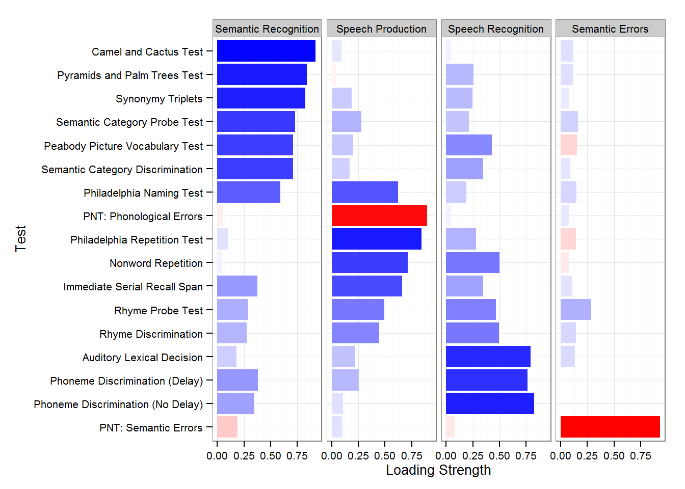

```{r setup, include=FALSE}
knitr::opts_chunk$set(echo = TRUE,message=F,warning=F)
library(knitr)
```


```{r,echo=F}
library(ggplot2)
```


## [Intro factor analysis](https://en.wikipedia.org/wiki/Factor_analysis)

- Target is to analyse the  variability among observed, correlated variables,

- ideally the variablity can be described with a lower number of unobserved variables called factors


## Examples for factor analysis

- [Plotting Factor Analysis Results ](http://mindingthebrain.blogspot.de/2015/04/plotting-factor-analysis-results.html)

- [Plotting Factor Analysis Results II](http://rpubs.com/danmirman/plotting_factor_analysis)


## Get data set

```{r getdata}
(load(url("http://dmirman.github.io/FAex.Rdata")))
```

```{r}
kable(head(loadings))
```


```{r}
summary(loadings)
```


## Preparing the graph

```{r,cache=vCA}
library(reshape2)
Ord <- c(17, 16, 13, 15, 12,  2, 3,  5,  9,  8, 11,  7, 14,  6,  4,  10,  1)
loadings$Test <- reorder(loadings$Test, Ord) 
loadings.m <- melt(loadings, id="Test", 
                   measure=c("Semantic Recognition", "Speech Production", 
                             "Speech Recognition", "Semantic Errors"), 
                   variable.name="Factor", value.name="Loading")
```

## A ggplot 2 graphic
```{r,eval=F,cache=vCA}
library(ggplot2)
ggplot(loadings.m, aes(Test, abs(Loading), fill=Loading)) + 
  facet_wrap(~ Factor, nrow=1) + #place the factors in separate facets
  geom_bar(stat="identity") + #make the bars
  coord_flip() + #flip the axes so the test names can be horizontal  
  #define the fill color gradient: blue=positive, red=negative
  scale_fill_gradient2(name = "Loading", 
                       high = "blue", mid = "white", low = "red", 
                       midpoint=0, guide=F) +
  ylab("Loading Strength") + #improve y-axis label
  theme_bw(base_size=10) #use a black-and0white theme with set font size
```

## A ggplot 2 graphic



[Source](https://3.bp.blogspot.com/-vSVrsYeTRLk/VTRYZF_YKKI/AAAAAAAABJc/Jn3OFn5Aikc/s1600/fig1.png)

## Example Rinne

- [Fred Böker](http://www.statoek.wiso.uni-goettingen.de/veranstaltungen/Multivariate/Daten/mvsec1.pdf)

- [Faktorenanalyse](http://www.google.de/url?sa=t&rct=j&q=&esrc=s&source=web&cd=1&ved=0CCIQFjAAahUKEwiysr7cn_PGAhWEhywKHYpxB0s&url=http%3A%2F%2Fwww.uni-goettingen.de%2Fde%2Fdocument%2Fdownload%2F4855fa4c29db1eb8a5a4b82f8ae89ce2.pdf%2Fmvsec5.pdf&ei=p-mxVfLCPISPsgGK453YBA&usg=AFQjCNEY7GYbiFuGG5iH0akKPFyjsFhyrQ&bvm=bv.98476267,d.bGg&cad=rja)


```{r,cache=vCA}
link <- "https://raw.githubusercontent.com/Japhilko/DataAnalysis/master/data/RinneBSP.csv"
Auto.frame <-t(read.csv(link,header=F))

rownames(Auto.frame) <- 1:25
colnames(Auto.frame) <- paste("X",1:7,sep="")

Auto.cor<-cor(Auto.frame)
```

## Example data 

```{r,echo=F,cache=vCA}
kable(round(Auto.cor,digits=4))
```


## Lattice Graphic

```{r,cache=vCA}
library(lattice)
panelLevel<-function(x,y,z,...){
    panel.levelplot(x=x,y=y,z=z,...)
    cat(str(z))
    for(i in 1:length(unique(y))){
        panel.text(x=x,y=y,labels=round(z,digits=2),col="white",cex=1.5)
    }
}
```


## Levelplot

```{r,cache=vCA}
  levelplot(round(Auto.cor,digits=2),col.regions=colorRampPalette(c("royalblue","yellow","orange", "chocolate1")),xlab="",ylab="",panel=panelLevel,cex=2)
```

## Eigen values

```{r,cache=vCA}
Auto.eigen<-eigen(cor(Auto.frame))$values
round(Auto.eigen,digits=4)
```

cumulative proportion of the variation explained with the first principal component:

```{r,cache=vCA}
round(cumsum(Auto.eigen/7)*100,digits=2)
```


```{r,cache=vCA}
Auto.eigenvektor12<-eigen(cor(Auto.frame))$vectors[,1:2]
round(Auto.eigenvektor12,digits=4)

Auto.Ladung<-Auto.eigenvektor12%*%diag(sqrt(Auto.eigen[1:2]))
round(Auto.Ladung,digits=4)

Auto.Kommun<-diag(Auto.Ladung%*%t(Auto.Ladung))
round(Auto.Kommun,digits=4)

Auto.Rest<-Auto.cor-Auto.Ladung%*%t(Auto.Ladung)
round(Auto.Rest,digits=4)

Dreh.mat<-matrix(c(0.9284,-0.3716,0.3716,0.9284),byrow=T,nrow=2)
Auto.Dreh.Ladung<-Auto.Ladung%*%Dreh.mat
round(Auto.Dreh.Ladung,digits=4)
```

## 

```{r,cache=vCA}
  plot(Auto.Ladung,type="n",xlim=c(-1,1),ylim=c(-1,1),xlab="1. Faktor",
  ylab="2. Faktor")
  null<-rep(0,7)
  arrows(null,null,Auto.Ladung[,1],Auto.Ladung[,2])
  abline(h=0)
  abline(v=0)
```


## 

```{r,cache=vCA}
  plot(Auto.Dreh.Ladung,type="n",xlim=c(-1,1),ylim=c(-1,1),xlab="1.
  Faktor", ylab="2. Faktor")
  arrows(null,null,Auto.Dreh.Ladung[,1],Auto.Dreh.Ladung[,2])
  abline(h=0)
  abline(v=0)
```

## The command `factanal`

```{r,cache=vCA}
factanal(Auto.frame,factors=2)
```

## R in a Nutshell  von Joseph Adler, S.370

```{r}
v1 <- c(1,1,1,1,1,1,1,1,1,1,3,3,3,3,3,4,5,6)
v2 <- c(1,2,1,1,1,1,2,1,2,1,3,4,3,3,3,4,6,5)
v3 <- c(3,3,3,3,3,1,1,1,1,1,1,1,1,1,1,5,4,6)
v4 <- c(3,3,4,3,3,1,1,2,1,1,1,1,2,1,1,5,6,4)
v5 <- c(1,1,1,1,1,3,3,3,3,3,1,1,1,1,1,6,4,5)
v6 <- c(1,1,1,2,1,3,3,3,4,3,1,1,1,2,1,6,5,4)
m1 <- cbind(v1,v2,v3,v4,v5,v6)
```

## The command `factanal`

```{r}
# ?factanal

cor(m1)
factanal(m1, factors = 3) # varimax is the default
factanal(m1, factors = 3, rotation = "promax")
```


## 

```{r}
# The following shows the g factor as PC1
prcomp(m1)

## formula interface
factanal(~v1+v2+v3+v4+v5+v6, factors = 3,
         scores = "Bartlett")$scores

## a realistic example from Bartholomew (1987, pp. 61-65)
utils::example(ability.cov)
```

