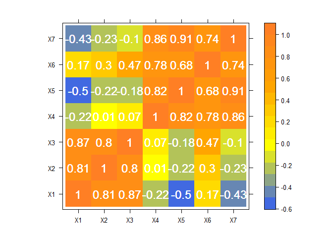
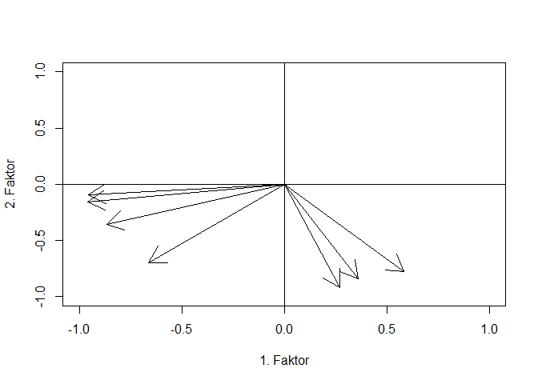
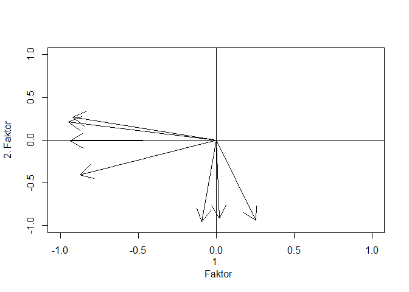

# Factor Analysis
Jan-Philipp Kolb  
24. Juli 2015  


## Intro factor analysis


## Source for the following

- [Plotting Factor Analysis Results ](http://mindingthebrain.blogspot.de/2015/04/plotting-factor-analysis-results.html)

- [Plotting Factor Analysis Results II](http://rpubs.com/danmirman/plotting_factor_analysis)


## Get data set


```r
load(url("http://dmirman.github.io/FAex.Rdata"))
summary(loadings)
```

```
##  Semantic Recognition Speech Production Speech Recognition
##  Min.   :-0.1918      Min.   :-0.8924   Min.   :-0.08145  
##  1st Qu.: 0.1781      1st Qu.: 0.1082   1st Qu.: 0.21305  
##  Median : 0.3753      Median : 0.2195   Median : 0.34497  
##  Mean   : 0.4158      Mean   : 0.2623   Mean   : 0.36232  
##  3rd Qu.: 0.7106      3rd Qu.: 0.4951   3rd Qu.: 0.49335  
##  Max.   : 0.9222      Max.   : 0.8416   Max.   : 0.82656  
##                                                           
##  Semantic Errors                                    Test   
##  Min.   :-0.933956   PNT: Semantic Errors             : 1  
##  1st Qu.:-0.010944   Phoneme Discrimination (No Delay): 1  
##  Median : 0.093386   Phoneme Discrimination (Delay)   : 1  
##  Mean   : 0.008282   Auditory Lexical Decision        : 1  
##  3rd Qu.: 0.135101   Rhyme Discrimination             : 1  
##  Max.   : 0.287418   Rhyme Probe Test                 : 1  
##                      (Other)                          :11
```


## Preparing the graph


```r
library(reshape2)
Ord <- c(17, 16, 13, 15, 12,  2, 3,  5,  9,  8, 11,  7, 14,  6,  4,  10,  1)
loadings$Test <- reorder(loadings$Test, Ord) 
loadings.m <- melt(loadings, id="Test", 
                   measure=c("Semantic Recognition", "Speech Production", 
                             "Speech Recognition", "Semantic Errors"), 
                   variable.name="Factor", value.name="Loading")
```

## A ggplot 2 graphic

```r
library(ggplot2)
ggplot(loadings.m, aes(Test, abs(Loading), fill=Loading)) + 
  facet_wrap(~ Factor, nrow=1) + #place the factors in separate facets
  geom_bar(stat="identity") + #make the bars
  coord_flip() + #flip the axes so the test names can be horizontal  
  #define the fill color gradient: blue=positive, red=negative
  scale_fill_gradient2(name = "Loading", 
                       high = "blue", mid = "white", low = "red", 
                       midpoint=0, guide=F) +
  ylab("Loading Strength") + #improve y-axis label
  theme_bw(base_size=10) #use a black-and0white theme with set font size
```

## A ggplot 2 graphic


## Example Rinne

- [Fred Böker](http://www.statoek.wiso.uni-goettingen.de/veranstaltungen/Multivariate/Daten/mvsec1.pdf)

- [Faktorenanalyse](http://www.google.de/url?sa=t&rct=j&q=&esrc=s&source=web&cd=1&ved=0CCIQFjAAahUKEwiysr7cn_PGAhWEhywKHYpxB0s&url=http%3A%2F%2Fwww.uni-goettingen.de%2Fde%2Fdocument%2Fdownload%2F4855fa4c29db1eb8a5a4b82f8ae89ce2.pdf%2Fmvsec5.pdf&ei=p-mxVfLCPISPsgGK453YBA&usg=AFQjCNEY7GYbiFuGG5iH0akKPFyjsFhyrQ&bvm=bv.98476267,d.bGg&cad=rja)


```r
link <- "https://raw.githubusercontent.com/Japhilko/DataAnalysis/master/data/RinneBSP.csv"
Auto.frame <-t(read.csv(link,header=F))

rownames(Auto.frame) <- 1:25
colnames(Auto.frame) <- paste("X",1:7,sep="")

Auto.cor<-cor(Auto.frame)
```

## Example data 


           X1        X2        X3        X4        X5       X6        X7
---  --------  --------  --------  --------  --------  -------  --------
X1     1.0000    0.8143    0.8690   -0.2242   -0.5014   0.1700   -0.4315
X2     0.8143    1.0000    0.7980    0.0057   -0.2187   0.2979   -0.2339
X3     0.8690    0.7980    1.0000    0.0686   -0.1808   0.4726   -0.0983
X4    -0.2242    0.0057    0.0686    1.0000    0.8163   0.7758    0.8589
X5    -0.5014   -0.2187   -0.1808    0.8163    1.0000   0.6812    0.9090
X6     0.1700    0.2979    0.4726    0.7758    0.6812   1.0000    0.7364
X7    -0.4315   -0.2339   -0.0983    0.8589    0.9090   0.7364    1.0000


## lattice graphic


```r
library(lattice)
panelLevel<-function(x,y,z,...){
    panel.levelplot(x=x,y=y,z=z,...)
    cat(str(z))
    for(i in 1:length(unique(y))){
        panel.text(x=x,y=y,labels=round(z,digits=2),col="white",cex=1.5)
    }
}
```


## Levelplot


```r
  levelplot(round(Auto.cor,digits=2),col.regions=colorRampPalette(c("royalblue","yellow","orange", "chocolate1")),xlab="",ylab="",panel=panelLevel,cex=2)
```

<!-- -->

```
##  num [1:49] 1 0.81 0.87 -0.22 -0.5 0.17 -0.43 0.81 1 0.8 ...
```

## Eigen values


```r
Auto.eigen<-eigen(cor(Auto.frame))$values
round(Auto.eigen,digits=4)
```

```
## [1] 3.5668 2.8133 0.2586 0.1630 0.0818 0.0655 0.0510
```

cumulative proportion of the variation explained with the first principal component:


```r
round(cumsum(Auto.eigen/7)*100,digits=2)
```

```
## [1]  50.95  91.14  94.84  97.17  98.34  99.27 100.00
```


```r
Auto.eigenvektor12<-eigen(cor(Auto.frame))$vectors[,1:2]
round(Auto.eigenvektor12,digits=4)
```

```
##         [,1]    [,2]
## [1,]  0.3097 -0.4647
## [2,]  0.1903 -0.5014
## [3,]  0.1423 -0.5497
## [4,] -0.4595 -0.2115
## [5,] -0.5057 -0.0544
## [6,] -0.3501 -0.4175
## [7,] -0.5081 -0.0919
```

```r
Auto.Ladung<-Auto.eigenvektor12%*%diag(sqrt(Auto.eigen[1:2]))
round(Auto.Ladung,digits=4)
```

```
##         [,1]    [,2]
## [1,]  0.5849 -0.7794
## [2,]  0.3593 -0.8410
## [3,]  0.2688 -0.9221
## [4,] -0.8678 -0.3548
## [5,] -0.9551 -0.0912
## [6,] -0.6612 -0.7002
## [7,] -0.9597 -0.1542
```

```r
Auto.Kommun<-diag(Auto.Ladung%*%t(Auto.Ladung))
round(Auto.Kommun,digits=4)
```

```
## [1] 0.9496 0.8364 0.9225 0.8789 0.9205 0.9274 0.9447
```

```r
Auto.Rest<-Auto.cor-Auto.Ladung%*%t(Auto.Ladung)
round(Auto.Rest,digits=4)
```

```
##         X1      X2      X3      X4      X5      X6      X7
## X1  0.0504 -0.0514 -0.0069  0.0068 -0.0139  0.0109  0.0096
## X2 -0.0514  0.1636 -0.0741  0.0191  0.0478 -0.0534 -0.0188
## X3 -0.0069 -0.0741  0.0775 -0.0253 -0.0081  0.0046  0.0175
## X4  0.0068  0.0191 -0.0253  0.1211 -0.0449 -0.0464 -0.0286
## X5 -0.0139  0.0478 -0.0081 -0.0449  0.0795 -0.0141 -0.0217
## X6  0.0109 -0.0534  0.0046 -0.0464 -0.0141  0.0726 -0.0060
## X7  0.0096 -0.0188  0.0175 -0.0286 -0.0217 -0.0060  0.0553
```

```r
Dreh.mat<-matrix(c(0.9284,-0.3716,0.3716,0.9284),byrow=T,nrow=2)
Auto.Dreh.Ladung<-Auto.Ladung%*%Dreh.mat
round(Auto.Dreh.Ladung,digits=4)
```

```
##         [,1]    [,2]
## [1,]  0.2534 -0.9409
## [2,]  0.0211 -0.9143
## [3,] -0.0931 -0.9559
## [4,] -0.9375 -0.0069
## [5,] -0.9206  0.2702
## [6,] -0.8740 -0.4044
## [7,] -0.9483  0.2134
```

## 


```r
  plot(Auto.Ladung,type="n",xlim=c(-1,1),ylim=c(-1,1),xlab="1. Faktor",
  ylab="2. Faktor")
  null<-rep(0,7)
  arrows(null,null,Auto.Ladung[,1],Auto.Ladung[,2])
  abline(h=0)
  abline(v=0)
```

<!-- -->


## 


```r
  plot(Auto.Dreh.Ladung,type="n",xlim=c(-1,1),ylim=c(-1,1),xlab="1.
  Faktor", ylab="2. Faktor")
  arrows(null,null,Auto.Dreh.Ladung[,1],Auto.Dreh.Ladung[,2])
  abline(h=0)
  abline(v=0)
```

<!-- -->

##


```r
factanal(Auto.frame,factors=2)
```

```
## 
## Call:
## factanal(x = Auto.frame, factors = 2)
## 
## Uniquenesses:
##    X1    X2    X3    X4    X5    X6    X7 
## 0.026 0.288 0.110 0.191 0.094 0.074 0.072 
## 
## Loadings:
##    Factor1 Factor2
## X1 -0.252   0.954 
## X2          0.843 
## X3          0.938 
## X4  0.899         
## X5  0.909  -0.281 
## X6  0.871   0.408 
## X7  0.942  -0.205 
## 
##                Factor1 Factor2
## SS loadings      3.355   2.789
## Proportion Var   0.479   0.398
## Cumulative Var   0.479   0.878
## 
## Test of the hypothesis that 2 factors are sufficient.
## The chi square statistic is 4.96 on 8 degrees of freedom.
## The p-value is 0.762
```

## R in a Nutshell  von Joseph Adler, S.370


```r
v1 <- c(1,1,1,1,1,1,1,1,1,1,3,3,3,3,3,4,5,6)
v2 <- c(1,2,1,1,1,1,2,1,2,1,3,4,3,3,3,4,6,5)
v3 <- c(3,3,3,3,3,1,1,1,1,1,1,1,1,1,1,5,4,6)
v4 <- c(3,3,4,3,3,1,1,2,1,1,1,1,2,1,1,5,6,4)
v5 <- c(1,1,1,1,1,3,3,3,3,3,1,1,1,1,1,6,4,5)
v6 <- c(1,1,1,2,1,3,3,3,4,3,1,1,1,2,1,6,5,4)
m1 <- cbind(v1,v2,v3,v4,v5,v6)
```

## The command `factanal`


```r
# ?factanal

cor(m1)
```

```
##           v1        v2        v3        v4        v5        v6
## v1 1.0000000 0.9393083 0.5128866 0.4320310 0.4664948 0.4086076
## v2 0.9393083 1.0000000 0.4124441 0.4084281 0.4363925 0.4326113
## v3 0.5128866 0.4124441 1.0000000 0.8770750 0.5128866 0.4320310
## v4 0.4320310 0.4084281 0.8770750 1.0000000 0.4320310 0.4323259
## v5 0.4664948 0.4363925 0.5128866 0.4320310 1.0000000 0.9473451
## v6 0.4086076 0.4326113 0.4320310 0.4323259 0.9473451 1.0000000
```

```r
factanal(m1, factors = 3) # varimax is the default
```

```
## 
## Call:
## factanal(x = m1, factors = 3)
## 
## Uniquenesses:
##    v1    v2    v3    v4    v5    v6 
## 0.005 0.101 0.005 0.224 0.084 0.005 
## 
## Loadings:
##    Factor1 Factor2 Factor3
## v1 0.944   0.182   0.267  
## v2 0.905   0.235   0.159  
## v3 0.236   0.210   0.946  
## v4 0.180   0.242   0.828  
## v5 0.242   0.881   0.286  
## v6 0.193   0.959   0.196  
## 
##                Factor1 Factor2 Factor3
## SS loadings      1.893   1.886   1.797
## Proportion Var   0.316   0.314   0.300
## Cumulative Var   0.316   0.630   0.929
## 
## The degrees of freedom for the model is 0 and the fit was 0.4755
```

```r
factanal(m1, factors = 3, rotation = "promax")
```

```
## 
## Call:
## factanal(x = m1, factors = 3, rotation = "promax")
## 
## Uniquenesses:
##    v1    v2    v3    v4    v5    v6 
## 0.005 0.101 0.005 0.224 0.084 0.005 
## 
## Loadings:
##    Factor1 Factor2 Factor3
## v1          0.985         
## v2          0.951         
## v3                  1.003 
## v4                  0.867 
## v5  0.910                 
## v6  1.033                 
## 
##                Factor1 Factor2 Factor3
## SS loadings      1.903   1.876   1.772
## Proportion Var   0.317   0.313   0.295
## Cumulative Var   0.317   0.630   0.925
## 
## Factor Correlations:
##         Factor1 Factor2 Factor3
## Factor1   1.000  -0.462   0.460
## Factor2  -0.462   1.000  -0.501
## Factor3   0.460  -0.501   1.000
## 
## The degrees of freedom for the model is 0 and the fit was 0.4755
```


## 


```r
# The following shows the g factor as PC1
prcomp(m1)
```

```
## Standard deviations:
## [1] 3.0368683 1.6313757 1.5818857 0.6344131 0.3190765 0.2649086
## 
## Rotation:
##          PC1         PC2        PC3        PC4        PC5         PC6
## v1 0.4168038 -0.52292304  0.2354298 -0.2686501  0.5157193 -0.39907358
## v2 0.3885610 -0.50887673  0.2985906  0.3060519 -0.5061522  0.38865228
## v3 0.4182779  0.01521834 -0.5555132 -0.5686880 -0.4308467 -0.08474731
## v4 0.3943646  0.02184360 -0.5986150  0.5922259  0.3558110  0.09124977
## v5 0.4254013  0.47017231  0.2923345 -0.2789775  0.3060409  0.58397162
## v6 0.4047824  0.49580764  0.3209708  0.2866938 -0.2682391 -0.57719858
```

```r
## formula interface
factanal(~v1+v2+v3+v4+v5+v6, factors = 3,
         scores = "Bartlett")$scores
```

```
##       Factor1    Factor2    Factor3
## 1  -0.9039949 -0.9308984  0.9475392
## 2  -0.8685952 -0.9328721  0.9352330
## 3  -0.9082818 -0.9320093  0.9616422
## 4  -1.0021975 -0.2529689  0.8178552
## 5  -0.9039949 -0.9308984  0.9475392
## 6  -0.7452711  0.7273960 -0.7884733
## 7  -0.7098714  0.7254223 -0.8007795
## 8  -0.7495580  0.7262851 -0.7743704
## 9  -0.8080740  1.4033517 -0.9304636
## 10 -0.7452711  0.7273960 -0.7884733
## 11  0.9272282 -0.9307506 -0.8371538
## 12  0.9626279 -0.9327243 -0.8494600
## 13  0.9229413 -0.9318615 -0.8230509
## 14  0.8290256 -0.2528211 -0.9668378
## 15  0.9272282 -0.9307506 -0.8371538
## 16  0.4224366  2.0453079  1.2864761
## 17  1.4713902  1.2947716  0.5451562
## 18  1.8822320  0.3086244  1.9547752
```

```r
## a realistic example from Bartholomew (1987, pp. 61-65)
utils::example(ability.cov)
```

```
## 
## ablty.> ## No test: 
## ablty.> ##D require(stats)
## ablty.> ##D (ability.FA <- factanal(factors = 1, covmat = ability.cov))
## ablty.> ##D update(ability.FA, factors = 2)
## ablty.> ##D ## The signs of factors and hence the signs of correlations are
## ablty.> ##D ## arbitrary with promax rotation.
## ablty.> ##D update(ability.FA, factors = 2, rotation = "promax")
## ablty.> ## End(No test)
## ablty.> 
## ablty.>
```

