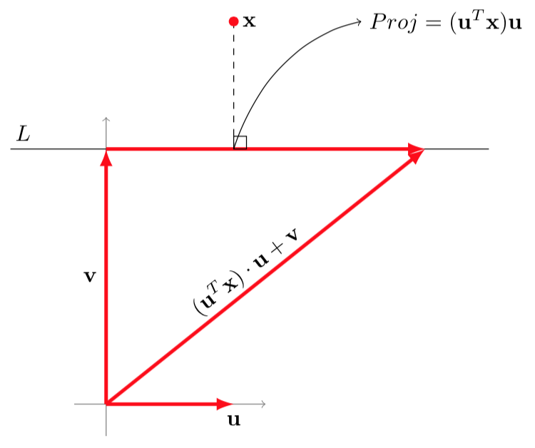

```{r,echo=F}
vCA <- T
library(knitr)
```


## [Quick-R on Principal Component Analysis](http://www.statmethods.net/advstats/factor.html)

```{r}
(load("data/berplz.RData"))
dat <- berplz@data[,-c(1:3)]
rownames(dat) <- berplz@data$PLZ99
```


```{r,echo=F}
kable(head(dat))
```

```{r}
kable(cor(dat))
```

The result is a list containing the coefficients defining each component (sometimes referred to as
loadings), the principal component scores

```{r}
osm_pca <- prcomp(dat)
print(osm_pca)
plot(dat)
summary(osm_pca)
```

Linear combination for the first principal component is

```{r}
a1 <- osm_pca$rotation[,1]
a1
```

- cafe and restaurant are the most important variables
- biergarten is less important


```{r}
hm <- as.matrix(dat)
drop(hm%*% osm_pca$rotation[,1])
```

```{r}
plot(osm_pca)
```


```{r}
biplot(osm_pca, col = c("gray", "black"))
```


```{r}
#?princomp
fit <- princomp(dat, cor=TRUE)
fit
summary(fit) # print variance accounted for
loadings(fit) # pc loadings
plot(fit,type="lines") # scree plot
head(fit$scores) # the principal components
biplot(fit) 
```

```{r,eval=F}
install.packages("psych")
```


```{r}
library(psych)
fit <- principal(mydata, nfactors=5, rotate="varimax")
fit # print results 
```


## Intro Principal Component Analysis

- Al-Ahmadgaid Asaad [Analysis Programming](http://alstatr.blogspot.de/2014/12/principal-component-analysis-on-imaging.html)

- [Analysis with Programming](http://alstatr.blogspot.de/)


## Intro Principal Component Analysis


[Source](https://1.bp.blogspot.com/-oIhTE11jN2M/VJal1FsTndI/AAAAAAAACCU/BQOhihmxKbg/s1600/Screen+Shot+2014-12-21+at+6.49.01+PM.png)

## Intro Principal Component Analysis



[Source](https://1.bp.blogspot.com/-wXHcQqUbIg4/VJuuXbZlUKI/AAAAAAAACGc/ythfr395Z5s/s1600/Screen+Shot+2014-12-25+at+2.25.12+PM.png)

## [Plot Principal Component Analysis](https://martinsbioblogg.wordpress.com/2013/06/26/using-r-two-plots-of-principal-component-analysis/)
```{r}
sample.groups <- c(rep(1, 10), rep(2, 10), rep(3, 10),
  rep(4, 10), rep(5, 10))
variable.groups <- c(rep(1, 10), rep(2, 10), rep(3, 10),
  rep(4, 10), rep(5, 10), rep(6, 10),
  rep(7, 10))
 
data <- matrix(nrow=length(sample.groups), ncol=70)
base.data <- matrix(nrow=length(sample.groups), ncol=7)
 
for (j in 1:ncol(base.data)) {
  mu <- rnorm(1, 0, 4)
  sigma <- runif(1, 5, 10)
  base.data[,j] <- sample.groups*mu +
  rnorm(length(sample.groups), 0, sigma)
}
```


## Prepare data

```{r}
for (j in 1:ncol(data)) {
  mu <- runif(1, 0, 4)
  data[,j] <- base.data[,variable.groups[j]] +
  rnorm(length(sample.groups), mu, 10)
}
```


## qplot

```{r}
library(ggplot2)
library(reshape2)
qplot(x=Var1, y=Var2, data=melt(cor(data)), geom="tile",
fill=value)
```


## Resources

- [Principal Component Analysis on Imaging](http://www.r-bloggers.com/principal-component-analysis-on-imaging/)

- [Introduction to principal component analysis](https://cran.r-project.org/web/packages/HSAUR/vignettes/Ch_principal_components_analysis.pdf)

