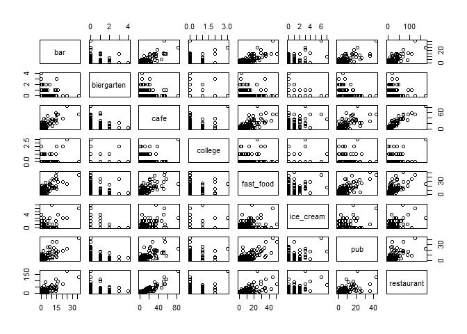
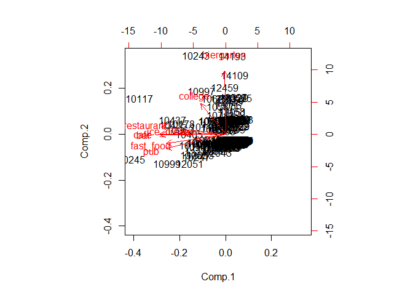
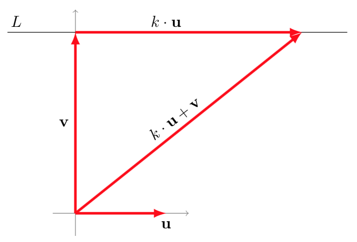
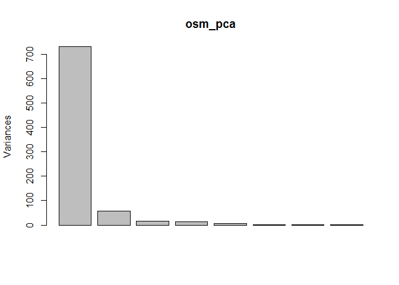

# Principal Component Analysis
Jan-Philipp Kolb  
24. Juli 2015  


## [Quick-R on Principal Component Analysis](http://www.statmethods.net/advstats/factor.html)


```r
(load("data/berplz.RData"))
```

```
## [1] "berplz"
```

```r
dat <- berplz@data[,-c(1:3)]
rownames(dat) <- berplz@data$PLZ99
```


         bar   biergarten   cafe   college   fast_food   ice_cream   pub   restaurant
------  ----  -----------  -----  --------  ----------  ----------  ----  -----------
10115     15            0     51         0          13           0    15           72
10117     25            0     83         3          24           3    22          174
10119     13            1     29         0          15           0    16           42
10178     14            1     58         0          36           0     9          108
10179      1            1     16         0           9           0     3           38
10243     15            3     21         2          35           0     7           43


```r
#?princomp
fit <- princomp(dat, cor=TRUE)
fit
```

```
## Call:
## princomp(x = dat, cor = TRUE)
## 
## Standard deviations:
##    Comp.1    Comp.2    Comp.3    Comp.4    Comp.5    Comp.6    Comp.7 
## 2.1042233 1.0217004 0.9508640 0.8416641 0.6435552 0.5069438 0.4208653 
##    Comp.8 
## 0.2599019 
## 
##  8  variables and  190 observations.
```

```r
summary(fit) # print variance accounted for
```

```
## Importance of components:
##                           Comp.1    Comp.2    Comp.3     Comp.4     Comp.5
## Standard deviation     2.1042233 1.0217004 0.9508640 0.84166409 0.64355516
## Proportion of Variance 0.5534695 0.1304840 0.1130178 0.08854981 0.05177041
## Cumulative Proportion  0.5534695 0.6839534 0.7969712 0.88552102 0.93729142
##                           Comp.6     Comp.7      Comp.8
## Standard deviation     0.5069438 0.42086534 0.259901860
## Proportion of Variance 0.0321240 0.02214095 0.008443622
## Cumulative Proportion  0.9694154 0.99155638 1.000000000
```

```r
loadings(fit) # pc loadings
```

```
## 
## Loadings:
##            Comp.1 Comp.2 Comp.3 Comp.4 Comp.5 Comp.6 Comp.7 Comp.8
## bar        -0.436                0.102        -0.242  0.857       
## biergarten         0.870  0.469        -0.111                     
## cafe       -0.443                       0.450        -0.256  0.731
## college    -0.165  0.421 -0.858  0.129 -0.201                     
## fast_food  -0.396 -0.129  0.134  0.329 -0.314  0.772              
## ice_cream  -0.298               -0.885 -0.340                     
## pub        -0.396 -0.192  0.137  0.252 -0.467 -0.580 -0.398 -0.106
## restaurant -0.429  0.105        -0.103  0.558        -0.192 -0.667
## 
##                Comp.1 Comp.2 Comp.3 Comp.4 Comp.5 Comp.6 Comp.7 Comp.8
## SS loadings     1.000  1.000  1.000  1.000  1.000  1.000  1.000  1.000
## Proportion Var  0.125  0.125  0.125  0.125  0.125  0.125  0.125  0.125
## Cumulative Var  0.125  0.250  0.375  0.500  0.625  0.750  0.875  1.000
```

```r
plot(fit,type="lines") # scree plot
```

<!-- -->

```r
fit$scores # the principal components
```

```
##              Comp.1      Comp.2       Comp.3        Comp.4       Comp.5
## 10115  -4.077984541 -0.65823317  0.483505795  0.9240399805  2.266517081
## 10117 -10.847680718  2.22794160 -4.585797413 -0.3966575618  2.787539326
## 10119  -2.727266847  0.45959640  1.226616148  1.2132797140  0.437302315
## 10178  -5.594915348  0.67065568  1.365156264  1.4998025084  2.842038433
## 10179  -0.108730244  0.90794112  0.691490160  0.2483106512  0.959370093
## 10243  -3.727782168  4.85803140 -0.871937288  2.4370571489 -1.086283326
## 10245 -11.851143318 -1.53028580  1.872871470 -1.8879922881 -1.364154145
## 10247  -3.645197339 -1.36782847  0.939306174  2.0537482495 -0.923433463
## 10249  -0.121447834 -0.59825137  0.105820695  0.3766911772  0.378288569
## 10315   0.622934259 -0.62530677  0.089938576  0.3768299353 -0.325425737
## 10317  -1.139479307 -0.99475955  0.495791402  0.3710530436 -1.323020957
## 10318  -0.132518994 -0.33504358 -0.018723503 -3.4959109076 -1.010434083
## 10319  -0.125524541  0.26712090 -1.709184077 -0.2061719588 -1.038866176
## 10365  -0.395311960  0.22336844 -1.642604232  0.8868143825 -0.520124109
## 10367   1.470240546 -0.47236747 -0.105320473  0.0044722129 -0.036205047
## 10369   0.758413275 -0.56095465  0.023965064  0.2464806734 -0.057085955
## 10405  -4.526904207  0.01853643 -1.161031513 -0.1972107763 -0.290760335
## 10407   0.562338809 -0.52039941  0.008012696  0.2311367529  0.337978792
## 10409   1.690828971 -0.39045479 -0.182921077 -0.1735776679  0.183707833
## 10435  -6.615847709  0.57857629  1.539326027 -1.8505519012  0.614065363
## 10437  -6.632317545  0.88908928 -2.745680636 -0.3422269786 -0.806589205
## 10439  -0.287445188  0.67204540  0.857099013  0.5294911503  0.082953361
## 10551   1.065463297 -0.42630213 -0.096180807 -0.0147937042  0.318524940
## 10553   0.137352678 -0.79507526  0.238586790  0.7698901894 -0.603702989
## 10555  -0.669558697 -0.78243992  0.301416712  0.8464539735 -0.125697421
## 10557  -1.687229902  0.82695686  0.913613821 -2.0361933121 -0.245180635
## 10559   0.895817891 -0.58848533  0.012403486  0.1864333680 -0.198211484
## 10585  -0.680362999  0.28941023 -1.705703837 -0.2287206000 -0.469489958
## 10587  -0.614296528  1.71038581 -1.042258877  0.7238881728  0.122401230
## 10589   0.861557320 -0.46123554 -0.045742515  0.1054968610  0.232160484
## 10623  -1.296533149  2.19916297  1.560407472 -0.2979285022  0.461713188
## 10625   0.035473801 -0.31779848 -0.082500202 -0.0548430440  1.316095089
## 10627  -1.291499842 -0.59765940  0.213817491 -1.1952128220  0.024500900
## 10629  -3.160057204 -0.52688415  0.321069727 -0.1905860581  1.713235847
## 10707   0.001258424 -0.44864871 -0.013658724  0.1289784924  0.941362667
## 10709  -0.672496437 -0.56698785  0.146987653 -0.4525115745  0.181143754
## 10711  -0.034680911 -0.61794603  0.071702853  0.2650685209  0.437327438
## 10713  -0.569438660  1.20989434 -3.578940454  0.9179401301 -0.519285497
## 10715   0.248968620  0.41088355 -1.866493546  0.3814382866  0.085188009
## 10717   0.680711454 -0.38602478 -0.104763271 -0.0353020685  0.801000990
## 10719  -2.253315180 -0.31762764  0.112118279 -1.4952473151  1.628708479
## 10777  -1.098516154 -0.62944559  0.286325817 -0.1876906058 -0.242552989
## 10779   0.830772662 -0.36224877 -0.099103844 -0.0320193444  0.586354759
## 10781  -2.501202608 -0.57282094  0.350947480 -0.0660695591  1.052934296
## 10783   0.228545021 -0.49006294  0.043158440 -1.4989854266 -0.596521406
## 10785  -1.031907200 -0.30629706  0.023352373  0.1573706448  1.899920958
## 10787   1.135116798 -0.31269703 -0.170485309 -0.1909358622  0.674559213
## 10789  -0.628703369  0.88148508  0.804985221 -0.4225878772  0.288233220
## 10823  -1.585576836  0.84382905  0.888101474 -1.2482757758  0.205456025
## 10825   1.187647784  0.83788517  0.626262073  0.1573454536 -0.033727730
## 10827  -0.191991086 -0.81007841  0.236557109  0.7094986903 -0.267530521
## 10829   0.710153905  0.82092493  0.683524246  0.2131593646  0.084487022
## 10961   0.854245447 -0.60980107  0.022543604  0.2560579257 -0.143562912
## 10963  -5.711593090  0.29595070 -1.195317227 -4.8047034173 -1.465242045
## 10965  -2.634404596 -0.63363600  0.369002840  0.8188562440  1.496892179
## 10967  -3.459024296 -0.77043077  0.494089698 -0.7187919602  0.666707572
## 10969  -1.392062338  0.36935545 -1.683786871 -0.1824268279  0.228028012
## 10997  -3.013880109  2.67483980  0.119991955  0.8139548323 -0.782445312
## 10999  -7.352914160 -1.78777731  1.506706587  2.2506179474 -0.801489233
## 12043  -0.903154683 -1.10489091  0.459596174  1.0012651389 -1.140604059
## 12045   1.076345180  0.84382800  0.625554450  0.1394914661  0.125107030
## 12047  -0.817615530 -0.83246205  0.259386817  0.6155234462  0.100639591
## 12049  -3.070574625 -0.50643004 -0.991833962  2.1266150217 -1.671603151
## 12051  -4.448477351 -1.80738982  1.255216096  1.7910123235 -2.473711156
## 12053  -3.179700738 -1.25589332  0.801594442  1.8034946271 -0.437958982
## 12055   0.570628815 -0.61629935  0.060700446  0.3081880902 -0.059634347
## 12057   1.052869356  0.80763226  0.663661148  0.2134609135 -0.136837164
## 12059   0.965702989 -0.50271601 -0.045876162  0.0630344225  0.084781991
## 12099   0.810065536  0.30456832 -1.828801276  0.5086700730 -0.733179921
## 12101   0.639116660  0.89749787  0.653058073 -0.7074386569 -0.128442269
## 12103  -0.079737354 -0.53663911  0.075867547 -0.5706557993  0.018546555
## 12105   0.036582018 -0.75163116  0.203216829  0.6368983064 -0.348571634
## 12107   0.996741980 -0.53364379 -0.034425886  0.1398578645  0.054680217
## 12109   1.449098084 -0.43410136 -0.136912228 -0.0915165329  0.124501006
## 12157   0.885614273  0.76690051  0.685880992  0.2597397540 -0.096415237
## 12159   0.694553042  2.14505731  1.393982239  0.3710166661 -0.056426243
## 12161  -0.195586921  0.33398836 -1.775074375  0.5838853463  0.034633197
## 12163  -2.065869908 -0.49513160  0.283454773 -2.0150024549 -0.210686295
## 12165  -0.001366499 -0.45211246  0.040332597 -1.4953709167 -0.327080143
## 12167   0.905915970 -0.36888322 -0.114330045 -0.9435628848  0.085738504
## 12169   1.201277574 -0.58615395 -0.022736037  0.1560581474 -0.277615753
## 12203   0.790333552  0.85442477  0.651206406  0.1543427507  0.152465147
## 12205   0.590790601 -0.41375982 -0.049560161 -0.8256240957  0.021919393
## 12207   0.988197640 -0.50580285 -0.045202582  0.1234992906  0.128200855
## 12209   0.698515758 -0.33727781 -0.099039794 -1.8096097291 -0.300962643
## 12247   1.050680196 -0.50228857 -0.046311773  0.1127753183  0.046308725
## 12249   0.835715697  0.98243128  0.596094877 -1.7279514334 -0.514461593
## 12277   1.264313003  0.84568891  0.637610591  0.2278159359 -0.132142852
## 12279   1.323664733 -0.49569378 -0.083558584  0.0412533741 -0.010407576
## 12305   1.134310260 -0.42680499 -0.099014181 -0.0187682958  0.248484981
## 12307   1.250690256 -0.46800797 -0.083166143  0.0630977399  0.096915507
## 12309   1.841169256 -0.37623765 -0.200539435 -0.1991853532  0.143199976
## 12347   0.450901313 -0.82081939  0.182094430  0.5631620078 -0.773280984
## 12349   0.435901548 -0.71716918  0.158082526  0.6117769515 -0.412588418
## 12351   1.515914254 -0.41535906 -0.144724870 -0.0835143687  0.142660777
## 12353   0.873966281 -0.53578344  0.002930020  0.2675585860  0.020420601
## 12355   0.303306976  0.72498043  0.801470883 -0.3631938009 -0.622411362
## 12357   1.573196183 -0.42939997 -0.140634604 -0.0697350985  0.068065228
## 12359   1.495467334 -0.45322915 -0.121706089 -0.0369285289  0.023822739
## 12435   0.533574863  2.01333016  1.489159627  0.6096960114 -0.373058864
## 12437   0.996741980 -0.53364379 -0.034425886  0.1398578645  0.054680217
## 12439   0.993968163 -0.45653932 -0.054713050  0.0908936567  0.175244866
## 12459  -0.079490285  2.87393874 -0.283068561  0.9902305714 -0.883754109
## 12487  -0.122732958 -0.71467690  0.207628417 -0.2547827138 -0.714820565
## 12489   0.417596417 -0.58404028  0.059998912  0.3316438833  0.085992136
## 12524   1.403167283 -0.39302726 -0.138701925 -0.0724204658  0.229051804
## 12526   0.989772585 -0.43147082 -0.067822627 -0.8055548987 -0.229900477
## 12527   1.056589517  2.26910138  1.294059750 -0.7187723420 -0.359645727
## 12555   0.329055793 -0.64318297  0.130331579  0.5241338099 -0.168263624
## 12557  -0.103683414  2.22057271  1.451699381 -0.4361672748 -0.082486379
## 12559   1.260355942 -0.42546275 -0.112796504 -0.0244658287  0.240138888
## 12587   1.278671163 -0.33812084 -0.181082833 -0.1779495357  0.631107210
## 12589   1.381835292  0.97447815  0.540773143 -0.9255197286 -0.261333447
## 12619   0.421645909 -0.66948878  0.159758217  0.5960688169 -0.432868775
## 12621   1.172850908 -0.40199309 -0.118788603 -0.9535887856 -0.192160182
## 12623   1.309325128 -0.43949849 -0.103458080  0.0256980802  0.166023179
## 12627   1.253991534 -0.42144561 -0.111072321 -0.0312152094  0.228286717
## 12629   1.394053728  0.50082918 -2.009907904  0.1046156741 -0.304441245
## 12679   1.361621090 -0.47721862 -0.096856595 -0.0023036583  0.012902856
## 12681   0.774228710 -0.51630256 -0.004701243  0.2319507367  0.183810951
## 12683   1.300128434 -0.42010874 -0.118427009 -0.0137153658  0.261070944
## 12685   1.077303116 -0.52518723 -0.036661289  0.1397153602 -0.007977231
## 12687   1.665602184 -0.40959311 -0.166535461 -0.1321769261  0.123680047
## 12689   1.309325883 -0.43212737 -0.096922108  0.0100430281  0.105601483
## 13051   0.988527582  1.37750000 -3.810703400  0.4578196076 -0.793950481
## 13053   0.995924972  0.87384616  0.632699045  0.1544910914  0.125561471
## 13055   0.950004642 -0.60667764  0.035255545  0.3311214981 -0.266843217
## 13057   1.266208849  0.49089634 -1.985079995  0.1750331755 -0.280936220
## 13059   1.635595527 -0.40999967 -0.156783011 -0.0959612823  0.122462513
## 13086   0.363234591  1.79269214 -1.183610918 -0.4893721933 -0.656615462
## 13088   0.686917387 -0.59856297  0.058896849  0.3678230863 -0.139944333
## 13089   1.764793349 -0.35751643 -0.205993123 -0.2175577135  0.242660708
## 13125   1.142639942 -0.44852192 -0.085549247  0.0638745293  0.260785697
## 13127   1.554102207 -0.42471967 -0.141998026 -0.0743281886  0.092930411
## 13129   1.345653683  0.53920213 -2.030093311  0.0620044259 -0.115563248
## 13156   0.759113109 -0.53422657 -0.011145343  0.1879019235  0.168566089
## 13158   0.834108017  1.41611384 -3.828292642  0.4040083929 -0.529402024
## 13159   1.806745774 -0.37598622 -0.199122748 -0.1971980574  0.178219956
## 13187   0.042117176  0.78927045  0.762875785  0.4320540525  0.454341981
## 13189   1.469225149 -0.46274489 -0.107810108  0.0104605908  0.007894818
## 13347  -3.408120805 -1.10927127  0.759838761 -0.1866009498 -1.102671467
## 13349   1.718104245 -0.40490226 -0.169078361 -0.1235827539  0.107894750
## 13351   0.098286573 -0.64872354  0.138993859  0.4524424849 -0.075051955
## 13353  -3.904693598 -1.27377372  0.943628374  2.1421889484 -0.436353147
## 13355   0.080253223 -0.53786587  0.091005131 -1.3819820855 -0.691854419
## 13357  -1.331357441 -0.97190169  0.499484583  1.2365026264 -0.583232562
## 13359   0.205726967 -0.76861929  0.181067062  0.5637855889 -0.414990284
## 13403   1.114352031 -0.59059337 -0.018776451  0.1494512711 -0.226810476
## 13405   0.383536732 -0.59449150  0.066248972  0.2889328770  0.038017682
## 13407   0.711408608 -0.57198982  0.023279785  0.2878652609  0.077899996
## 13409   1.256511018 -0.56660907 -0.048874104  0.0784417618 -0.216370433
## 13435   1.841169256 -0.37623765 -0.200539435 -0.1991853532  0.143199976
## 13437   1.087349799  0.85437044  0.645578466  0.2264835794 -0.037349039
## 13439   1.445351304 -0.43933282 -0.115806695  0.0006824028  0.091570253
## 13465   1.607304857 -0.38592961 -0.173115362 -0.1399678184  0.242375462
## 13467   1.496829504  0.92306588  0.551383749  0.0029689433  0.069752880
## 13469   1.475367188  0.89481837  0.571912896  0.0555431610 -0.004985292
## 13503   1.457979969 -0.40976933 -0.153007369 -0.1203485110  0.238783454
## 13505   1.704460946  2.25698672  1.235327699  0.0822169302 -0.143123606
## 13507  -1.200816399  0.66057358  0.971167538 -1.8784650378 -1.179668953
## 13509   1.202968063 -0.49143058 -0.073990078  0.0596886657  0.053890553
## 13581   1.141707757 -0.45478535 -0.072999666  0.0853651187  0.168596147
## 13583   1.744346430 -0.39538652 -0.182974342 -0.1709718737  0.123822671
## 13585   0.263618063 -0.68962163  0.138931258  0.4811000177 -0.253095998
## 13587   1.116511511 -0.43393502 -0.114629782 -0.0738952253  0.342966976
## 13589   1.645492810 -0.39529022 -0.170388518 -0.1307816382  0.192645096
## 13591   1.407526394 -0.44804598 -0.120236137 -0.0375470274  0.118727882
## 13593   1.496820277 -0.41067875 -0.146088292 -0.0881074587  0.167525960
## 13595   1.349929655 -0.39028327 -0.155390473 -0.1195717216  0.402653644
## 13597   0.118036828  0.85127366  0.738037916 -0.5606049585 -0.142784966
## 13599   0.930679069 -0.57416156  0.017867268  0.2737851955 -0.168937236
## 13627   1.660130954  0.90878407  0.552877851  0.0279481799 -0.080513129
## 13629   0.605454609 -0.57329431  0.015666102  0.1887950943  0.064922180
## 14050   1.580029583 -0.37148214 -0.186958078 -0.1899627324  0.318188545
## 14052   0.920472023 -0.43491382 -0.082776266  0.0235517398  0.414984833
## 14053   1.786960436  0.92833950  0.525560307 -0.0364809435 -0.059918289
## 14055   1.010007484  0.91573339  0.611404447  0.1011558709  0.232547338
## 14057  -1.330653575 -0.56959224  0.187484622 -0.3718096543  0.668822434
## 14059   0.024243274 -0.56291160  0.057305747  0.2797669834  0.507480720
## 14089   1.122198067 -0.37615660 -0.145715437 -0.1063480185  0.586722098
## 14109   1.203290101  3.64656367  1.941135907  0.1682076063  0.206391362
## 14129   1.175033392  2.25230171  1.277749817  0.1526443817  0.166060428
## 14163   0.165245824 -0.47944931  0.028183216 -0.6340861573  0.082788813
## 14165   0.869317859 -0.50728968 -0.021430599  0.1805870254  0.129698913
## 14167   1.627414230 -0.40023250 -0.169262305 -0.1413631062  0.173410413
## 14169   1.289889057 -0.31713836 -0.175397332 -1.0811313176  0.019095959
## 14193   0.875000895  4.80391313  2.770058757  0.5225034045 -0.367130445
## 14195   0.081605582  0.46365569 -1.877946185  0.3804125616  0.411853479
## 14197   0.789540524 -0.49753305 -0.032730416  0.1219979392  0.221297294
## 14199   0.479207412 -0.41300036 -0.040061942 -0.7832775696  0.127459171
##             Comp.6       Comp.7       Comp.8
## 10115 -1.123295027  0.300795592  0.581749313
## 10117 -0.964403105 -0.124551741 -0.421697417
## 10119 -0.973463828  0.505116298  0.224923702
## 10178  1.413554493 -0.115324354 -0.124776897
## 10179  0.219906541 -0.513029401 -0.197967016
## 10243  1.373328287  1.213546474 -0.041480905
## 10245 -1.242389852  1.618359464 -1.147133502
## 10247  0.060759311  0.042956929 -0.513106812
## 10249 -0.199400800 -0.135698923 -0.020663125
## 10315 -0.218173744  0.724606457 -0.005297327
## 10317  1.048760953 -0.065827033 -0.203219283
## 10318  0.216904938 -0.240313182 -0.026185950
## 10319 -0.200779448  0.103160872  0.037686529
## 10365  0.697325289  0.313251576  0.019487161
## 10367 -0.058078685  0.071874977 -0.093341386
## 10369 -0.118765461  0.363337459  0.004317011
## 10405 -0.981290522  0.196115173  0.118288226
## 10407  0.273408813  0.124048704  0.412487739
## 10409 -0.318436312  0.131983193  0.038364525
## 10435  0.374520532 -0.038738712  0.124865264
## 10437 -0.023654768  1.219275973 -0.008861251
## 10439 -1.070055398  0.171615573  0.346021217
## 10551 -0.241191938  0.284803181 -0.057780772
## 10553  1.019899440 -0.170513166 -0.343872978
## 10555  0.787141538  0.038436514 -0.102143880
## 10557  0.472213055 -0.511218104  0.409470498
## 10559 -0.809490972  0.247769282  0.026033149
## 10585 -0.269568954 -0.679989281  0.034656168
## 10587  0.293700356 -0.172203526 -0.271313697
## 10589  0.107302776  0.269262176 -0.349359969
## 10623 -0.407469726  0.379769450 -0.203889201
## 10625 -0.333171711  0.198491988 -0.049507153
## 10627  0.594909729 -0.809393004  0.480068153
## 10629  0.471625395 -1.200468707 -1.015526493
## 10707  0.041540093 -0.675656771 -0.469517268
## 10709  0.065438115 -0.239517667 -0.133378935
## 10711 -0.963261862 -0.770168640  0.092941290
## 10713  0.467917184 -0.628250243 -0.161564275
## 10715 -0.054137578 -0.453419147  0.105577574
## 10717  0.034711432 -0.309954742 -0.155296314
## 10719  0.505138955 -0.826381752  0.404210064
## 10777  0.014160910  1.395042240 -0.209508558
## 10779 -0.079612316  0.686123616 -0.116705338
## 10781  0.703079380  0.811557801  0.808889383
## 10783  0.588199306  0.027368009  0.281676185
## 10785  0.297202697  0.496866008  0.212678871
## 10787 -0.376705556  0.541109382 -0.032177171
## 10789  0.543008351  0.347935960 -0.307393941
## 10823 -0.364391583 -0.072021781 -0.003828054
## 10825 -0.172566038 -0.176499066  0.042552168
## 10827  0.292923405 -0.787048663 -0.010852744
## 10829 -0.802212102  0.334060669  0.277618637
## 10961 -0.142522278 -0.306910174 -0.012708346
## 10963 -0.075543783 -0.528463955  0.143370464
## 10965 -0.068349437  0.424172793  0.283771032
## 10967  0.092850534 -0.972731118  1.135558530
## 10969  0.374258698 -0.643074566  0.145671344
## 10997  0.201400708 -0.314889371 -0.296269244
## 10999  0.441443677 -1.115782086  0.254761130
## 12043 -2.242669479 -0.474859681 -0.249364902
## 12045 -0.398993961 -0.072122953  0.551179454
## 12047 -1.441337726 -1.119507733  0.110762301
## 12049 -0.615459373 -0.662408244  0.299083441
## 12051 -0.671031308 -0.802334604  0.296595275
## 12053  0.284523563 -0.360496371  0.511329432
## 12055 -0.380092519  0.174850385  0.353623468
## 12057 -0.444927068  0.142683009  0.131709384
## 12059 -0.722932606  0.323173703  0.032687253
## 12099  0.114520087 -0.123782262 -0.002942648
## 12101  0.040433801 -0.057708630  0.159978235
## 12103  0.108969999 -0.147531050  0.151012917
## 12105  0.280856658 -0.180311544 -0.245419212
## 12107 -0.056559083 -0.194491725 -0.003562316
## 12109 -0.400798047 -0.020481612 -0.235446293
## 12157 -0.429645500 -0.418745175  0.020034606
## 12159 -0.297263123 -0.064613191 -0.023217907
## 12161  0.293445087 -0.610572088  0.018412458
## 12163  0.603583038  0.572292517 -0.078471266
## 12165  0.987369705 -0.211808580  0.001465727
## 12167  0.120337159 -0.052117948 -0.094038307
## 12169 -0.402154115 -0.183721612 -0.099422206
## 12203 -0.611171878 -0.024426037 -0.262571325
## 12205  0.021781807  0.215233495 -0.051760266
## 12207  0.117483818 -0.144489418 -0.141103107
## 12209  0.381216666  0.022956630 -0.030259022
## 12247 -0.018473818  0.090188721 -0.183889501
## 12249  0.038832752  0.168626751  0.419815443
## 12277  0.517643956  0.052876165 -0.087932581
## 12279 -0.144221723 -0.035393058 -0.025012264
## 12305 -0.240517113  0.324582178 -0.171533236
## 12307  0.288162483  0.047392184 -0.104640729
## 12309 -0.233563272  0.236486258  0.086279793
## 12347 -0.567767361 -0.660453485 -0.540703832
## 12349  1.067082009 -0.223817693 -0.185693221
## 12351 -0.057117410  0.108242124 -0.159302777
## 12353  0.807922880 -0.025509391 -0.210610319
## 12355  0.472108075 -0.151876068  0.109214626
## 12357 -0.058516287  0.133928918 -0.070250539
## 12359 -0.143984499  0.066439881 -0.115673881
## 12435  0.093714392 -0.313555895  0.298455833
## 12437 -0.056559083 -0.194491725 -0.003562316
## 12439  0.053469651  0.554572179 -0.027673928
## 12459  0.133985677 -0.261089673  0.074810159
## 12487  0.454094061 -0.104874765 -0.058043951
## 12489  0.245168391 -0.188591816 -0.378338043
## 12524  0.066794015  0.321564639 -0.206036929
## 12526  0.549170870  0.094014998 -0.013669290
## 12527 -0.024895731 -0.134805418 -0.025658537
## 12555  0.883481928  0.156409242 -0.265494451
## 12557  0.077962474  0.441785000 -0.071875638
## 12559 -0.020619020  0.211531635 -0.021463416
## 12587 -0.056315443 -0.008976780 -0.002743092
## 12589 -0.085563707  0.085841262  0.112832010
## 12619  0.954414897  0.689670343 -0.181770178
## 12621 -0.140593366  0.014813969 -0.057914543
## 12623  0.374096988  0.106318956 -0.088901466
## 12627 -0.157251483  0.406430776  0.049502655
## 12629 -0.318782132  0.106467174  0.075895661
## 12679 -0.367226292  0.162633252  0.053305391
## 12681  0.583568659  0.092958925  0.095212265
## 12683  0.287853761  0.080994362 -0.054357729
## 12685 -0.021480106  0.093221047  0.078283360
## 12687 -0.232530498  0.137418288  0.060697020
## 12689 -0.036266692  0.699578643  0.153680826
## 13051  0.025585460  0.110606921  0.163987540
## 13053 -0.184691903  0.194708561  0.064292161
## 13055  0.547221423 -0.068972678 -0.113509017
## 13057  0.026397572  0.127560675  0.096772324
## 13059  0.026148220  0.190090722  0.061733114
## 13086 -0.525456107  0.017294659  0.056246967
## 13088  0.586259808  0.039846771 -0.208158437
## 13089 -0.231698102  0.202237199 -0.032456524
## 13125  0.459923148  0.034961026  0.044691567
## 13127 -0.058049994  0.125366654 -0.099934619
## 13129 -0.232589869  0.108490420  0.146019230
## 13156  0.118645471 -0.272009151 -0.139493728
## 13158 -0.059467424  0.011254271  0.193547425
## 13159 -0.233900685  0.216596760  0.143156025
## 13187  0.334126015 -0.201842765  0.412449882
## 13189  0.113424221  0.116347346  0.001606604
## 13347 -0.739259304  0.662750035  0.991368426
## 13349 -0.061156471  0.210342421  0.128452857
## 13351 -0.300694788  0.418555601 -0.056587069
## 13353  1.506225094  0.755489105  0.347425828
## 13355  0.846511921  0.006659267  0.346181744
## 13357  0.534870329  0.748701080  0.433529100
## 13359 -0.326811756 -0.262372385  0.081401203
## 13403 -0.573865555 -0.276535243 -0.110301811
## 13405 -0.597321736  0.264979102 -0.001742981
## 13407  0.460690008 -0.219431560  0.116363643
## 13409 -0.746738648 -0.241829140 -0.122790795
## 13435 -0.233563272  0.236486258  0.086279793
## 13437  0.435777203 -0.054659227 -0.398020710
## 13439  0.286663417  0.155022419 -0.049373876
## 13465 -0.059628715  0.156203863  0.066592772
## 13467 -0.172429003  0.007277314 -0.081894834
## 13469 -0.087793186  0.009947440  0.056682052
## 13503 -0.316004661  0.007228428 -0.076270487
## 13505 -0.204732726  0.045064629  0.162164695
## 13507  0.451257470 -0.975747050 -0.271899328
## 13509 -0.055984446 -0.072769287 -0.151100165
## 13581  0.410803911  0.257949730 -0.035130490
## 13583 -0.318565192  0.160434956  0.011172372
## 13585 -0.063490650 -0.136586133 -0.359449419
## 13587 -0.622720617 -0.026768061 -0.044258720
## 13589 -0.060561300  0.173328393  0.125960930
## 13591 -0.144193032  0.018098619 -0.031605496
## 13593 -0.056651117  0.099679859 -0.188986856
## 13595 -0.144243996 -0.005202730  0.073061809
## 13597 -0.052812492  0.110307485 -0.201743748
## 13599  0.325615731  0.103366837 -0.124243599
## 13627 -0.002582733  0.134340005  0.047721088
## 13629 -0.617368749 -0.315030183 -0.401286895
## 14050 -0.316908556  0.077844635 -0.023495560
## 14052 -0.017929611  0.029873343 -0.081714121
## 14053 -0.176259531  0.157718873  0.121792415
## 14055 -0.234457276  0.431409945  0.091629337
## 14057  0.428875246 -0.964922493 -0.236636681
## 14059 -0.185252195 -0.516115696 -0.140540514
## 14089 -0.055748961 -0.099482486  0.001358214
## 14109 -0.140047961 -0.247492020 -0.166007414
## 14129 -0.114480865 -0.213748889  0.089578552
## 14163  0.589520322 -0.111873516  0.065528745
## 14165  0.326834765  0.082830458 -0.135820684
## 14167 -0.231597913  0.120293759  0.001328861
## 14169 -0.190796341  0.313569294 -0.007486521
## 14193 -0.512883035 -0.612331002 -0.179507027
## 14195  0.462027776 -0.402592362  0.355753612
## 14197 -0.101819102 -0.068452903 -0.293664854
## 14199  0.416884453  0.024665526 -0.037621857
```

```r
biplot(fit) 
```

<!-- -->


## Intro Principal Component Analysis

- Al-Ahmadgaid Asaad [Analysis Programming](http://alstatr.blogspot.de/2014/12/principal-component-analysis-on-imaging.html)

- [Analysis with Programming](http://alstatr.blogspot.de/)


## Intro Principal Component Analysis



[Source](https://1.bp.blogspot.com/-oIhTE11jN2M/VJal1FsTndI/AAAAAAAACCU/BQOhihmxKbg/s1600/Screen+Shot+2014-12-21+at+6.49.01+PM.png)

## Intro Principal Component Analysis


[Source](https://1.bp.blogspot.com/-wXHcQqUbIg4/VJuuXbZlUKI/AAAAAAAACGc/ythfr395Z5s/s1600/Screen+Shot+2014-12-25+at+2.25.12+PM.png)

## [Plot Principal Component Analysis](https://martinsbioblogg.wordpress.com/2013/06/26/using-r-two-plots-of-principal-component-analysis/)

```r
sample.groups <- c(rep(1, 10), rep(2, 10), rep(3, 10),
  rep(4, 10), rep(5, 10))
variable.groups <- c(rep(1, 10), rep(2, 10), rep(3, 10),
  rep(4, 10), rep(5, 10), rep(6, 10),
  rep(7, 10))
 
data <- matrix(nrow=length(sample.groups), ncol=70)
base.data <- matrix(nrow=length(sample.groups), ncol=7)
 
for (j in 1:ncol(base.data)) {
  mu <- rnorm(1, 0, 4)
  sigma <- runif(1, 5, 10)
  base.data[,j] <- sample.groups*mu +
  rnorm(length(sample.groups), 0, sigma)
}
```


## Prepare data


```r
for (j in 1:ncol(data)) {
  mu <- runif(1, 0, 4)
  data[,j] <- base.data[,variable.groups[j]] +
  rnorm(length(sample.groups), mu, 10)
}
```


## qplot


```r
library(ggplot2)
library(reshape2)
qplot(x=Var1, y=Var2, data=melt(cor(data)), geom="tile",
fill=value)
```

<!-- -->


## Resources

- [Principal Component Analysis on Imaging](http://www.r-bloggers.com/principal-component-analysis-on-imaging/)

