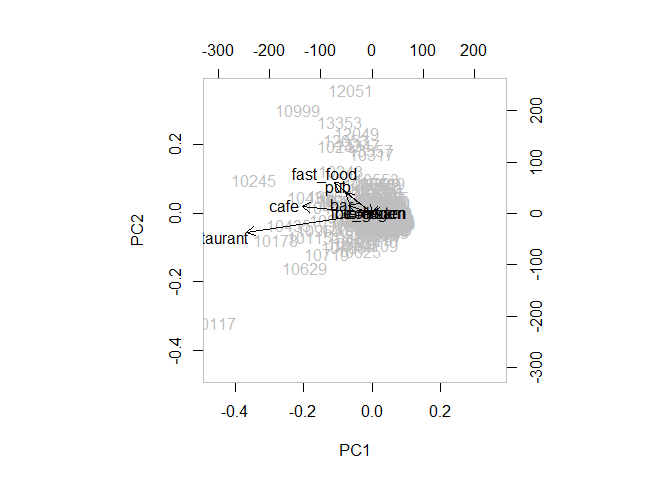
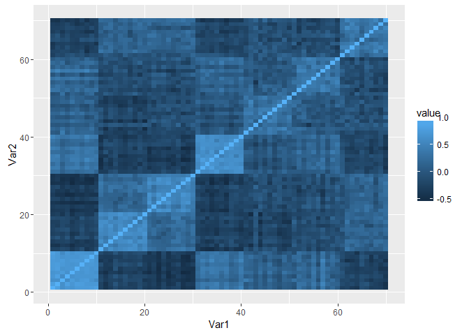

# Principal Component Analysis
Jan-Philipp Kolb  
24. Juli 2015  


## Introduction

- [Introduction to Principal Component Analysis](https://tgmstat.wordpress.com/2013/11/21/introduction-to-principal-component-analysis-pca/)
- dimensionality reduction technique
- better visualisation of data
- high correlation between covariates
- PCA can produce linear combinations of the covariates

[Computing the principal components](https://www.r-bloggers.com/computing-and-visualizing-pca-in-r/)


## [Quick-R on Principal Component Analysis](http://www.statmethods.net/advstats/factor.html)


```r
(load("data/berplz.RData"))
```

```
## [1] "berplz"
```

```r
dat <- berplz@data[,-c(1:3)]
rownames(dat) <- berplz@data$PLZ99
```


         bar   biergarten   cafe   college   fast_food   ice_cream   pub   restaurant
------  ----  -----------  -----  --------  ----------  ----------  ----  -----------
10115     15            0     51         0          13           0    15           72
10117     25            0     83         3          24           3    22          174
10119     13            1     29         0          15           0    16           42
10178     14            1     58         0          36           0     9          108
10179      1            1     16         0           9           0     3           38
10243     15            3     21         2          35           0     7           43


```r
kable(cor(dat))
```

                    bar   biergarten        cafe     college    fast_food   ice_cream          pub   restaurant
-----------  ----------  -----------  ----------  ----------  -----------  ----------  -----------  -----------
bar           1.0000000    0.0360454   0.8230221   0.2666845    0.7442104   0.5030702    0.7655769    0.7907744
biergarten    0.0360454    1.0000000   0.0079651   0.0403088   -0.0188983   0.0053024   -0.0628498    0.0635560
cafe          0.8230221    0.0079651   1.0000000   0.2773126    0.7227623   0.5090110    0.7083860    0.9183939
college       0.2666845    0.0403088   0.2773126   1.0000000    0.1840336   0.1618049    0.1611660    0.3259721
fast_food     0.7442104   -0.0188983   0.7227623   0.1840336    1.0000000   0.3779702    0.7439075    0.6436423
ice_cream     0.5030702    0.0053024   0.5090110   0.1618049    0.3779702   1.0000000    0.4147883    0.5533428
pub           0.7655769   -0.0628498   0.7083860   0.1611660    0.7439075   0.4147883    1.0000000    0.6171304
restaurant    0.7907744    0.0635560   0.9183939   0.3259721    0.6436423   0.5533428    0.6171304    1.0000000

The result is a list containing the coefficients defining each component (sometimes referred to as
loadings), the principal component scores


```r
osm_pca <- prcomp(dat)
print(osm_pca)
```

```
## Standard deviations:
## [1] 27.0347458  7.6022570  4.0953944  3.6724722  2.2694353  0.8355418
## [7]  0.6490672  0.4430962
## 
## Rotation:
##                     PC1          PC2           PC3          PC4
## bar        -0.153571978  0.175690377  0.0921290248 -0.172894561
## biergarten -0.001027976 -0.010407442 -0.0159161408 -0.002125229
## cafe       -0.457977168  0.152338633  0.6194214285  0.616921043
## college    -0.005461803 -0.005700315 -0.0061253661 -0.003308590
## fast_food  -0.243077516  0.725736703 -0.5956534121  0.232428454
## ice_cream  -0.020819374 -0.003187774  0.0009428886 -0.033767378
## pub        -0.176055282  0.479644984  0.4201611784 -0.693648200
## restaurant -0.822268865 -0.434766361 -0.2760420273 -0.230628242
##                    PC5          PC6           PC7          PC8
## bar         0.95124900  0.037526235 -0.0264804817  0.013570635
## biergarten  0.02787938  0.068776865  0.9970447459  0.005200588
## cafe       -0.04899543 -0.011749514  0.0145279240 -0.005070592
## college     0.01370083  0.020612903  0.0032391265 -0.999632989
## fast_food  -0.07299238 -0.007980025  0.0009088318 -0.001091706
## ice_cream   0.03246530 -0.996182056  0.0678003337 -0.019639167
## pub        -0.28394404  0.018051634  0.0167770009 -0.005517046
## restaurant -0.06894721  0.023029344 -0.0099913592  0.008924268
```

```r
plot(dat)
```

<!-- -->

```r
summary(osm_pca)
```

```
## Importance of components:
##                            PC1     PC2     PC3     PC4     PC5     PC6
## Standard deviation     27.0347 7.60226 4.09539 3.67247 2.26944 0.83554
## Proportion of Variance  0.8855 0.07002 0.02032 0.01634 0.00624 0.00085
## Cumulative Proportion   0.8855 0.95551 0.97583 0.99217 0.99841 0.99925
##                            PC7     PC8
## Standard deviation     0.64907 0.44310
## Proportion of Variance 0.00051 0.00024
## Cumulative Proportion  0.99976 1.00000
```

Linear combination for the first principal component is


```r
a1 <- osm_pca$rotation[,1]
a1
```

```
##          bar   biergarten         cafe      college    fast_food 
## -0.153571978 -0.001027976 -0.457977168 -0.005461803 -0.243077516 
##    ice_cream          pub   restaurant 
## -0.020819374 -0.176055282 -0.822268865
```

- cafe and restaurant are the most important variables
- biergarten is less important


```r
hm <- as.matrix(dat)
drop(hm%*% osm_pca$rotation[,1])
```

```
##        10115        10117        10119        10178        10179 
##  -90.6646104 -194.7121070  -56.2771411 -127.8540369  -41.4443150 
##        10243        10245        10247        10249        10315 
##  -57.0327689 -151.2187708  -57.6633700  -28.7466876   -6.9755174 
##        10317        10318        10319        10365        10367 
##  -23.0301437  -16.5719639  -12.0740638  -20.6318701   -4.6134961 
##        10369        10405        10407        10409        10435 
##  -10.4542704  -72.2910806  -15.7430980   -3.1008390 -112.8694620 
##        10437        10439        10551        10553        10555 
##  -90.1231269  -23.6812821  -12.2653533  -17.5556894  -29.7146749 
##        10557        10559        10585        10587        10589 
##  -43.2311577   -6.8422649  -29.3971268  -37.5412244  -16.4330533 
##        10623        10625        10627        10629        10707 
##  -47.3955760  -36.9804071  -39.9110095  -96.0927329  -40.8470854 
##        10709        10711        10713        10715        10717 
##  -35.4675212  -29.8815001  -30.0099699  -22.8290053  -26.7039914 
##        10719        10777        10779        10781        10783 
##  -71.6850391  -27.9232604  -17.0327857  -55.3735692  -11.9398187 
##        10785        10787        10789        10823        10825 
##  -53.6955303  -14.2623659  -37.2967158  -47.1897278   -9.9115635 
##        10827        10829        10961        10963        10965 
##  -25.1240898  -11.9806381  -11.6259111  -80.7556584  -67.0155578 
##        10967        10969        10997        10999        12043 
##  -68.2178809  -45.8714791  -58.3988958 -103.3489301  -20.8915141 
##        12045        12047        12049        12051        12053 
##   -8.2154991  -36.0523293  -39.1103425  -45.6096527  -51.7619917 
##        12055        12057        12059        12099        12101 
##  -10.3863827   -7.6848786   -9.1718606   -5.5790868  -14.8159840 
##        12103        12105        12107        12109        12157 
##  -23.6925030  -20.4436449  -11.8529918   -8.1716631  -13.8224903 
##        12159        12161        12163        12165        12167 
##  -17.3107046  -29.2477468  -45.0923793  -21.8423586  -14.5128575 
##        12169        12203        12205        12207        12209 
##   -5.7756944  -18.3073516  -15.6971114  -13.9288435  -12.4981842 
##        12247        12249        12277        12279        12305 
##  -11.2788459   -5.4390862   -8.4025848   -6.5277746  -11.3493989 
##        12307        12309        12347        12349        12351 
##   -9.3717031    0.0000000  -14.3436427  -15.3772913   -6.6611699 
##        12353        12355        12357        12359        12435 
##  -14.5772209  -13.9448534   -4.1943633   -5.1926874  -14.1666249 
##        12437        12439        12459        12487        12489 
##  -11.8529918  -10.0473187  -18.1832590  -16.9993336  -22.4429642 
##        12524        12526        12527        12555        12557 
##   -8.5263018   -8.6372759  -10.8890750  -18.3113004  -25.6634671 
##        12559        12587        12589        12619        12621 
##   -9.2540197  -14.7457821   -4.0119775  -10.7333841   -7.0729442 
##        12623        12627        12629        12679        12681 
##   -9.1956479   -7.5199765   -1.8260548   -4.5506538  -14.4320088 
##        12683        12685        12687        12689        13051 
##  -10.2328164   -8.0834559   -2.5216477   -3.1712492   -1.5624250 
##        13053        13055        13057        13059        13086 
##  -12.1451670   -9.2946636   -3.6594781   -2.8317474  -12.9808868 
##        13088        13089        13125        13127        13129 
##  -14.2606345   -3.2890755  -11.6349257   -5.0166322   -4.2104916 
##        13156        13158        13159        13187        13189 
##  -17.7307372   -6.8046233   -0.4579772  -26.9189107   -4.3162266 
##        13347        13349        13351        13353        13355 
##  -38.2921881   -0.9441322  -18.0832799  -57.3976037  -12.3047595 
##        13357        13359        13403        13405        13407 
##  -23.7046155  -14.7404402   -7.8111870  -16.1351290  -15.0885245 
##        13409        13435        13437        13439        13465 
##   -6.0447860    0.0000000  -14.6988139   -6.0277866   -4.6911848 
##        13467        13469        13503        13505        13507 
##   -7.6993664   -5.9336145   -8.0892933   -2.3476484  -33.8957704 
##        13509        13581        13583        13585        13587 
##  -10.0599275  -10.0502745   -1.8205930  -19.3776494  -13.0149053 
##        13589        13591        13593        13595        13597 
##   -3.0466471   -6.9309106   -7.4834387  -10.3525159  -22.9038362 
##        13599        13627        13629        14050        14052 
##   -9.7843494   -2.3747983  -19.9893414   -6.8478917  -16.8029661 
##        14053        14055        14057        14059        14089 
##   -0.2441055  -11.8796062  -53.9511307  -31.4855416  -16.4451610 
##        14109        14129        14163        14165        14167 
##  -18.7665249  -14.3447020  -22.5809658  -14.3925152   -4.1661854 
##        14169        14193        14195        14197        14199 
##   -6.3882506  -19.0686380  -26.9644956  -18.1267376  -19.4794776
```


```r
plot(osm_pca)
```

<!-- -->


```r
biplot(osm_pca, col = c("gray", "black"))
```

<!-- -->


```r
#?princomp
fit <- princomp(dat, cor=TRUE)
fit
```

```
## Call:
## princomp(x = dat, cor = TRUE)
## 
## Standard deviations:
##    Comp.1    Comp.2    Comp.3    Comp.4    Comp.5    Comp.6    Comp.7 
## 2.1042233 1.0217004 0.9508640 0.8416641 0.6435552 0.5069438 0.4208653 
##    Comp.8 
## 0.2599019 
## 
##  8  variables and  190 observations.
```

```r
summary(fit) # print variance accounted for
```

```
## Importance of components:
##                           Comp.1    Comp.2    Comp.3     Comp.4     Comp.5
## Standard deviation     2.1042233 1.0217004 0.9508640 0.84166409 0.64355516
## Proportion of Variance 0.5534695 0.1304840 0.1130178 0.08854981 0.05177041
## Cumulative Proportion  0.5534695 0.6839534 0.7969712 0.88552102 0.93729142
##                           Comp.6     Comp.7      Comp.8
## Standard deviation     0.5069438 0.42086534 0.259901860
## Proportion of Variance 0.0321240 0.02214095 0.008443622
## Cumulative Proportion  0.9694154 0.99155638 1.000000000
```

```r
loadings(fit) # pc loadings
```

```
## 
## Loadings:
##            Comp.1 Comp.2 Comp.3 Comp.4 Comp.5 Comp.6 Comp.7 Comp.8
## bar        -0.436                0.102        -0.242  0.857       
## biergarten         0.870  0.469        -0.111                     
## cafe       -0.443                       0.450        -0.256  0.731
## college    -0.165  0.421 -0.858  0.129 -0.201                     
## fast_food  -0.396 -0.129  0.134  0.329 -0.314  0.772              
## ice_cream  -0.298               -0.885 -0.340                     
## pub        -0.396 -0.192  0.137  0.252 -0.467 -0.580 -0.398 -0.106
## restaurant -0.429  0.105        -0.103  0.558        -0.192 -0.667
## 
##                Comp.1 Comp.2 Comp.3 Comp.4 Comp.5 Comp.6 Comp.7 Comp.8
## SS loadings     1.000  1.000  1.000  1.000  1.000  1.000  1.000  1.000
## Proportion Var  0.125  0.125  0.125  0.125  0.125  0.125  0.125  0.125
## Cumulative Var  0.125  0.250  0.375  0.500  0.625  0.750  0.875  1.000
```

```r
plot(fit,type="lines") # scree plot
```

<!-- -->

```r
head(fit$scores) # the principal components
```

```
##            Comp.1     Comp.2     Comp.3     Comp.4     Comp.5     Comp.6
## 10115  -4.0779845 -0.6582332  0.4835058  0.9240400  2.2665171 -1.1232950
## 10117 -10.8476807  2.2279416 -4.5857974 -0.3966576  2.7875393 -0.9644031
## 10119  -2.7272668  0.4595964  1.2266161  1.2132797  0.4373023 -0.9734638
## 10178  -5.5949153  0.6706557  1.3651563  1.4998025  2.8420384  1.4135545
## 10179  -0.1087302  0.9079411  0.6914902  0.2483107  0.9593701  0.2199065
## 10243  -3.7277822  4.8580314 -0.8719373  2.4370571 -1.0862833  1.3733283
##           Comp.7      Comp.8
## 10115  0.3007956  0.58174931
## 10117 -0.1245517 -0.42169742
## 10119  0.5051163  0.22492370
## 10178 -0.1153244 -0.12477690
## 10179 -0.5130294 -0.19796702
## 10243  1.2135465 -0.04148091
```

```r
biplot(fit) 
```

<!-- -->


```r
install.packages("psych")
```


```r
# install.packages("psych")
library(psych)
fit <- principal(mydata, nfactors=5, rotate="varimax")
fit # print results 
```


## Intro Principal Component Analysis

- Al-Ahmadgaid Asaad [Analysis Programming](http://alstatr.blogspot.de/2014/12/principal-component-analysis-on-imaging.html)

- [Analysis with Programming](http://alstatr.blogspot.de/)


## Intro Principal Component Analysis


[Source](https://1.bp.blogspot.com/-oIhTE11jN2M/VJal1FsTndI/AAAAAAAACCU/BQOhihmxKbg/s1600/Screen+Shot+2014-12-21+at+6.49.01+PM.png)

## Intro Principal Component Analysis


[Source](https://1.bp.blogspot.com/-wXHcQqUbIg4/VJuuXbZlUKI/AAAAAAAACGc/ythfr395Z5s/s1600/Screen+Shot+2014-12-25+at+2.25.12+PM.png)

## [Plot Principal Component Analysis](https://martinsbioblogg.wordpress.com/2013/06/26/using-r-two-plots-of-principal-component-analysis/)


```r
sample.groups <- c(rep(1, 10), rep(2, 10), rep(3, 10),
  rep(4, 10), rep(5, 10))
variable.groups <- c(rep(1, 10), rep(2, 10), rep(3, 10),
  rep(4, 10), rep(5, 10), rep(6, 10),
  rep(7, 10))
 
data <- matrix(nrow=length(sample.groups), ncol=70)
base.data <- matrix(nrow=length(sample.groups), ncol=7)
 
for (j in 1:ncol(base.data)) {
  mu <- rnorm(1, 0, 4)
  sigma <- runif(1, 5, 10)
  base.data[,j] <- sample.groups*mu +
  rnorm(length(sample.groups), 0, sigma)
}
```


## Prepare data


```r
for (j in 1:ncol(data)) {
  mu <- runif(1, 0, 4)
  data[,j] <- base.data[,variable.groups[j]] +
  rnorm(length(sample.groups), mu, 10)
}
```


## qplot


```r
library(ggplot2)
```

```
## Warning: package 'ggplot2' was built under R version 3.3.2
```

```r
library(reshape2)
```

```
## Warning: package 'reshape2' was built under R version 3.3.2
```

```r
qplot(x=Var1, y=Var2, data=melt(cor(data)), geom="tile",
fill=value)
```

<!-- -->


## Resources

- [Principal Component Analysis on Imaging](http://www.r-bloggers.com/principal-component-analysis-on-imaging/)

- [Introduction to principal component analysis](https://cran.r-project.org/web/packages/HSAUR/vignettes/Ch_principal_components_analysis.pdf)

