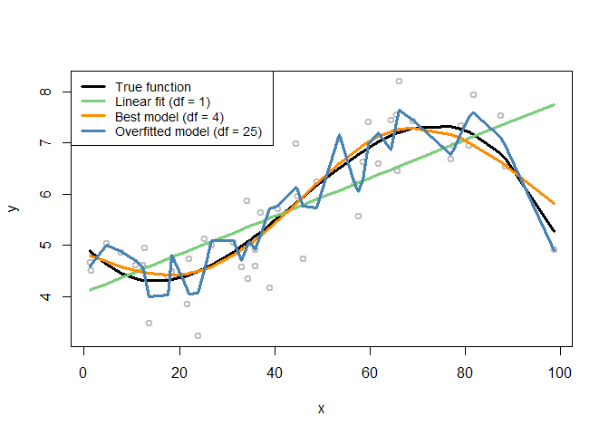

# Predictive Analytics
Jan-Philipp Kolb  
18 Juli 2016  


## [Cross-Validation](http://www.r-bloggers.com/cross-validation-for-predictive-analytics-using-r/)

- loss function


```r
seed <- 1809
set.seed(seed)

gen_data <- function(n, beta, sigma_eps) {
    eps <- rnorm(n, 0, sigma_eps)
    x <- sort(runif(n, 0, 100))
    X <- cbind(1, poly(x, degree = (length(beta) - 1), raw = TRUE))
    y <- as.numeric(X %*% beta + eps)
    
    return(data.frame(x = x, y = y))
}

# Fit the models
require(splines)
```

```
## Loading required package: splines
```

```r
n_rep <- 100
n_df <- 30
df <- 1:n_df
beta <- c(5, -0.1, 0.004, -3e-05)
n_train <- 50
n_test <- 10000
sigma_eps <- 0.5

xy <- res <- list()
xy_test <- gen_data(n_test, beta, sigma_eps)
for (i in 1:n_rep) {
    xy[[i]] <- gen_data(n_train, beta, sigma_eps)
    x <- xy[[i]][, "x"]
    y <- xy[[i]][, "y"]
    res[[i]] <- apply(t(df), 2, function(degf) lm(y ~ ns(x, df = degf)))
}
```


```r
# Plot the data
x <- xy[[1]]$x
X <- cbind(1, poly(x, degree = (length(beta) - 1), raw = TRUE))
y <- xy[[1]]$y
plot(y ~ x, col = "gray", lwd = 2)
lines(x, X %*% beta, lwd = 3, col = "black")
lines(x, fitted(res[[1]][[1]]), lwd = 3, col = "palegreen3")
lines(x, fitted(res[[1]][[4]]), lwd = 3, col = "darkorange")
lines(x, fitted(res[[1]][[25]]), lwd = 3, col = "steelblue")
legend(x = "topleft", legend = c("True function", "Linear fit (df = 1)", "Best model (df = 4)", 
    "Overfitted model (df = 25)"), lwd = rep(3, 4), col = c("black", "palegreen3", 
    "darkorange", "steelblue"), text.width = 32, cex = 0.85)
```

<!-- -->

## [Standards in Predictive Analytics](http://zementis.com/knowledge-base/standards-in-predictive-analytics/) 

- [Predictive Model Markup Language](https://de.wikipedia.org/wiki/Predictive_Model_Markup_Language)


```r
# install.packages("pmml")

library("pmml")
```

```
## Warning: package 'pmml' was built under R version 3.3.1
```

```
## Loading required package: XML
```


- [Intro R and Predictive Analytics](http://www.r-bloggers.com/introductions-to-r-and-predictive-analytics/)


[Webinar on web analytics](http://www.tatvic.com/perform-predictive-analysis-on-your-web-analytics-tool/)

## Support Vector Machines


[classification with Support Vector Machines](http://lectures.molgen.mpg.de/statistik03/docs/Kapitel_16.pdf)

- [support vector machines](http://www.svms.org/tutorials/Berwick2003.pdf)


```r
# http://joelcadwell.blogspot.de/2016/05/using-support-vector-machines-as-flower.html

library(e1071)
data(iris)
attach(iris)
 
## classification mode
# default with factor response:
model <- svm(Species ~ ., data = iris)
print(model)
```

```
## 
## Call:
## svm(formula = Species ~ ., data = iris)
## 
## 
## Parameters:
##    SVM-Type:  C-classification 
##  SVM-Kernel:  radial 
##        cost:  1 
##       gamma:  0.25 
## 
## Number of Support Vectors:  51
```

## Links

[Expert videos on statistical learning](http://www.r-bloggers.com/in-depth-introduction-to-machine-learning-in-15-hours-of-expert-videos/)
