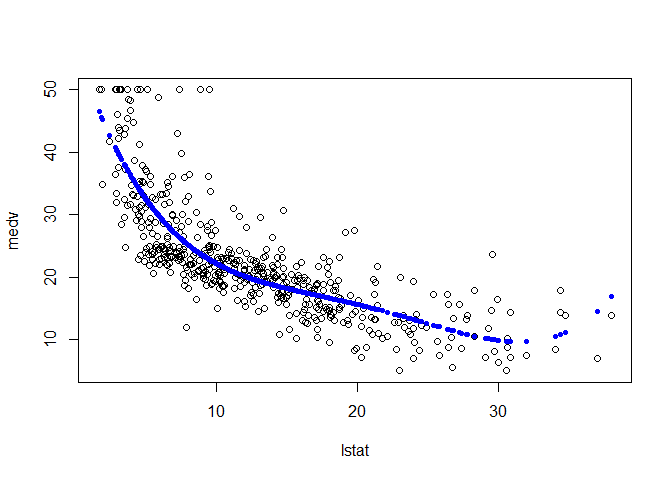

# Regression
Jan-Philipp Kolb  
26 Juli 2016  


## [Linear Model](https://www.youtube.com/watch?v=5ONFqIk3RFg)

The following is based on course by Trevor Hastie and Rob Tibshirani on statistical learning.  


```r
install.packages("ISLR")
```


```r
library("MASS")
library("ISLR")
```

```
## Warning: package 'ISLR' was built under R version 3.2.5
```


```r
names(Boston)
```

```
##  [1] "crim"    "zn"      "indus"   "chas"    "nox"     "rm"      "age"    
##  [8] "dis"     "rad"     "tax"     "ptratio" "black"   "lstat"   "medv"
```

```r
# ?Boston
```


```r
plot(medv~lstat,Boston)
```

<!-- -->

```r
fit1 <- lm(medv~lstat,Boston)
summary(fit1)
```

```
## 
## Call:
## lm(formula = medv ~ lstat, data = Boston)
## 
## Residuals:
##     Min      1Q  Median      3Q     Max 
## -15.168  -3.990  -1.318   2.034  24.500 
## 
## Coefficients:
##             Estimate Std. Error t value Pr(>|t|)    
## (Intercept) 34.55384    0.56263   61.41   <2e-16 ***
## lstat       -0.95005    0.03873  -24.53   <2e-16 ***
## ---
## Signif. codes:  0 '***' 0.001 '**' 0.01 '*' 0.05 '.' 0.1 ' ' 1
## 
## Residual standard error: 6.216 on 504 degrees of freedom
## Multiple R-squared:  0.5441,	Adjusted R-squared:  0.5432 
## F-statistic: 601.6 on 1 and 504 DF,  p-value: < 2.2e-16
```

[Picture - Simple Linear Regression](http://i0.wp.com/3.bp.blogspot.com/-M-eh1oV6NT0/Vn4nPWRl-LI/AAAAAAAAAbA/qiLz64Ky2Zw/s320/regression.png?resize=350%2C200)


```r
plot(medv~lstat,Boston)
abline(fit1,col=c("#8B008B"))
```

<!-- -->


```r
confint(fit1)
```

```
##                 2.5 %     97.5 %
## (Intercept) 33.448457 35.6592247
## lstat       -1.026148 -0.8739505
```

```r
predict(fit1,data.frame(lstat=c(5,10,15)),interval="confidence")
```

```
##        fit      lwr      upr
## 1 29.80359 29.00741 30.59978
## 2 25.05335 24.47413 25.63256
## 3 20.30310 19.73159 20.87461
```


```r
fit2 <- lm(medv~lstat+age,Boston)
summary(fit2)
```

```
## 
## Call:
## lm(formula = medv ~ lstat + age, data = Boston)
## 
## Residuals:
##     Min      1Q  Median      3Q     Max 
## -15.981  -3.978  -1.283   1.968  23.158 
## 
## Coefficients:
##             Estimate Std. Error t value Pr(>|t|)    
## (Intercept) 33.22276    0.73085  45.458  < 2e-16 ***
## lstat       -1.03207    0.04819 -21.416  < 2e-16 ***
## age          0.03454    0.01223   2.826  0.00491 ** 
## ---
## Signif. codes:  0 '***' 0.001 '**' 0.01 '*' 0.05 '.' 0.1 ' ' 1
## 
## Residual standard error: 6.173 on 503 degrees of freedom
## Multiple R-squared:  0.5513,	Adjusted R-squared:  0.5495 
## F-statistic:   309 on 2 and 503 DF,  p-value: < 2.2e-16
```

```r
fit3 <- lm(medv~.,Boston)
summary(fit3)
```

```
## 
## Call:
## lm(formula = medv ~ ., data = Boston)
## 
## Residuals:
##     Min      1Q  Median      3Q     Max 
## -15.595  -2.730  -0.518   1.777  26.199 
## 
## Coefficients:
##               Estimate Std. Error t value Pr(>|t|)    
## (Intercept)  3.646e+01  5.103e+00   7.144 3.28e-12 ***
## crim        -1.080e-01  3.286e-02  -3.287 0.001087 ** 
## zn           4.642e-02  1.373e-02   3.382 0.000778 ***
## indus        2.056e-02  6.150e-02   0.334 0.738288    
## chas         2.687e+00  8.616e-01   3.118 0.001925 ** 
## nox         -1.777e+01  3.820e+00  -4.651 4.25e-06 ***
## rm           3.810e+00  4.179e-01   9.116  < 2e-16 ***
## age          6.922e-04  1.321e-02   0.052 0.958229    
## dis         -1.476e+00  1.995e-01  -7.398 6.01e-13 ***
## rad          3.060e-01  6.635e-02   4.613 5.07e-06 ***
## tax         -1.233e-02  3.760e-03  -3.280 0.001112 ** 
## ptratio     -9.527e-01  1.308e-01  -7.283 1.31e-12 ***
## black        9.312e-03  2.686e-03   3.467 0.000573 ***
## lstat       -5.248e-01  5.072e-02 -10.347  < 2e-16 ***
## ---
## Signif. codes:  0 '***' 0.001 '**' 0.01 '*' 0.05 '.' 0.1 ' ' 1
## 
## Residual standard error: 4.745 on 492 degrees of freedom
## Multiple R-squared:  0.7406,	Adjusted R-squared:  0.7338 
## F-statistic: 108.1 on 13 and 492 DF,  p-value: < 2.2e-16
```


```r
par(mfrow=c(2,2))
plot(fit3)
```

<!-- -->

First plot: residuals vs fitted

is there some non-linearity - or straight line

Third plot: Scale Location

is the variance changing with the mean


```r
fit4 <- update(fit3,~.-age-indus)
summary(fit4)
```

```
## 
## Call:
## lm(formula = medv ~ crim + zn + chas + nox + rm + dis + rad + 
##     tax + ptratio + black + lstat, data = Boston)
## 
## Residuals:
##      Min       1Q   Median       3Q      Max 
## -15.5984  -2.7386  -0.5046   1.7273  26.2373 
## 
## Coefficients:
##               Estimate Std. Error t value Pr(>|t|)    
## (Intercept)  36.341145   5.067492   7.171 2.73e-12 ***
## crim         -0.108413   0.032779  -3.307 0.001010 ** 
## zn            0.045845   0.013523   3.390 0.000754 ***
## chas          2.718716   0.854240   3.183 0.001551 ** 
## nox         -17.376023   3.535243  -4.915 1.21e-06 ***
## rm            3.801579   0.406316   9.356  < 2e-16 ***
## dis          -1.492711   0.185731  -8.037 6.84e-15 ***
## rad           0.299608   0.063402   4.726 3.00e-06 ***
## tax          -0.011778   0.003372  -3.493 0.000521 ***
## ptratio      -0.946525   0.129066  -7.334 9.24e-13 ***
## black         0.009291   0.002674   3.475 0.000557 ***
## lstat        -0.522553   0.047424 -11.019  < 2e-16 ***
## ---
## Signif. codes:  0 '***' 0.001 '**' 0.01 '*' 0.05 '.' 0.1 ' ' 1
## 
## Residual standard error: 4.736 on 494 degrees of freedom
## Multiple R-squared:  0.7406,	Adjusted R-squared:  0.7348 
## F-statistic: 128.2 on 11 and 494 DF,  p-value: < 2.2e-16
```

## Interactions


```r
fit5 <- lm(medv~lstat*age,Boston)
summary(fit5)
```

```
## 
## Call:
## lm(formula = medv ~ lstat * age, data = Boston)
## 
## Residuals:
##     Min      1Q  Median      3Q     Max 
## -15.806  -4.045  -1.333   2.085  27.552 
## 
## Coefficients:
##               Estimate Std. Error t value Pr(>|t|)    
## (Intercept) 36.0885359  1.4698355  24.553  < 2e-16 ***
## lstat       -1.3921168  0.1674555  -8.313 8.78e-16 ***
## age         -0.0007209  0.0198792  -0.036   0.9711    
## lstat:age    0.0041560  0.0018518   2.244   0.0252 *  
## ---
## Signif. codes:  0 '***' 0.001 '**' 0.01 '*' 0.05 '.' 0.1 ' ' 1
## 
## Residual standard error: 6.149 on 502 degrees of freedom
## Multiple R-squared:  0.5557,	Adjusted R-squared:  0.5531 
## F-statistic: 209.3 on 3 and 502 DF,  p-value: < 2.2e-16
```


```r
fit6 <- lm(medv ~ lstat +I(lstat^2),Boston)
summary(fit6)
```

```
## 
## Call:
## lm(formula = medv ~ lstat + I(lstat^2), data = Boston)
## 
## Residuals:
##      Min       1Q   Median       3Q      Max 
## -15.2834  -3.8313  -0.5295   2.3095  25.4148 
## 
## Coefficients:
##              Estimate Std. Error t value Pr(>|t|)    
## (Intercept) 42.862007   0.872084   49.15   <2e-16 ***
## lstat       -2.332821   0.123803  -18.84   <2e-16 ***
## I(lstat^2)   0.043547   0.003745   11.63   <2e-16 ***
## ---
## Signif. codes:  0 '***' 0.001 '**' 0.01 '*' 0.05 '.' 0.1 ' ' 1
## 
## Residual standard error: 5.524 on 503 degrees of freedom
## Multiple R-squared:  0.6407,	Adjusted R-squared:  0.6393 
## F-statistic: 448.5 on 2 and 503 DF,  p-value: < 2.2e-16
```

```r
attach(Boston)

plot(medv~lstat)
points(lstat,fitted(fit6),col="red",pch=20)
```

<!-- -->

## Fitting Polynomials


```r
fit7 <- lm(medv ~ lstat +poly(lstat,4),Boston)
plot(medv~lstat)
points(lstat,fitted(fit7),col="blue",pch=20)
```

<!-- -->

tends to overfit


```r
kable(head(Carseats))
```


 Sales   CompPrice   Income   Advertising   Population   Price  ShelveLoc    Age   Education  Urban   US  
------  ----------  -------  ------------  -----------  ------  ----------  ----  ----------  ------  ----
  9.50         138       73            11          276     120  Bad           42          17  Yes     Yes 
 11.22         111       48            16          260      83  Good          65          10  Yes     Yes 
 10.06         113       35            10          269      80  Medium        59          12  Yes     Yes 
  7.40         117      100             4          466      97  Medium        55          14  Yes     Yes 
  4.15         141       64             3          340     128  Bad           38          13  Yes     No  
 10.81         124      113            13          501      72  Bad           78          16  No      Yes 


```r
attach(Carseats)
mod1 <- lm(Sales~.+Income:Advertising,Carseats)
contrasts(ShelveLoc)
```

```
##        Good Medium
## Bad       0      0
## Good      1      0
## Medium    0      1
```

