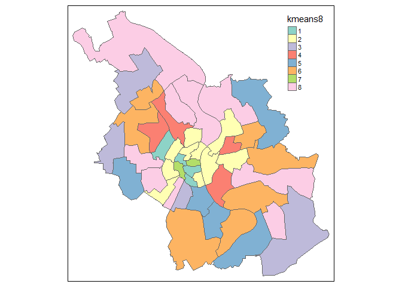

# Analyzing OSM data in zip code areas
Jan-Philipp Kolb  
31 August 2016  


## The libraries


```r
library("geosmdata")
library("rgdal")
```

## The zip code file

[Shape File for zip codes in Germany](http://www.metaspatial.net/download/plz.tar.gz)


```r
PLZ <- readOGR ("post_pl.shp","post_pl")
berplz <- PLZ[PLZ$PLZORT99%in%c("Berlin-West","Berlin (östl. Stadtbezirke)"),]
hhplz <- PLZ[PLZ$PLZORT99%in%"Hamburg",]
koelnplz <- PLZ[PLZ$PLZORT99%in%"Köln",]

save(koelnplz,file="data/koelnplz.RData")
```


```r
load("data/koelnplz.RData")
```


```r
par(mai=c(0,0,0,0))
plot(koelnplz,col="royalblue")
```

<!-- -->

## Get OSM data

[Overview of OSM features](http://wiki.openstreetmap.org/wiki/DE:Map_Features)


## Point in Polygon


```r
dnam <- dir()
dnam2 <- agrep("info",dnam)
dnam3 <- dnam[dnam2]
dnam4 <- gsub("info_","",dnam3)
dnam4 <- gsub("_Koeln.RData","",dnam4)

for (i in 1:length(dnam4)){
  load(dnam3[i])
  poi <- info
  coordinates(poi) <- ~ lon + lat
  proj4string(poi) <- proj4string(koelnplz)
  ind <- over(poi, koelnplz)
  
  tab2plz <- tapply(ind$PLZ99_N,ind$PLZ99_N,length)
  ind <- match(koelnplz@data$PLZ99_N,names(tab2plz))
  eval(parse(text=paste0("koelnplz@data$",dnam4[i],"<-tab2plz[ind]")))
  eval(parse(text=paste0("koelnplz$",dnam4[i],"[is.na(koelnplz$",dnam4[i],")]<-0")))
}

save(koelnplz,file="koelnplz.RData")
```

## Plot the results


```r
library("sp")
```


```r
load("data/koelnplz.RData")

spplot(koelnplz,c("cafe","fast_food"))
```

<!-- -->


```r
kable(head(koelnplz@data))
```

       PLZ99    PLZ99_N  PLZORT99    bar   biergarten   cafe   college   fast_food   ice_cream   pub   restaurant
-----  ------  --------  ---------  ----  -----------  -----  --------  ----------  ----------  ----  -----------
3576   50667      50667  Köln          5            0     52         1          36           1    44           99
3577   50668      50668  Köln          2            0     10         1           7           0    11           29
3578   50670      50670  Köln          2            0      8         2           6           2    13           36
3579   50672      50672  Köln         20            1     16         0          19           4    17           56
3580   50674      50674  Köln         31            1     33         4          40           1    66          117
3581   50676      50676  Köln         10            0     29         2          31           0    21           44


```r
koelnplz@data$bar2 <- koelnplz@data$bar/sum(koelnplz@data$bar)

koelnplz@data$college2 <- koelnplz@data$college/sum(koelnplz@data$college)
```


```r
spplot(koelnplz,c("bar2","college2"))
```

<!-- -->

## Cluster Analysis


```r
mydata <- koelnplz@data[,c("bar","biergarten","cafe","college","fast_food","ice_cream","pub","restaurant")]
```

K-Means Clustering


```r
fit <- kmeans(mydata, 4) # 4 cluster solution
mydata <- data.frame(mydata, fit$cluster)
koelnplz@data$kmeans4 <- as.factor(fit$cluster)
```


```r
library("tmap")
qtm(koelnplz,"kmeans4")
```

<!-- -->


```r
fit8 <- kmeans(mydata, 8) # 8 cluster solution
mydata <- data.frame(mydata, fit8$cluster)
koelnplz@data$kmeans8 <- as.factor(fit8$cluster)
```


```r
qtm(koelnplz,"kmeans8")
```

<!-- -->


```r
rownames(mydata) <- koelnplz$PLZ99_N
s <- mydata[,-match("fit.cluster",colnames(mydata))]
s0 <- s
for (i in 1:ncol(s)){
s0[,i] <- s[,i]/apply(s,1,sd)  
}

hcities <- hclust(dist(s0), method = "ward.D2")

plot(hcities, sub = "")
```

<!-- -->


```r
ct2h <- cutree(hcities, h = 2)
```


```r
ind <- match(koelnplz$PLZ99_N,names(ct2h))
koelnplz$ct2h <- as.factor(ct2h[ind])
```


```r
qtm(koelnplz,"ct2h")
```

<!-- -->

```r
qtm(koelnplz,c("kmeans8","ct2h"))
```

<!-- -->


[Shapefiles for Colone](http://offenedaten-koeln.de/dataset/stadtteile)


