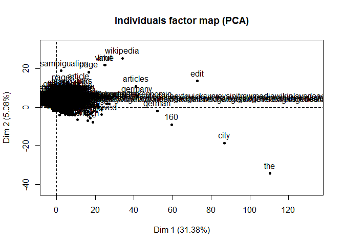
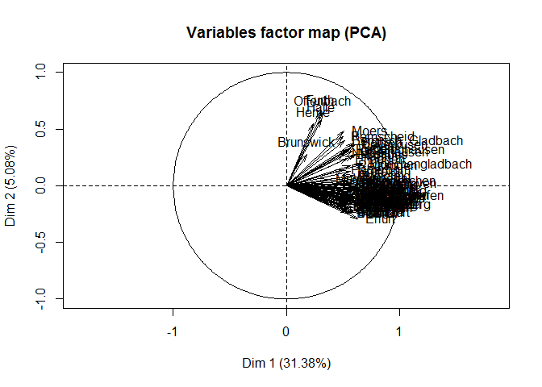
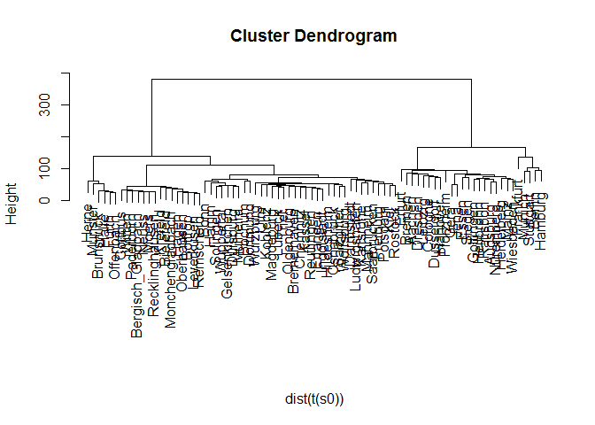
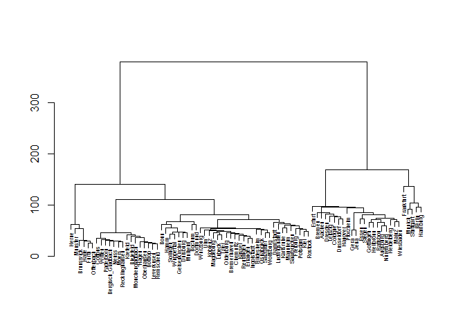
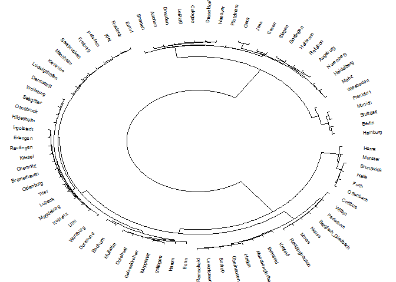
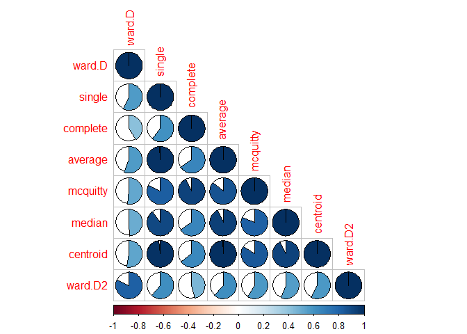
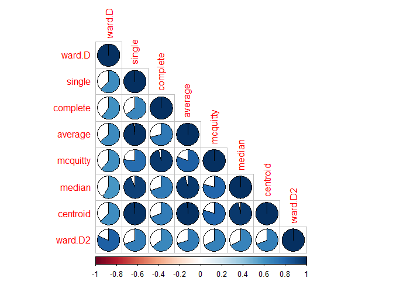
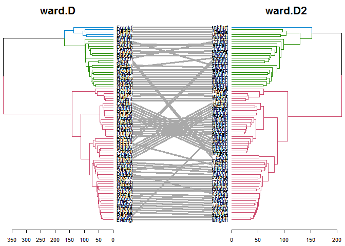

# Analysing German Cities
Jan-Philipp Kolb  
26 August 2016  


## The used Libraries

The R-library [`stringi`](http://stringi.rexamine.com/) by Marek Gagolewski and Bartek Tartanus provides character string processing facilities.


```r
library("stringi")
```

[`tm`](http://www.jstatsoft.org/v25/i05/) is a R-package to realize text mining. It is authored by Ingo Feinerer, Kurt Hornik, and David Meyer.


```r
library("tm")
```

And finally we need the [`FactoMineR`](https://cran.r-project.org/web/packages/FactoMineR/vignettes/FactoMineR.pdf)-package created by Sebastien Le, Julie Josse and Francois Husson to perform the principal component analysis. 


```r
library("FactoMineR")
```


## Overview - Cities in Germany


```r
library(maps)
data(world.cities)
```


name                 country.etc      pop     lat    long   capital
-------------------  ------------  ------  ------  ------  --------
'Abasan al-Jadidah   Palestine       5629   31.31   34.34         0
'Abasan al-Kabirah   Palestine      18999   31.32   34.35         0
'Abdul Hakim         Pakistan       47788   30.55   72.11         0
'Abdullah-as-Salam   Kuwait         21817   29.36   47.98         0
'Abud                Palestine       2456   32.03   35.07         0
'Abwein              Palestine       3434   32.03   35.20         0


```r
dcities <- world.cities[world.cities$country.etc=="Germany",]
```


      name     country.etc       pop     lat    long   capital
----  -------  ------------  -------  ------  ------  --------
139   Aachen   Germany        273472   50.77    6.09         0
145   Aalen    Germany         67188   48.85   10.09         0
320   Achern   Germany         24637   48.63    8.08         0
322   Achim    Germany         30109   53.04    9.01         0
590   Ahaus    Germany         38293   52.09    7.01         0
597   Ahlen    Germany         55265   51.77    7.88         0

We will do the analysis only on the biggest cities in Germany:


```r
nrow(dcities)
```

```
## [1] 998
```

```r
dcities[which.min(dcities$pop),]
```

```
##       name country.etc   pop   lat long capital
## 3770 Bebra     Germany 14713 50.97  9.8       0
```

```r
dcitiesb <- dcities[dcities$pop>100000,]
nrow(dcitiesb)
```

```
## [1] 82
```


## Getting Wikipedia Articles


```r
wiki <- "http://en.wikipedia.org/wiki/"

titles <- dcitiesb$name
titles <- gsub(" ","_",titles)
```


```r
articles <- character(length(titles))

for (i in 1:length(titles)){
    articles[i] <- stri_flatten(readLines(stri_paste(wiki, titles[i])), col = " ")
    cat(titles[i],"\n")
}
save(articles,file="data/GermanCities_Wikipedia.RData")
```


```r
docs <- Corpus(VectorSource(articles))

docs2 <- tm_map(docs, function(x) stri_replace_all_regex(x, "<.+?>", " "))
docs3 <- tm_map(docs2, function(x) stri_replace_all_fixed(x, "\t", " "))

docs4 <- tm_map(docs3, PlainTextDocument)
docs5 <- tm_map(docs4, stripWhitespace)
docs6 <- tm_map(docs5, removeWords, stopwords("english"))
docs7 <- tm_map(docs6, removePunctuation)
docs8 <- tm_map(docs7, tolower)
docs8 <- tm_map(docs8, PlainTextDocument)
dtm <- DocumentTermMatrix(docs8)  

save(dtm,file="data/GermanCities_Wikipedia_dtm.RData")
```


## [Principal Component Analysis](https://dzone.com/articles/manipulate-clusters-of-texts)


```r
load("data/GermanCities_Wikipedia_dtm.RData")
```


The following is based on a blog post by  Arthur Charpentier on mining Wikipedia. He uses R to manipulate clusters of texts.


```r
dtm2 <- as.matrix(dtm)
frequency <- colSums(dtm2)
frequency <- sort(frequency, decreasing=TRUE)
words <- frequency[frequency>20]
s <- dtm2[1,which(colnames(dtm2) %in% names(words))]

for(i in 2:nrow(dtm2)){
  s <- cbind(s,dtm2[i,which(colnames(dtm2) %in% names(words))])
} 

colnames(s) <- titles
```


```r
PCA(s)
```

<!-- --><!-- -->

```
## **Results for the Principal Component Analysis (PCA)**
## The analysis was performed on 2295 individuals, described by 82 variables
## *The results are available in the following objects:
## 
##    name               description                          
## 1  "$eig"             "eigenvalues"                        
## 2  "$var"             "results for the variables"          
## 3  "$var$coord"       "coord. for the variables"           
## 4  "$var$cor"         "correlations variables - dimensions"
## 5  "$var$cos2"        "cos2 for the variables"             
## 6  "$var$contrib"     "contributions of the variables"     
## 7  "$ind"             "results for the individuals"        
## 8  "$ind$coord"       "coord. for the individuals"         
## 9  "$ind$cos2"        "cos2 for the individuals"           
## 10 "$ind$contrib"     "contributions of the individuals"   
## 11 "$call"            "summary statistics"                 
## 12 "$call$centre"     "mean of the variables"              
## 13 "$call$ecart.type" "standard error of the variables"    
## 14 "$call$row.w"      "weights for the individuals"        
## 15 "$call$col.w"      "weights for the variables"
```


In the following the normalization is done and the results are plotted. 


```r
s0 <- s/apply(s,1,sd)
hcities <- hclust(dist(t(s0)), method = "ward")

plot(hcities, labels = titles, sub = "")
```

<!-- -->


```r
install.packages("pvclust")
```


[Cutting](https://stat.ethz.ch/R-manual/R-devel/library/stats/html/cutree.html) the result of `hclust` in several groups:


```r
head(cutree(hcities, k = 1:10))
```

```
##                   1 2 3 4 5 6 7 8 9 10
## Aachen            1 1 1 1 1 1 1 1 1  1
## Augsburg          1 1 1 1 1 1 1 1 1  2
## Bergisch_Gladbach 1 2 2 2 2 2 2 2 2  3
## Berlin            1 1 3 3 3 3 3 3 3  4
## Bielefeld         1 2 2 2 2 2 2 2 2  3
## Bochum            1 2 2 2 2 4 4 4 4  5
```

```r
ct8 <- cutree(hcities, k = 8)

# tapply(names(ct8),ct8,function(x)x)
```

## [More plotting possibilities](https://cran.r-project.org/web/packages/dendextend/vignettes/Cluster_Analysis.html)


```r
install.packages("dendextend")
install.packages("circlize")
```


```r
library(dendextend)
```

```
## Warning: package 'dendextend' was built under R version 3.2.5
```

```r
dend <- as.dendrogram(hcities)
dend <- hang.dendrogram(dend,hang_height=10)
dend <- set(dend, "labels_cex", 0.5)
plot(dend,horiz=F)
```

<!-- -->


```r
par(mar = rep(0,4))
circlize_dendrogram(dend)
```

<!-- -->

## Comparing different methods


```r
hclust_methods <- c("ward.D", "single", "complete", "average", "mcquitty", 
        "median", "centroid", "ward.D2")
wcit_dendlist <- dendlist()
for(i in seq_along(hclust_methods)) {
   hc_cities <- hclust(dist(t(s0)), method = hclust_methods[i])   
   wcit_dendlist <- dendlist(wcit_dendlist, as.dendrogram(hc_cities))
}
names(wcit_dendlist) <- hclust_methods
# wcit_dendlist
```


```r
wcit_dendlist_cor <- cor.dendlist(wcit_dendlist)
wcit_dendlist_cor
```

```
##             ward.D    single  complete   average  mcquitty    median
## ward.D   1.0000000 0.5668341 0.4104887 0.5654455 0.5168578 0.4961242
## single   0.5668341 1.0000000 0.6040681 0.9892948 0.8249307 0.9007080
## complete 0.4104887 0.6040681 1.0000000 0.6581689 0.9282764 0.6590196
## average  0.5654455 0.9892948 0.6581689 1.0000000 0.8613546 0.9323234
## mcquitty 0.5168578 0.8249307 0.9282764 0.8613546 1.0000000 0.8165386
## median   0.4961242 0.9007080 0.6590196 0.9323234 0.8165386 1.0000000
## centroid 0.5281225 0.9840134 0.6435588 0.9925118 0.8425067 0.9252836
## ward.D2  0.8154154 0.6155683 0.4598789 0.6146645 0.5794038 0.5579235
##           centroid   ward.D2
## ward.D   0.5281225 0.8154154
## single   0.9840134 0.6155683
## complete 0.6435588 0.4598789
## average  0.9925118 0.6146645
## mcquitty 0.8425067 0.5794038
## median   0.9252836 0.5579235
## centroid 1.0000000 0.5752382
## ward.D2  0.5752382 1.0000000
```


```r
install.packages("corrplot")
```


```r
corrplot::corrplot(wcit_dendlist_cor, "pie", "lower")
```

<!-- -->


```r
wcit_dendlist_cor_spearman <- cor.dendlist(wcit_dendlist, method_coef = "spearman")
corrplot::corrplot(wcit_dendlist_cor_spearman, "pie", "lower")
```

<!-- -->


```r
wcit_dendlist %>% dendlist(which = c(1,8)) %>% ladderize %>% 
   set("branches_k_color", k=3) %>% 
   tanglegram(faster = TRUE) # 
```

<!-- -->


```r
wcit_dendlist %>% dendlist(which = c(1,4)) %>% ladderize %>% 
   set("rank_branches") %>%
   tanglegram(common_subtrees_color_branches = TRUE)
```

<!-- -->

