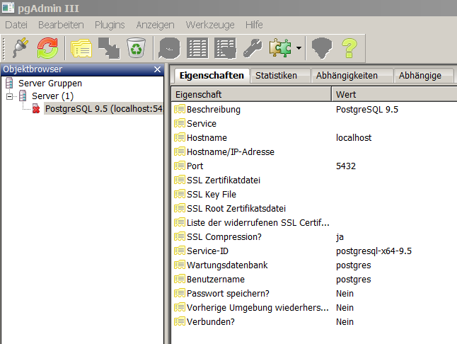

```{r setup, include=FALSE}
knitr::opts_chunk$set(echo = TRUE)
```


## Localhost

Der Name localhost ist in der Netzwerktechnik der per Internetstandard definierte Domainname der virtuellen IP-Adresse eines auf dem momentan genutzten eigenen Rechner laufenden Servers.


Quelle: [Wikipedia](https://de.wikipedia.org/wiki/Localhost)


## 



## Find Server and Port PGSQL is running on