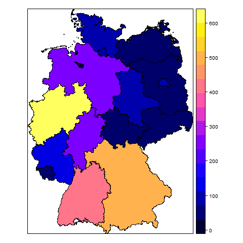

## R Markdown

```{r}
link <- "http://ichef.bbci.co.uk/news/624/cpsprodpb/32F6/production/_85164031_migrant_journeys_turkey_to_germany_624.png"

internet <- T
```


## 



## 

```{r}
graph.path <- paste("../stata/BIP2BLA.png")
```


`r "## Hallo Seggene"`


## 

```{r,echo=F}
if(internet)paste(
  "## Hallo Welt" 
)
```


## 

```{r,echo=F}
a <- "<a href=\"https://uchicagoconsulting.wordpress.com/\" target=\"_blank\"></a>"
```

`r a `

## 

- guess about picture taker's mode of transportation
- time stamps and distance traveled between a user's pictures
* Black is walking (less than 7mph), 
* Red is bicycling or equivalent speed (less than 19mph), 
    + Blue is motor vehicles on normal roads (less than 43mph); 
    + Green is freeways or rapid transit. 
